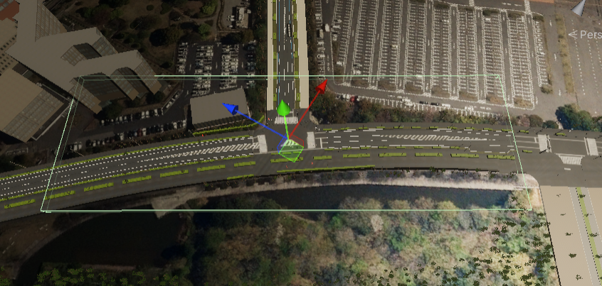
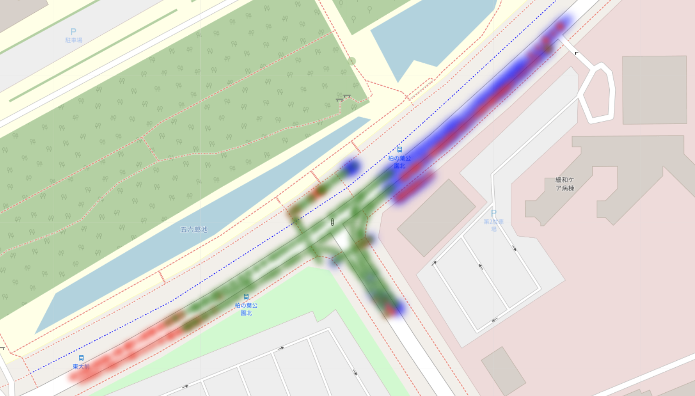
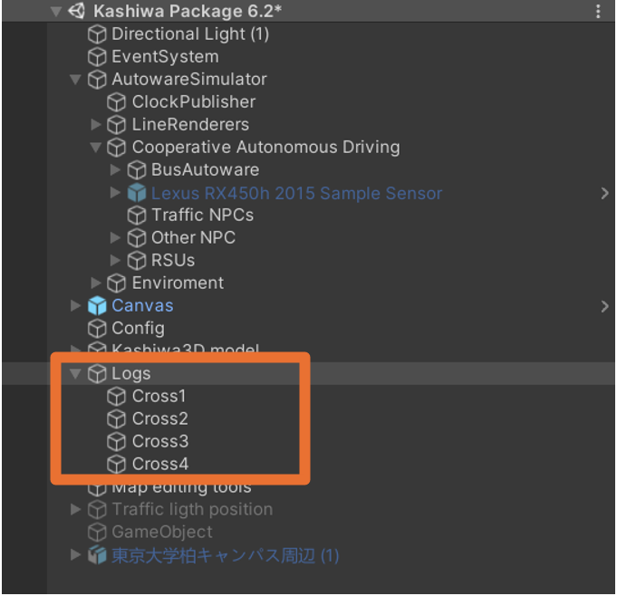
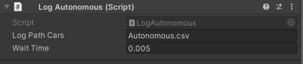

# Logs System

We have created two log systems. The first type is used for capturing data in specific areas and is named Log Area. The second type focuses on autonomous vehicles and is named Log Autonomous.

## Log Area
This component is specifically focused on a defined area, as shown by the green box in the picture:

  

The component saves the position, rotation, and time based on the Unity origin, as well as the observation state for cars or humans. This includes saving the color of the hint box around the car. We have also developed a short script that interprets and presents a heat map to better understand traffic and observation states based on this log (The code will be published soon).

  

Green colors indicate objects that have been seen by the autonomous car, red indicates objects that have not been seen, and blue indicates objects that have been detected.

You can find sample of this log in 

<!--  -->

  

## Log Autonomous
This component gets the name of the output file and the rate of logs, and it saves position, speed, acceleration, collisions with humans, and collisions with other cars in CSV format based on the ROS world origin.
This component required to attach to autonomous vehicle to get access to the data and will log data in a csv file. The time in the csv file from ros time class which is contain sec and nanosec

  

