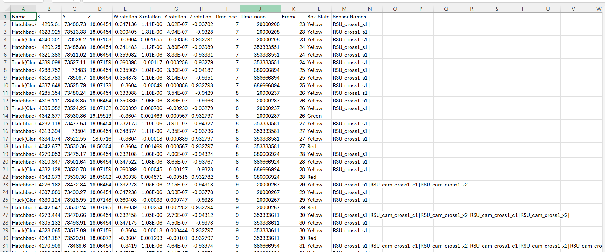
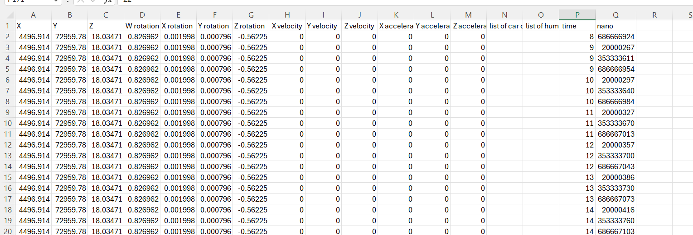

# Logs System

We have created two log systems. The first type is used for capturing data in specific areas and is named Log Area. The second type focuses on autonomous vehicles and is named Log Autonomous.

## Log Area
This component is specifically focused on a defined area, as shown by the green box in the picture:

  
  
 Sample image of log area 

  
  
Log sample of Log area module

**The Sensor** Name list contains the names of sensors that have a direct line of sight to the object within a specified distance. The vertical bar "|" has been used to separate elements in the list.

The component saves the position, rotation, and time based on the Unity origin, as well as the observation state for cars or humans. This includes saving the color of the hint box around the car. We have also developed a short script that interprets and presents a heat map to better understand traffic and observation states based on this log (The code will be published soon).

  

Green colors indicate objects that have been seen by the autonomous car, red indicates objects that have not been seen, and blue indicates objects that have been detected.

You can find sample of this log in 

<!--  -->

  
  
Location of Log Area components

## Log Autonomous
This component retrieves the name of the output file and the logging rate. It then saves position, speed, acceleration, collisions with humans, and collisions with other cars in CSV format based on the ROS world origin. To use this component, it must be attached to an autonomous vehicle to access the data and log it in a CSV file. The timestamp in the CSV file is derived from the ROS time class, which contains seconds and nanoseconds. Additionally, most of the physical features in the log are obtained from the RigidBody object, which is essential for autonomous car functionality.

  
  
Log Autonomous component

  
  
Sample of log file in csv

hese areas look for 'NPCVehicle' and 'NPCPedestrian' in the objects that enter the zone. If the objects contain these components, they will start capturing data about the objects.