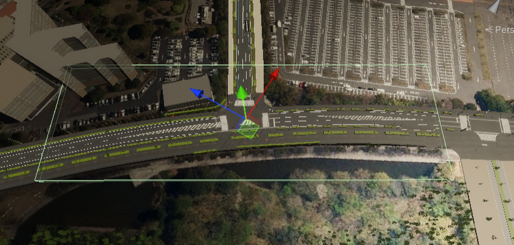
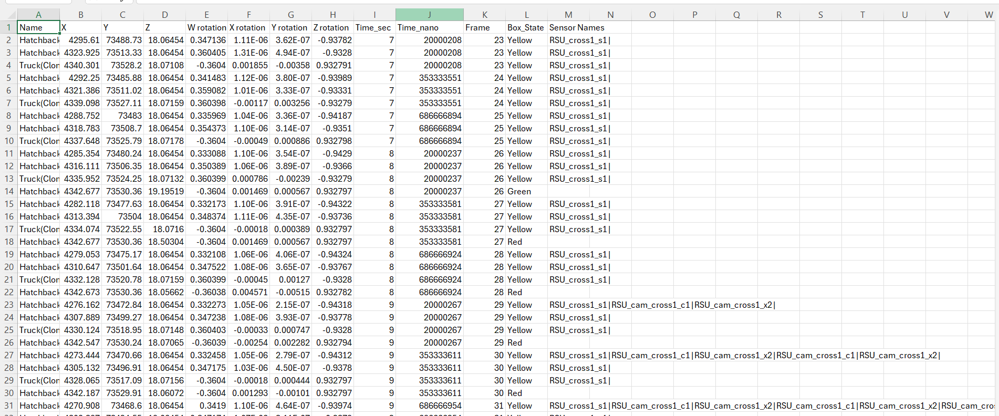
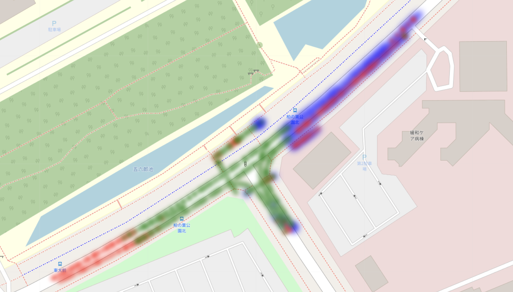
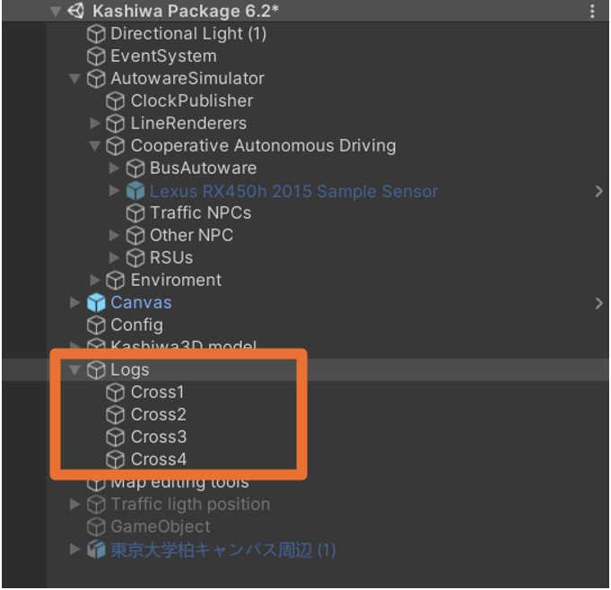
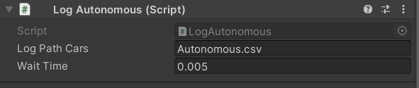
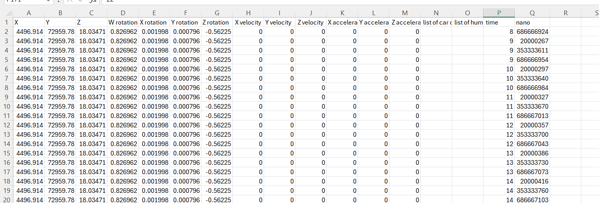

# Logs System

The simulator has two complementary logging components. **LogArea** monitors all NPCs that pass through a defined trigger zone and writes their state to CSV files. **LogAutonomous** tracks the ego vehicle's own motion and collision events, and also records spawn selection data written by the [Teleporter](../Teleport/index.md).

---

## LogArea

### What It Does

`LogArea` is a `BoxCollider` trigger that maintains live lists of vehicles and pedestrians currently inside it. Every few frames (or every few seconds), it writes a row per tracked NPC to separate CSV files for humans and cars.

  
  
The green box in the scene view marks the LogArea trigger volume.

  
  
Sample CSV output from LogArea.

---

### Logging Modes

`LogArea` supports two timing modes, controlled by the `ultraMode` toggle:

| Mode | Toggle | Field | Description |
|---|---|---|---|
| **Frame-based** | `ultraMode = true` (default) | `waitForFrame` | Log every N frames (default: 2). High-frequency output, best for smooth data. |
| **Time-based** | `ultraMode = false` | `waitTime` | Log every N seconds (default: 0.05 s). Useful when frame rate varies. |

---

### Detection Logic

`LogArea` uses `OnTriggerEnter` / `OnTriggerExit` to add and remove objects from its tracking lists:

- Objects with an `NPCVehicle` component → tracked as **cars**
- Objects with an `NPCPedestrian` component → tracked as **humans**
- Objects on the vehicle layer with a `Rigidbody` (e.g., buses with compound colliders) → also tracked as cars

The component checks separately for humans (`checkHumans`) and cars (`checkCars`), both enabled by default.

---

### Sensor Column

The **Sensor** column in the CSV contains a pipe-separated (`|`) list of sensor names that had direct line-of-sight to the NPC at the time of logging. This is populated by the `LineOfSight` / `LineOfSightManager` system.

  

Color coding used in the companion heat-map tool:

- **Green** — NPC seen by the autonomous car
- **Red** — NPC not seen
- **Blue** — NPC detected by a roadside sensor

  
  
Typical placement of LogArea components in the scene.

---

### Inspector Fields

| Field | Default | Description |
|---|---|---|
| `logPathHumans` | — | Output CSV path for human NPC data |
| `logPathCars` | — | Output CSV path for vehicle NPC data |
| `checkHumans` | true | Track pedestrian NPCs |
| `checkCars` | true | Track vehicle NPCs |
| `waitTime` | 0.05 s | Log interval (time-based mode) |
| `waitForFrame` | 2 | Log interval in frames (frame-based mode) |
| `ultraMode` | true | Use frame-based timing |
| `checkpointJumper` | — | Reference for checkpoint/run index in filenames |
| `vehicleLayer` | — | Layer mask for vehicle detection |

---

### CSV Column Reference — Cars and Humans

| Column | Description |
|---|---|
| `timestamp_ros` | ROS time (seconds) |
| `timestamp_sys` | System wall-clock time |
| `frame` | Unity frame count |
| `id` | NPC identifier (vehicle name or `ScenarioHumanId`) |
| `pos_x`, `pos_y`, `pos_z` | World position |
| `rot_x`, `rot_y`, `rot_z` | World Euler rotation |
| `speed` | Scalar speed (m/s) |
| `vel_x`, `vel_y`, `vel_z` | Velocity vector |
| `box_state` | Checkpoint / scenario state from `CheckpointJumper` |
| `sensor_*` | Pipe-separated sensor names with line-of-sight |

---

## LogAutonomous

### What It Does

`LogAutonomous` is attached directly to the ego vehicle. It continuously logs the vehicle's position, velocity, and acceleration, and records collision events. It also receives spawn selection data from the [Teleporter](../Teleport/index.md) after each teleport.

  
  
LogAutonomous component in the Inspector.

  
  
Sample CSV output from LogAutonomous.

---

### Ego Vehicle State Log

Every frame, LogAutonomous writes one row with:

| Column | Description |
|---|---|
| `timestamp` | Simulation time (ROS seconds + nanoseconds) |
| `pos_x`, `pos_y`, `pos_z` | Ego position in world space |
| `rot_x`, `rot_y`, `rot_z` | Ego Euler rotation |
| `vel_x`, `vel_y`, `vel_z` | Velocity from Rigidbody |
| `accel_x`, `accel_y`, `accel_z` | Acceleration (velocity delta) |
| `collision_cars` | Semicolon-separated names of colliding vehicles |
| `collision_humans` | Semicolon-separated names of colliding pedestrians |

Collision lists are populated by Unity `OnCollisionEnter` / `OnTriggerEnter` callbacks and cleared each frame.

---

### Spawn Selection Log

After each teleport, the [Teleporter](../Teleport/index.md) calls `LogSpawnSelection()` on this component, which appends a row to a separate spawn-selection CSV file.

| Column | Description |
|---|---|
| `timestamp` | Time of teleport |
| `midpoint_segment` | Name of the target midpoint lane |
| `spawn_lane` | Lane chosen for the spawn (or `"RandomPoint"`) |
| `sample_index` | Index of the sampled point on the spawn lane |
| `distance_to_midpoint` | Dijkstra path distance to the midpoint (m) |
| `estimated_time` | Kinematic ETA to midpoint (s) |
| `target_time` | Randomly drawn target arrival time (s) |
| `reached_cruise` | Whether cruise speed was reached before the midpoint |
| `spawn_x`, `spawn_y`, `spawn_z` | World position of the teleport destination |

This log is the primary tool for verifying that the Teleporter is placing the vehicle at the intended arrival times.

---

### Inspector Fields

| Field | Description |
|---|---|
| `outputFile` | Base path for the ego state CSV |
| `spawnLogFile` | Base path for the spawn selection CSV |
| `filePrefix` | Optional prefix for multi-run experiments |
| `logRate` | How often to write state rows (frames or seconds) |

---

## File Paths and Multi-Run Support

Both LogArea and LogAutonomous support **run-indexed filenames** via `CheckpointJumper`. When `CheckpointJumper` advances to a new run index, the logging components create a new file with the run number appended, so each scenario run produces an independent CSV rather than appending to a single large file.

!!! tip
    All output goes to the `SimulationOutput/` directory by default. This directory is listed in `.gitignore` and is not committed to the repository.
