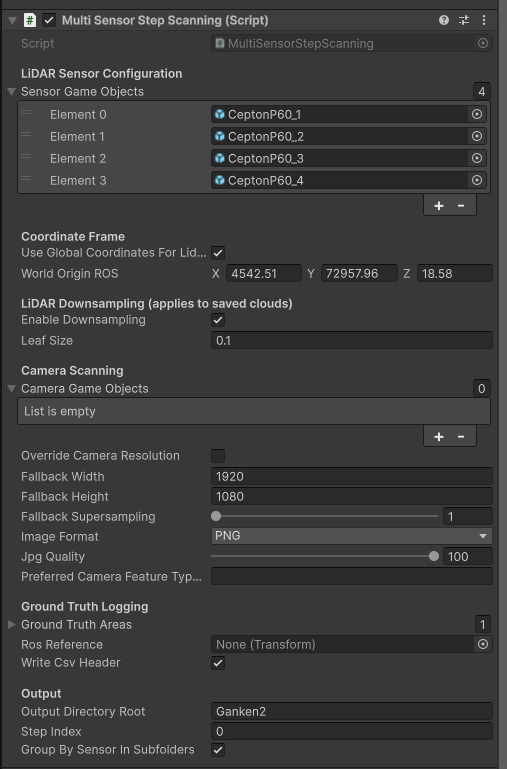

# MultiSensor Step Scanning (LiDAR + Camera)

**Namespace:** `AWSIM.Scanning`  
**Script:** `MultiSensorStepScanning.cs`  

A unified, step-based scanning system for LiDAR and camera sensors in Unity.  
Designed for **AWSIM / RGLUnityPlugin**, this tool enables synchronized LiDAR and camera captures on a per-step basis, useful for dataset generation, ground-truth logging, or robotic simulation.

---

## 🧭 Overview

`MultiSensorStepScanning` coordinates **LiDAR** and **camera** captures frame-by-frame, ensuring precise, motion-free outputs.  
Each “step” freezes the Unity simulation (`Time.timeScale = 0`), triggers all sensors, and saves outputs before resuming time.  
The script also supports **ground truth logging** of detected objects via configured `GroundTruthArea` components.

### Key Features

- **LiDAR Scanning**
  - Builds RGL subgraphs per LiDAR sensor.
  - Supports **local ROS axes** or **global ROS world** transformations.
  - Optional **voxel downsampling** for `.pcd` output files.
  - Saves results under `Assets/{outputDirectoryRoot}/Lidar`.

- **Camera Scanning**
  - Captures one image per configured camera each step.
  - Supports existing custom capture components or built-in fallback capture.
  - Configurable resolution, supersampling, and image format (`.png` / `.jpg`).
  - Saves images under `Assets/{outputDirectoryRoot}/Camera`.

- **Ground Truth CSV Logging**
  - Aggregates visible objects from assigned `GroundTruthArea` volumes.
  - Logs object name, UUID, ROS-space position, yaw, and step index.
  - CSV outputs saved under `Assets/{outputDirectoryRoot}/GroundTruthPos`.

- **Triggering**
  - Manually via **Space key**.
  - Or programmatically via `TriggerAndSaveStep()` / coroutine variant.

---

## ⚙️ How to Use

### 1. Add the Script
Attach `MultiSensorStepScanning` to an empty GameObject in your Unity scene.

### 2. Configure Sensors
In the **Inspector** panel:

#### LiDAR
- Assign all GameObjects containing `LidarSensor` components.
- Choose coordinate frame mode:
  - **Local** (default, ROS axes)
  - **Global** (transforms using `worldOriginROS`)
- Enable/disable **downsampling** and adjust **leaf size**.

#### Camera
- Assign all GameObjects with `Camera` components.
- Optionally define:
  - Override resolution and supersampling.
  - Image format (PNG/JPG) and quality.
  - Custom capture component name (e.g., `"MyCustomCameraFeature"`).

#### Ground Truth (optional)
- Add one or more `GroundTruthArea` volumes.
- Optionally specify a `rosReference` transform to define relative frame.
- Enable **CSV header writing** if desired.

#### Output
- Choose root folder name under `Assets/`.
- Enable or disable **per-sensor subfolders**.
- The step index will auto-increment after each capture.

---

<div align="center">
  
</div>

## ⌨️ Triggering a Step

**Manual:**
Press **Space** in Play Mode.

**Programmatic:**
```csharp
var scanner = FindObjectOfType<MultiSensorStepScanning>();
scanner.TriggerAndSaveStep();
```
