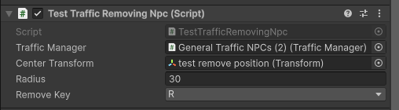

# Vehicle Despawn System

## Overview

The Vehicle Despawn System removes NPC vehicles within a specified radius. This is used during bus teleportation to prevent collisions.

## How It Works

The system uses a two-phase approach:

1. **Mark Phase**: Vehicles within radius are flagged for removal
2. **Despawn Phase**: Flagged vehicles are destroyed in the next `FixedUpdate()`

### System Flow
```
Game Code (TestTrafficRemovingNpc)
    ↓
TrafficManager.RemoveVehiclesInRadius()
    ↓
NPCVehicleSimulator.RemoveVehiclesInRadius()
    ↓
NPCVehicleInternalState (ShouldDespawn = true)
    ↓
TrafficManager.FixedUpdate() → Despawn()
```

## Usage

### Basic Implementation
```csharp
using AWSIM.TrafficSimulation;
using UnityEngine;

public class TestTrafficRemovingNpc : MonoBehaviour
{
    [SerializeField] TrafficManager trafficManager;
    [SerializeField] Transform centerTransform;
    [SerializeField] float radius;
    [SerializeField] KeyCode RemoveKey = KeyCode.R;

    private void FixedUpdate()
    {
        if (Input.GetKeyDown(RemoveKey))
        {
            trafficManager.RemoveVehiclesInRadius(centerTransform, radius);
        }
    }
}
```

### Component Setup

<!--  -->


**Inspector Parameters**:
- **Traffic Manager**: Reference to the TrafficManager in the scene
- **Center Transform**: The center point for vehicle removal (typically the bus transform)
- **Radius**: Distance in meters from center point
- **Remove Key**: Keyboard key to trigger removal (default: R)

## API Reference

### RemoveVehiclesInRadius

**Method**: `TrafficManager.RemoveVehiclesInRadius()`

**Parameters**:
- `center` (Transform) - Center point of removal area
- `radius` (float) - Radius in meters

**Returns**: `int` - Number of vehicles marked for removal

## Implementation Details

### Distance Calculation

The system uses squared distance (`sqrMagnitude`) for performance:
```csharp
float sqrDistance = (vehiclePosition - center.position).sqrMagnitude;
if (sqrDistance <= radius * radius)
{
    vehicleState.ShouldDespawn = true;
}
```

### Despawn Timing

Vehicles are not destroyed immediately. Destruction occurs in the next `FixedUpdate()` cycle (typically ~0.02 seconds later).

## Testing

1. Add `TestTrafficRemovingNpc` component to any GameObject
2. Assign the TrafficManager reference from the scene
3. Set the center transform (bus or target location)
4. Configure the radius (recommended: 20-30m)
5. Enter Play mode and press **R** key to test removal

## Performance Notes

- **Time Complexity**: O(n) where n is the number of active vehicles
- **Optimization**: Uses squared distance to avoid expensive square root calculations
- **Recommended Radius**: 20-30m for bus spawning

## Common Issues

**Vehicles still visible after pressing the key**
- Wait one `FixedUpdate()` cycle. Destruction is deferred, not immediate.

**Nothing happens when pressing the key**
- Verify TrafficManager reference is assigned in Inspector
- Check that vehicles exist within the specified radius
- Ensure the key code matches your input

**Performance drops when removing vehicles**
- Reduce the radius value
- Avoid calling the function every frame

## Notes

- The test component uses `FixedUpdate()` with `Input.GetKeyDown()` for testing purposes
- In production, call `RemoveVehiclesInRadius()` before teleporting or spawning buses
- Vehicles marked for despawn remain in the scene until next physics update

---

**Related**: Traffic Spawning System, Bus Teleportation System