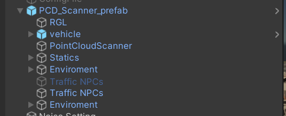
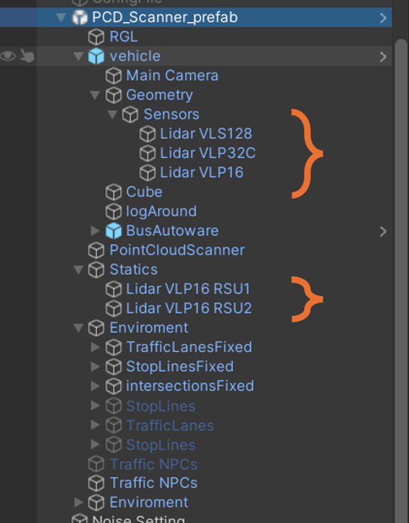
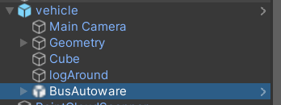
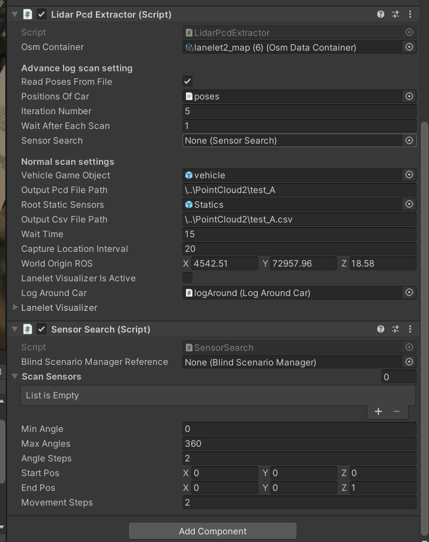

# Lidar PCD Extractor Component

## Prefab

To facilitate easier usage of this component, we have created a prefab located at:

## Lidar types

As shown in the image above, two types of sensors can be defined: **dynamic** and **static** lidar scanners.

- **Dynamic Sensors**: These sensors move with the car.
- **Static Sensors**: These sensors function as roadside unit sensors that remain stationary during the simulation.

Ensure that all of these sensors, in addition to having the `Lidar Sensor` component (which all lidar sensors have in AWSIM), also have the `RGLScanAdapter` component. The code automatically finds these sensors and captures a shot from each position with the defined features on each of them.

## Vehicle object
The `BusAutoware` object does not perform any functionality in this context and does not run according to the logic of an autonomous vehicle. Therefore, we have disabled all internal functionalities of this component. The purpose of this component is solely to provide realistic observations for dynamic sensors and to correctly represent blind spot positions. In other words, it acts merely as an obstruction of view, which is its intended role.

## Lidar PCD Extractor

This component is mainly responsible for methods to capture data. The first method uses lanelets: when using the lanelet option, the scanner moves along the lines of the lanelet and scans the positions. The difference of this package compared to the original one is that the shots are stored separately and don't accumulate together.

The second method is using **'Read Poses From File'**. When this option is set to true, you can use a CSV file as positions of the car. Then the system only captures the specific points that you have already inserted in the file. The file inputs positions and rotations.

### Iteration

Iteration is the number of times that the test scenario is repeated. This feature helps to capture different types and conditions of cars, and also helps to collect complete data. The vehicle object has the **'Scanner Car'** component, which is responsible for evaluating whether the state of the bus is reasonable or not. In case of collision of the bus with another object, or if the sensors intersect with another car, this capture will be denied (these cases occur because during these scan scenarios we only set the position of the car as specified in the file, and it may not be compatible with the current state which is actually available in the city).

### Wait After Each Scan

We recommend setting it to `0`, but if you want to see the process work at a slower speed, set a number that you prefer.

### Sensor Search

There is no need to assign it, but if you assign the **Sensor Search** component to the same object, it will use it and automatically find and fill it.

The Sensor Search component is optional. This component will explore different setups of angles and positions and will create different states that could compare the results of each position in the final scans, which are separately captured.

### Vehicle Game Object

This is a reference to the vehicle object. Consider that this game object is just a symbol and does not need to have movement logic; the lidar extractor component will move it in the city.

### Output Files Direction

- **Output PCD File Path**: The files of the lidar scan will be saved in the directory with the prefix that you have set at the end of this string.
- **Output CSV File Path**: In this directory, with this name, a CSV file will be created that shows the position, rotation, and extra information of sensors. This file is required to understand which PCD file is related to which experiment and which sensor.

### Root Static Sensors

This is a reference to an object that is the parent of the static sensors. In the code, we will search the children of this object to find the static sensors.

### Wait Time

This is the time that the entire system lets the city run its traffic before sampling starts.

### Log Around the Car

**'Log Around the Car'** is a component that is attached to the vehicle and saves the logs of cars which are near the car in the scan environment. You can leave it null or entirely ignore it, but it will save some data related to blind spots and cars or vehicles that are never seen or seen by which sensors.

  
  
 Lidar PCD Extractor and Sensor Search

<!-- 

################################################################

## Lidar Pcd Extractor:

This component is mainly responsible for capturing methods to capture data, first method is using lanelet when using the lanelet option the scanner mover on lines of lanelet and scann the position the different of these package compare to the original one is that the shots will store sperately and don't accumulate together.
second way is using 'Read Poses From File' when it is true you can use a csv file as Positions of car then the system only capture the specific point that you already insert it in the file. the file input position and rotation. 

### Iteration:
iteration is the number of times that the test scenario is repeating this feature help to capture different type and condition of cars. also this feature help to capture compelet data. the vehicil object have the 'Scanner Car' component this component is responsible to evaluate that the state of bus is reasonable or not. in case of collision of bus with other object or entrance of sensors in other car this capture will deiny (these cases occured because during these scan scenarios we only set position of car in specific which mentioned in the file and it may is not compatiable with current state which is really available in the city)

### Wait after each scan:
we recomend to set it 0 but if you want to see the process of work in slower speed set a number which you like 

### Sensor search
No need to assign but if you assign Sensor search Component to the same object, it will use it and automatically find it and fill it.

The sensor search component is an optional component, this component will explore different setup of angle and position and will create different state that could compare the result of each position in final scanns which is seperately capture

### Vechicle game object:
Is a reference to the vehicle object. consider that this game object is just a symbole and no need to have movment logic on the other hand the pcd scanner component will move it in the city

### Output files direction:
'Output Pcd File Path' the files of lidar scan will save in the directory with the prefix that you have set in the end of this string
'Output Csv File Path' in this directory with this name a csv file will creat that shows the position and rotation and extra information of sensors. this file require to undrestand which pcd file is related to which experiment and which sensor.'

### Root Static Sensors:
This is a reference to a object that is the father of static sensor. In the code we will search child of this object to find the static sensors

### Wait time:
This is the time that entire system let the city run its traffic before sampling starts.

### Log Around The Car:
'Log Around the Car' is component which is attached to the vehicl and save the logs of carrs which is near the car in scan environement you fill it null or entirly ignore it but it will save some data related to blind spots and car or vehicles that never seen or seen by which sensors 
 -->
