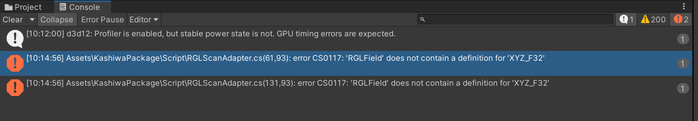
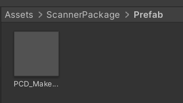
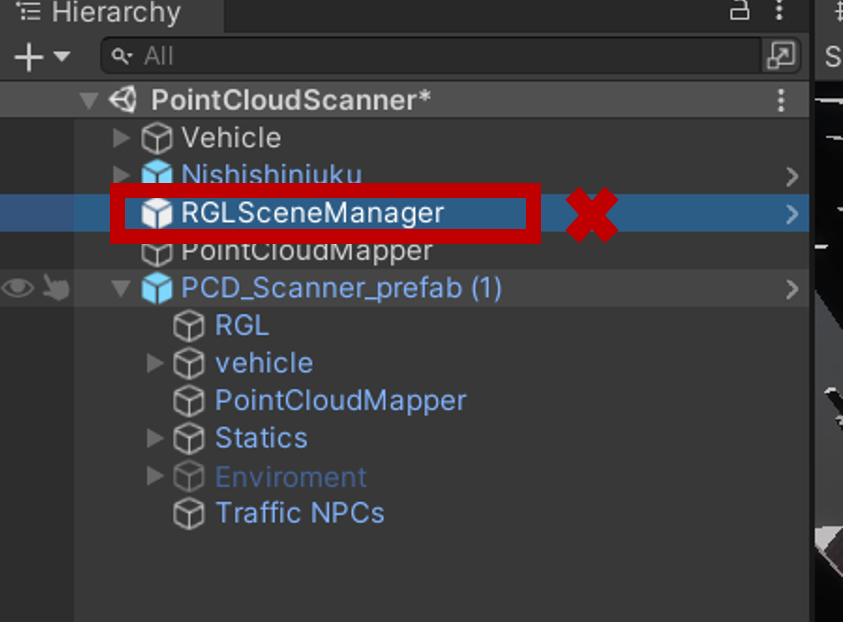
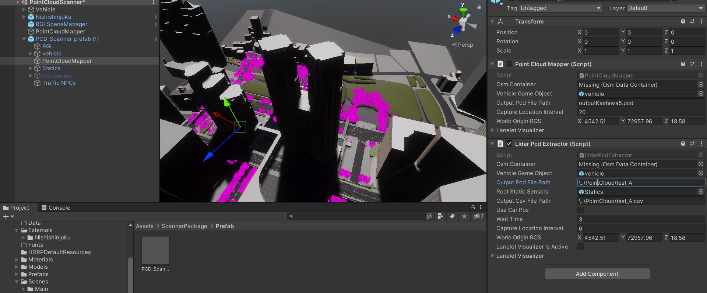
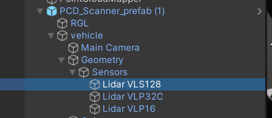
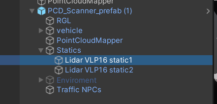

**Scanner Package**

This package is developed based on the \"PointCloudMapping\" system of
Awsim, which is used to create a point cloud of a city. Our package aims
to capture and save the point cloud of the city separately, point by
point, but in a more realistic environment. This package can be used
alongside the traffic system of the city to simulate input data when
different traffic conditions are applied to the city.

You may encounter an error when importing our package.

To resolve this, simply change the following line of code:

Same for second error

How to use

First, duplicate your base scene, which has a 3D map and can include the
traffic system. In my case, I duplicated PointCloudMapping and renamed
it to PointCloudScanner.

Now, go to Assets/ScannerPackage/Prefab and drag and drop the prefab
into the scene.

Because we already have the RGL component in our prefab, we must remove
the RGL Scene Manage component from the scene. In your case, if you are
building your scene from scratch, you may not be required to do the
same.

In the PointCloudScanner, there are two components: Point CloudMapper,
which performs the normal scanning, and Lidar Pcd Extractor, which scans
the environment frame by
frame.

**Configuring the Components:**

This package supports multiple static and dynamic sensors. Dynamic
sensors are the sensors carried by the car, while static sensors remain
in the same place all the time during scanning.

For example, in the image below, you can see we have three dynamic
lidars on our car. Since the position of sensors is relative to the
parent, it is possible to choose the position of each sensor
independently. The log system will save the position of each sensor in
each frame. However, you must ensure that sensor names are unique, as
the log file saves data by the name of the sensor, and unique names are
necessary for identification in the log file.

Similarly, we have two static lidars. Our code only checks the children
of the "Statics" component. In this section, you can duplicate or add
different sensors as needed.

\*\* As you can see in the lidar object, the lidar objects in this
prefab must have an RGL scan adapter. We recommend using our sensors and
duplicating them to create new sensors to avoid missing this component.
However, if you want to create it from scratch, you can manually add
this component at the end of your components in the lidar or each sensor
that you use.

The traffic system does not need to be inside our object and only needs
to run simultaneously.

**For Developers:** The logic of the code uses a box collider of the
scanner car to detect whether it is inside a car or not. If it is
outside the car, it will scan in that step. If not, it won't scan and
will skip that step.

Lidar PCD Extractor(in Point cloud scanner object)

**Check the Path of PCD and CSV:** The path is relative to the Asset
file.

**Osm Container:** This is the lanelet through which the scanner
travels.

**Wait Time:** This is the amount of time the system waits for the
traffic system or other systems to start working. After this period, the
process of capturing will begin.

**World Origin ROS:** It is very important to configure this based on
the real position of your map location. The default position of the
package is set for Kashiwa, and you must edit this field according to
your project.

**Lanelet Visualizer is Active:** Controls the visibility of the path
lines that cars travel through.

**Use CarPos:** Hold off on using this feature as it does not work
yet.
