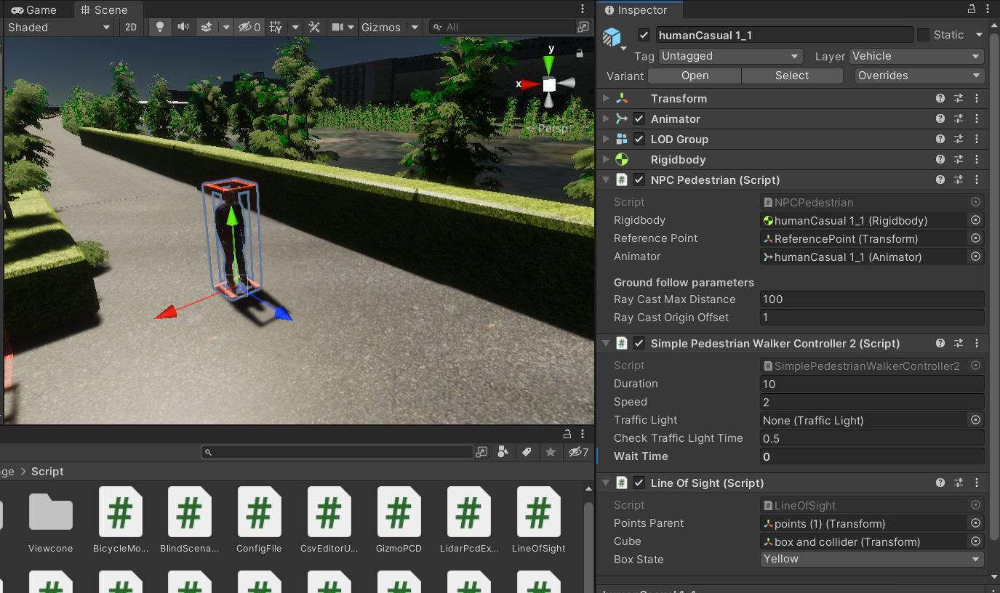
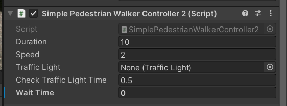
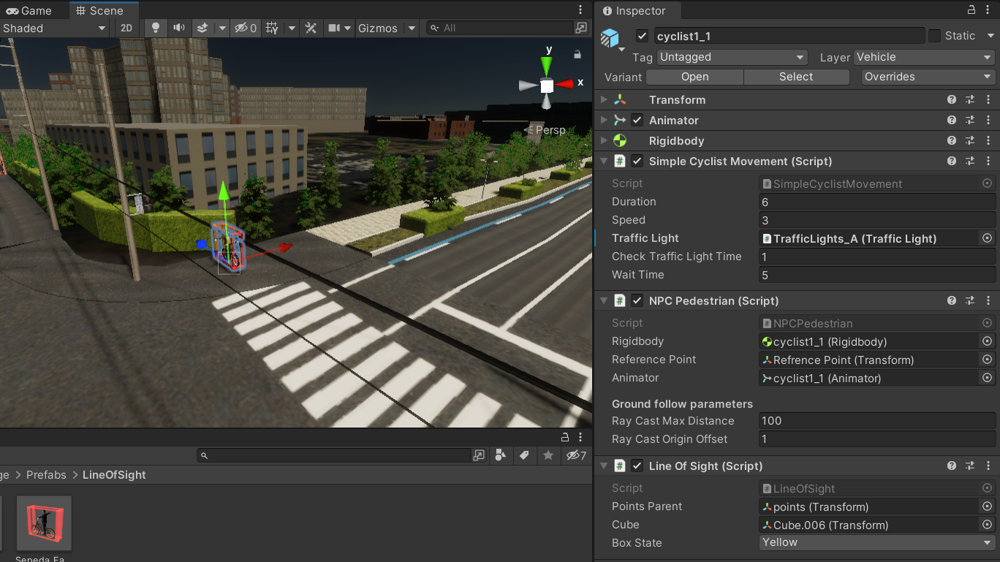

# Pedestrian & Cyclists

## Pedestrian

Each pedestrian has three script components, as shown in the picture:

  

1. **NPC  Pedestrian** : This component handles and checks the physics behavior of the model. The log system uses this component to determine if an object is a human (this applies to cyclists as well).

2. **Simple PedestrianWalker Controller2** : This component enables NPCs to move and return over crosswalks

    * **Duration** : Time of movement
    * **Speed** : Speed of movement
    * **Traffic light** : If this field is assigned, the character will check the color of the traffic light before moving into the street. If left null, the character skips this check and, after the duration time, will rotate and return to the initial position, looping this back-and-forth movement infinitely.
    * **Check Traffic Ligh Time** : Frequency of scanning the traffic light state when character wants to cross the road.
    * **Wait Time** : Duration of the character's waiting time when reaching the end of movement before starting to come back.

  

3. **Line of sight** : Similar to the Vehcile section and psudo sensor section this component responsible to detecting system of our custom messages 

    * **Points Parent** : representitive points of pedestrian to better understand this section please look at the pesudo sensor section 
    * **Cube** : is a reference to the box which is around the character and show the sate of visibility
    * **Box State** : is only for testing 

**Note** To copy or create a new pedestrian in the city, you can duplicate the current pedestrians and configure them, or use the prefab located at **ASSET/KashiwaPackage/Prefabs/LineOfSight**

## Cyclists

Cyclists have similar components compared to pedestrians, but there is one key difference: the "Simple Pedestrian Walker Controller 2" component is replaced with "Simple Cyclist Movement".

  

