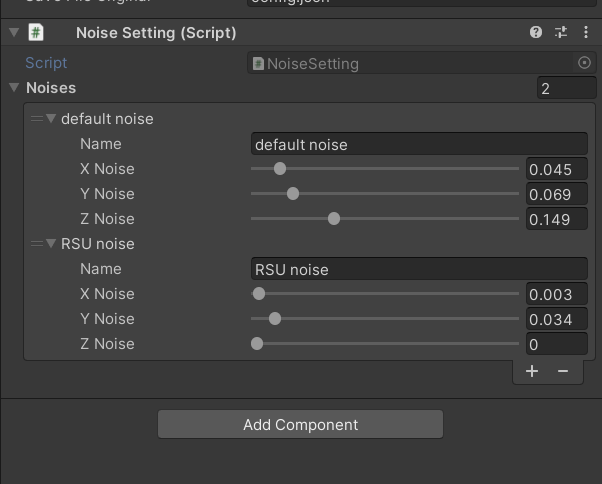
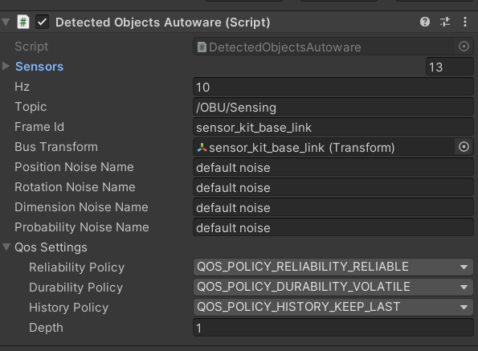

**Noise Setting**

**Noise Setting** is a singleton class responsible for creating noise
for all the mock sensors. At the start of their operation, each sensor
will check and obtain the related noise for itself.

The numbers in the component show the amount of noise that will be added to the target signal, within a range of [-value, value], in a uniform distribution.

As seen in the components, multiple types of noise can be defined with
different factors. In the image below, a publisher sends four types of
three-dimensional vectors with default noise. By default, if the name
written in the field does not match any of the existing noises, it will
return the first noise in the list. If the list of noises is empty, the
system will consider the data as having no noise.

