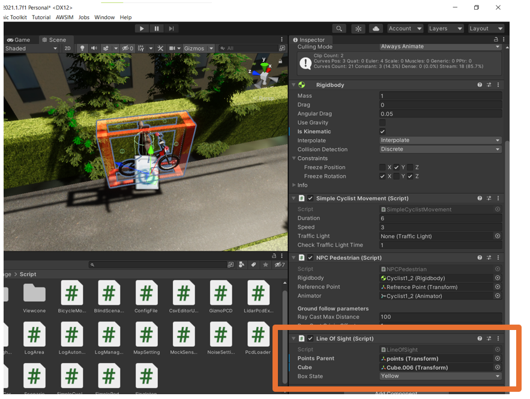
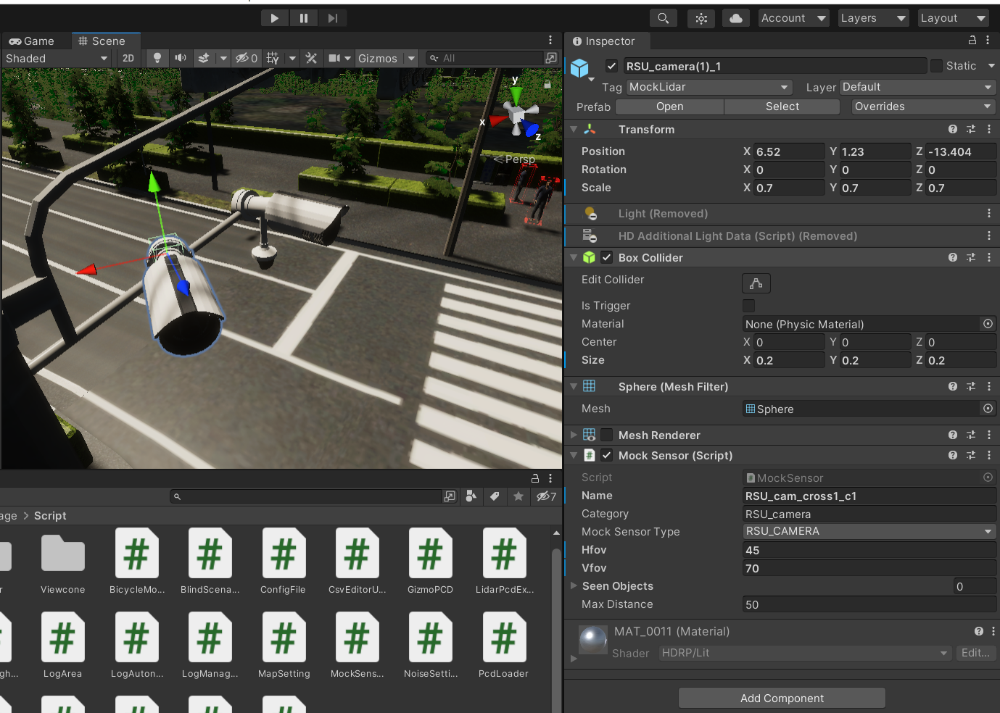
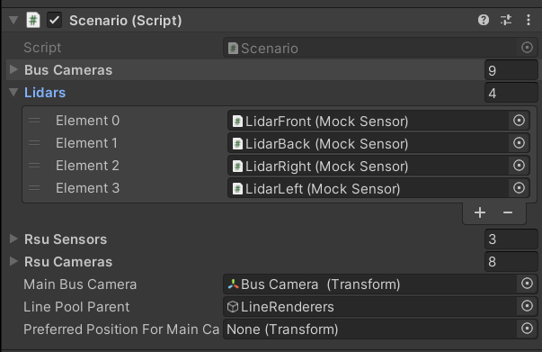
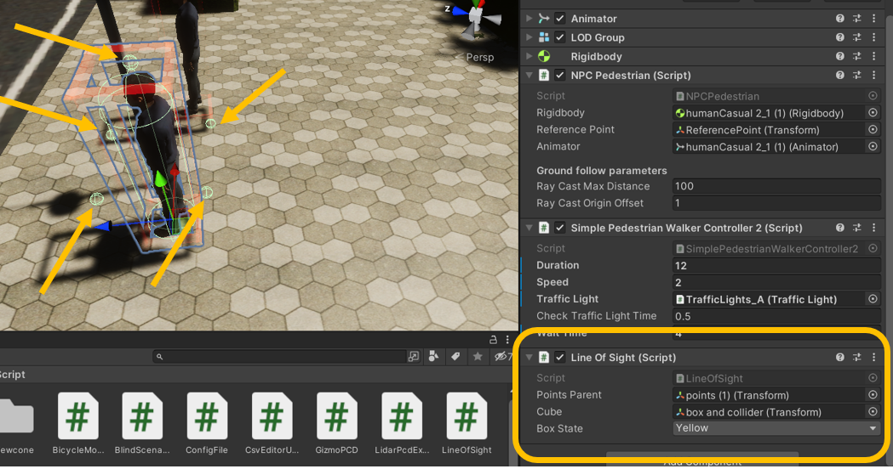
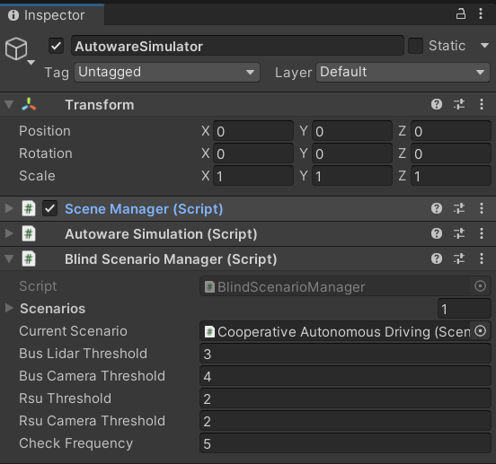

# Pseudo Sensor
Pseudo sensors are designed to reduce the number of processes compared to real sensors such as lidar. Unlike real sensors that broadcast signals in all directions, pseudo sensors use line of sight. Rays are directly sent toward target objects that already have a line of sight, as illustrated in the picture below.

<!--  -->

  

Each pseudo sensor requires a Mock Sensor Object and a box collider. The box collider is used to calculate ray collisions.

<!--  -->

  

#### Fields:

* **Name** : This field is used in the log system to identify which sensors have detected objects.
* **Category** : This field categorizes sensors using a config file. If you prefer to manually set the position and features of the sensor in the Unity scene, you can ignore this field.

* **Mock Sensor Type** : This enum field determines if the sensor simulates a Camera or lidar and sets it in a bus or roadside.

* **HFOV (Horizontal Field of View)** : Specifies the horizontal field of view.

* **VFOV (Vertical Field of View)** : Specifies the vertical field of view.

* **Sceen Objects** : This field is for testing purposes and shows the detected objects during runtime.

* **Max Distnace** : Specifies the range of the rays.

#### Other configuration:
At the end the pseudo sensor must be add to scenario this enable the system to detect  which object detect by which type of sensors

<!--  -->

  

## How it works
Each component that must be detected by a pseudo sensor must have the Line of Sight component. Objects with this component periodically check the Scenario component to determine if they have a line of sight to the sensor within their range. The line of sight is calculated using rays in Unity from the representative to the collider of the sensor, shown in the picture by arrows. Based on the number of points that can see the sensor, the box state for the object will be determined. The configuration of the number of required points to see a sensor, to be considered as a watched point, is defined in the Blind Scenario Manager component. In our case, the AutowareSimulator contains this component.

  
  
Pedestrian component

  
  
Configuration of thresholds

These thresholds indicate how many representative points of an object must see the sensor to be considered as detected.

### Color states
In our simulation, each car, pedestrian, or cyclist has three states. These states show how the autonomous car can observe these objects. The red state demonstrates that the car has no sense of the object. The purple or blue state means that RSUs (roadside units) detect the object, but the autonomous cars cannot see it. The green state indicates that the object is detected by the autonomous sensors.

## Add New Pseudo Sensor

1. Use the existing prefabs located in \Assets\KashiwaPackage\Prefabs\Pseudo Sensors.
2. Modify the relevant fields based on your needs.
3. Add the mock sensor to the scenario list of sensors.