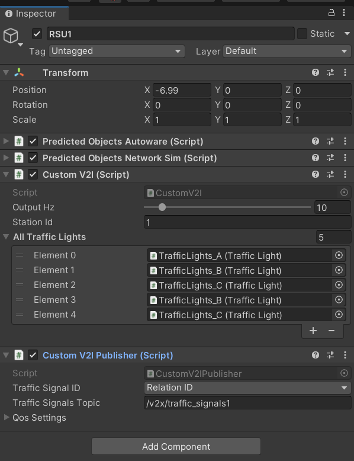

# RSU (Road Side Unit)

In our project RSUs responsible to send data of mock sensor and traffic light which are related to them selves

There are multi component that can be use in RSU 

## Custom V2I & Custom V2I Publisher

These two components send data of traffic lights in their topics. To change coresponding traffic light 