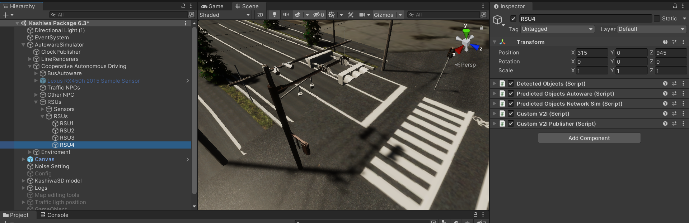
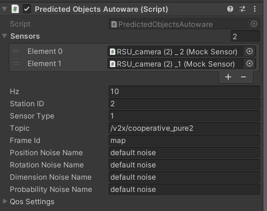

# RSU (Road Side Unit)

In our project RSUs responsible to send data of mock sensor and traffic light which are related to them selves

There are multi component that can be use in RSU 

  
  
 RSU4 with 4 pesudo sensors 

**Note** : When using the RSUs, you may find other message components added to them. These components are in the testing phase and have not been completely configured. However, if you need to use them, you can complete their fields in the code. There is no need to do anything regarding publishing or similar tasks.

## Custom V2I & Custom V2I Publisher

These two components send data about traffic lights in their topics. They are very similar to V2I and V2I Publisher in AWSIM, with one main difference: these components send data based on a predefined list rather than using the distance from the autonomous vehicle.

  
  
 Components of RSUs 

## PredictedObjectsAutoware && PredictedObjectsNetworkSim
These two components exactly work the same but final message format is different. they use a list of pseudo sensor and pridiocally scan the detected object list inside them and retrive the data of cars or humans detected by them and finally send the data in Hz that assigned to the component. These component also get the name of noise category and will apply the noise on output data when publishing ros message.

  
  
 PredictedObjectsAutoware component  

