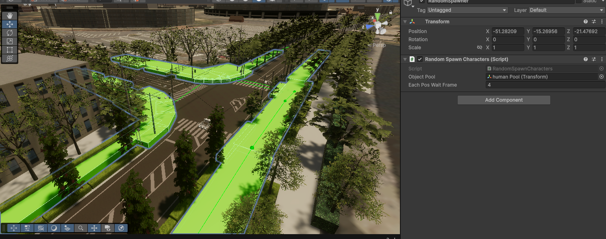

# RandomSpawnCharacters

## Sample Scene Setup

<p style="text-align:center">
  <br>
  <em>Figure 1. Example of assigned spawn areas and object pool setup.</em>
</p>


---

## Overview

The `RandomSpawnCharacters` component is responsible for randomly placing child objects (for example, characters, agents, or NPCs) that exist in an object pool within predefined spawn areas under the component's GameObject.

Each child area under this component defines a region where characters can appear. The script uses the area size of each region to weight the probability of selection — meaning larger areas are more likely to receive more characters.

---

## Component Responsibilities

- Collects all child area Transforms under the component
- Collects all pooled objects (for example, humans) from the assigned ObjectPool
- Calculates each area's relative area weight based on its local scale
- Spawns (or repositions) each human within one of the weighted child areas
- Repeats the sampling at a fixed interval using Unity's FixedUpdate loop

---

## Serialized Fields

| Field | Type | Description |
|-------|------|-------------|
| `ObjectPool` | `Transform` | The parent transform containing pooled objects (for example, humans or NPCs). Each child under this pool will be repositioned. |
| `eachPosWaitFrame` | `int` | The number of frames to wait between each reposition cycle (in FixedUpdate). Default is 4 frames. |

---

## Internal Variables

| Variable | Type | Description |
|----------|------|-------------|
| `childAreas` | `Transform[]` | Stores all the child transforms under the component. These define the spawn areas. |
| `humans` | `LineOfSight[]` | References to all characters inside the object pool. |
| `areaWeights` | `float[]` | Normalized area weights used for random area selection. |
| `timer` | `int` | Frame-based timer for controlling update intervals. |

---

## Script Flow

### 1. Initialization (Awake)
- Retrieves all child areas under this GameObject
- Retrieves all human agents under the ObjectPool
- Calculates area weights via `CalculateAreaWeights()`

### 2. Area Weight Calculation
- Each child area contributes proportionally to its surface area (`scale.x * scale.z`)
- Weights are normalized to ensure they sum to 1
- Larger areas have a higher chance of selection

### 3. Random Section Selection
- Uses a weighted random algorithm (`GetWeightedRandomSection`) to pick which area to place each human in

### 4. Character Placement
For each human:
- Chooses a random point within the selected area's bounds
- Applies the area's local rotation
- Translates the position into world space

### 5. Continuous Update
In `FixedUpdate`, the code checks if the frame count exceeds the wait threshold and re-samples all character positions accordingly.

---

## Usage Guide

1. Attach `RandomSpawnCharacters` to a GameObject (for example, `SpawnManager`)
2. Create child GameObjects under it to define spawn areas. Adjust each child's `Transform.localScale` to represent area size
3. Assign an `ObjectPool` Transform that contains all characters to be placed
4. Set `eachPosWaitFrame` if you want to adjust the update frequency

!!! tip
    Ensure all pooled objects have a `LineOfSight` component (or adjust the script for your component type).

---

## Example Scene Setup

```
SpawnManager (with RandomSpawnCharacters)
 ├── Area_1 (Transform defines spawn area)
 ├── Area_2 (Transform defines spawn area)
 └── Area_3 (Transform defines spawn area)

ObjectPool
 ├── Human_1 (LineOfSight)
 ├── Human_2 (LineOfSight)
 └── Human_3 (LineOfSight)
```

---

<!-- ## Visualization

Place a representative image or diagram here to show:

- Child areas under SpawnManager
- Object pool with human agents
- Example positions after sampling


--- -->

## Notes

- The system assumes rectangular spawn regions (x * z)
- Y-axis height is ignored (flat plane assumption)
- The parent transform is excluded from spawn area calculations
- You can extend the script to support:
    - Non-rectangular areas
    - Custom randomization patterns
    - Weighted spawn limits per area

---