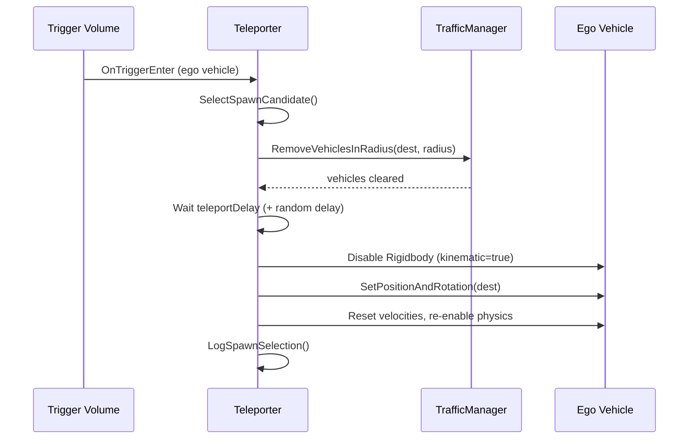
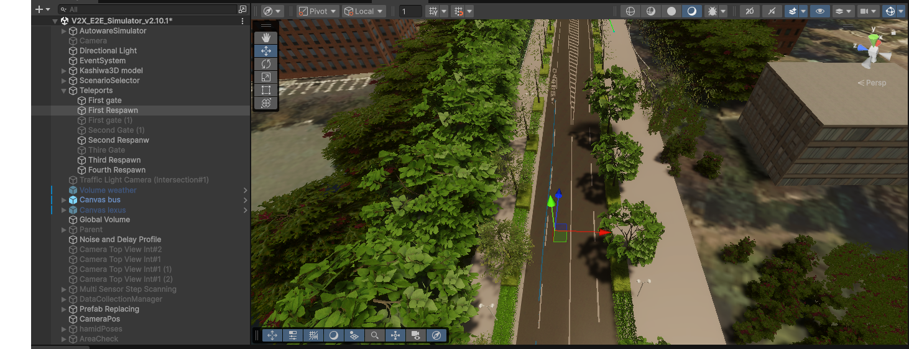
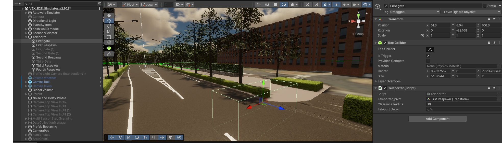

# Teleporter Component

## Overview

The `Teleporter` component is a trigger-based system that automatically relocates the ego (autonomous) vehicle to a new spawn position whenever it exits through a designated trigger volume. It handles NPC clearance at the destination, optional delays, and logs the spawn selection data for analysis.

!!! info "Key Design Goal"
    The Teleporter is designed for **repeatable, controlled experiments**: by targeting a midpoint lane segment with a randomized arrival time, each run places the ego vehicle at a different distance from a point of interest while keeping the scenario statistically comparable.

---

## Spawn Strategies

The Teleporter supports two independent strategies, selectable from the Inspector.

=== "LaneMidpoint (default)"

    Samples candidate spawn positions along a set of configured `TrafficLane` objects, then picks the candidate whose **estimated travel time** to a target midpoint lane is closest to a randomly drawn target time.

    This strategy guarantees that the ego vehicle is placed at a realistic driving distance from the point of interest — far enough to observe natural traffic behaviour before reaching it.

=== "RandomPoint"

    Picks a random `Transform` from a hand-placed list of `RandomSpawnPoint` entries. Each entry can optionally override the rotation with a custom Euler angle.

    Use this strategy when you need full manual control over spawn positions without any ETA logic.

---

## LaneMidpoint Strategy in Detail

### Candidate Generation

The Teleporter walks through all `LaneSpawnSource` entries and samples each lane at regular intervals defined by `spawnSubdivisionSpacing` (default 10 m):

```
Lane waypoints → cumulative distance table → sample every N metres
```

If `includeSegmentEndpoints` is enabled, the start and end of each lane are also included as candidates.

For each sample, the component caches:

- World position (interpolated along the lane waypoints)
- Forward direction (used to orient the vehicle on spawn)

### Distance Calculation (Dijkstra)

For each candidate, the Teleporter computes the driving distance to the configured `midpointSegment` lane. When the candidate is on a different lane than the midpoint, it runs a lightweight Dijkstra search through the lane graph (`NextLanes` connections):

```
cost(start_lane) = lane_length - distance_from_start
cost(next_lane)  = cost(current_lane) + next_lane_length
...
stop when midpointSegment is reached
```

Candidates with no reachable path to the midpoint are excluded.

### ETA Calculation

Travel time is estimated with a two-phase kinematic model (acceleration + cruise):

$$
t = \begin{cases}
\sqrt{\dfrac{2d}{a}} & \text{if } d \leq \dfrac{v_c^2}{2a} \\[10pt]
\dfrac{v_c}{a} + \dfrac{d - \dfrac{v_c^2}{2a}}{v_c} & \text{otherwise}
\end{cases}
$$

Where:

- $d$ = distance to midpoint (metres)
- $v_c$ = cruise speed (`cruiseSpeedKmh` converted to m/s)
- $a$ = assumed acceleration (`assumedAcceleration`)

### Target Time Selection

Each teleport draws a random target arrival time uniformly from `targetArrivalWindow`:

```
t_target ~ Uniform(targetArrivalWindow.x, targetArrivalWindow.y)
```

The candidate with the smallest `|ETA - t_target|` is selected.

---

## NPC Clearance

Before moving the ego vehicle, the Teleporter calls `RemoveVehiclesInRadius()` on every active `TrafficManager` in the scene, clearing all NPC vehicles within `clearanceRadius` of the destination. After clearing, it waits for `teleportDelay` seconds (plus an optional random `spawnDelayRange`) to let the physics settle before the actual teleport.



---

## Inspector Reference

### Teleport Timing

| Field | Default | Description |
|---|---|---|
| `clearanceRadius` | 10 m | Radius around destination to clear NPC vehicles |
| `teleportDelay` | 0.5 s | Fixed wait after NPC clearance, before teleport |
| `spawnDelayRange` | `(0, 0)` | Extra random delay: X = min, Y = max. Set Y > 0 to enable. |

### Strategy Selection

| Field | Default | Description |
|---|---|---|
| `spawnStrategy` | `LaneMidpoint` | `LaneMidpoint` or `RandomPoint` |

### Lane-Based (Midpoint Targeting)

| Field | Default | Description |
|---|---|---|
| `laneSpawnSources` | — | Lanes to sample candidates from |
| `spawnSubdivisionSpacing` | 10 m | Distance between sampled points along each lane |
| `includeSegmentEndpoints` | true | Include lane start and end as candidates |
| `midpointSegment` | — | The target lane for ETA calculation |
| `midpointSegmentFraction` | 0.5 | Normalised position on midpoint lane (0 = start, 1 = end) |
| `cruiseSpeedKmh` | 30 km/h | Cruise speed for ETA estimation |
| `assumedAcceleration` | 2 m/s² | Acceleration for ETA estimation |
| `targetArrivalWindow` | `(0, 90)` s | Random range for target arrival time |

### Random Spawn Points

| Field | Description |
|---|---|
| `randomSpawnPoints` | List of `Transform` entries used by the `RandomPoint` strategy |
| `useCustomRotation` | Per-entry toggle to override rotation with `customEulerRotation` |

---

## Spawn Selection Logging

After every teleport, the Teleporter calls `LogSpawnSelection()` on the ego vehicle's `LogAutonomous` component (if present). This writes one row to the spawn selection CSV:

| Column | Description |
|---|---|
| `timestamp` | Simulation time of teleport |
| `midpoint_segment` | Name of the target midpoint lane |
| `spawn_lane` | Name of the selected spawn lane (or `"RandomPoint"`) |
| `sample_index` | Index of the sample point on the spawn lane |
| `distance_to_midpoint` | Dijkstra path distance to midpoint (m) |
| `estimated_time` | Kinematic ETA to midpoint (s) |
| `target_time` | Randomly drawn target arrival time (s) |
| `reached_cruise` | Whether cruise speed was reached before the midpoint |
| `spawn_x/y/z` | World position of the teleport destination |

See [Loggers](../Logger/index.md) for details on the full CSV output.

---

## Scene Setup

### Step 1 — Create the Trigger Volume

1. Create an empty GameObject.
2. Add a **BoxCollider** and enable **Is Trigger**.
3. Scale it to cover the exit area of your road loop.
4. Attach the **Teleporter** script.

### Step 2 — Configure Lanes (LaneMidpoint strategy)

1. In the Inspector, add entries to **Lane Spawn Sources** and assign `TrafficLane` objects that cover the valid spawn zone.
2. Assign the **Midpoint Segment** — the lane the ego vehicle should be heading toward on each run.
3. Adjust `cruiseSpeedKmh` and `assumedAcceleration` to match the ego vehicle's expected behaviour.

### Step 3 — Tune the Arrival Window

Set `targetArrivalWindow` to the range of arrival times you want to study. For example:

- `(10, 60)` s → vehicle always arrives between 10 and 60 seconds after spawn
- `(0, 0)` → vehicle always spawns as close to the midpoint as possible

<div align="center">
    <br/>
    <em>Figure 1: Final vehicle position after teleport</em>
</div>
<div align="center">
    <br/>
    <em>Figure 2: Trigger gate and BoxCollider in the scene</em>
</div>

---

## Tips and Best Practices

!!! tip "Lane Coverage"
    Add lanes that span the full approach zone to the midpoint. More candidates give the system more flexibility to match the target arrival time precisely.

!!! tip "Clearance Radius"
    Set `clearanceRadius` large enough to prevent the ego vehicle from spawning inside an NPC. A value of 10–15 m is usually sufficient.

!!! warning "Midpoint Must Be Reachable"
    If no candidate has a connected path to the `midpointSegment`, the teleport is aborted. Verify lane connections with the **TrafficManager gizmo** (enable `showSpawnPoints` in the Inspector).

!!! info "Re-trigger Prevention"
    The Teleporter internally tracks which vehicles are currently being teleported (`teleportingVehicles` HashSet), so a vehicle re-entering the trigger during the delay phase is ignored.
