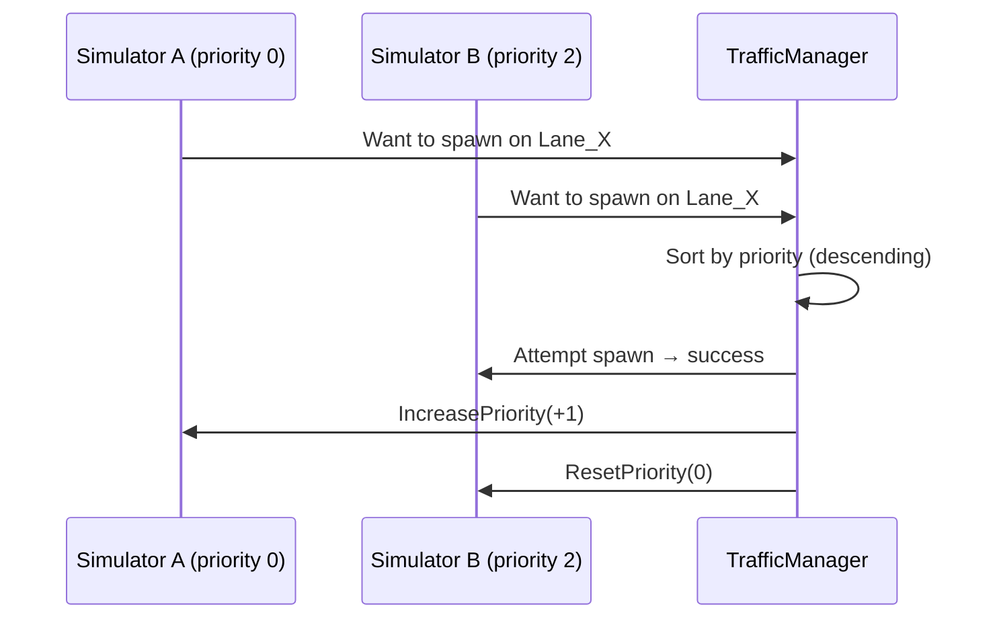
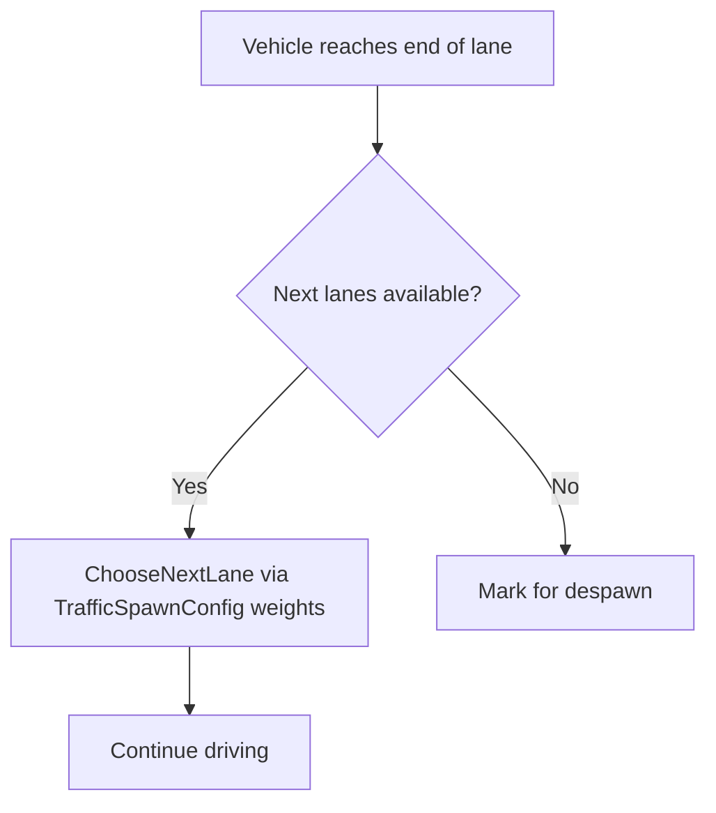

# Random Traffic Simulator

## Overview

The `RandomTrafficSimulator` is responsible for continuously spawning NPC vehicles across a configurable set of lanes. It works within the [TrafficManager](../TrafficManager/index.md) pipeline and supports per-lane spawn rate control, weighted lane-change probabilities, and a maximum-spawn lifetime.

---

## Core Concepts

### Spawnable Lanes

Each `RandomTrafficSimulator` instance is given a list of `SpawnableLaneConfig` entries — one per lane it is allowed to use as a spawn point:

```csharp
public struct SpawnableLaneConfig {
    public TrafficLane lane;
    public float spawnsPerMinute;   // 0 = no rate limit
}
```

Every `FixedUpdate`, the simulator requests a random spawn point from this list and hands it to the `TrafficManager`. If the lane is occupied or too close to the ego vehicle, the spawn is deferred to the next frame.

### Maximum Spawns

Setting `maximumSpawns > 0` gives the simulator a finite lifetime: it deactivates itself after spawning that many vehicles. This is useful for scripted scenarios where you want exactly N cars on a route.

```
maximumSpawns = 0  →  unlimited (run forever)
maximumSpawns = N  →  deactivate after N spawns
```

### Priority System

When two or more simulators request the same spawn lane at the same time, `TrafficManager` resolves the conflict using a fair round-robin priority counter:



Each time a simulator loses the race it gains +1 priority, so it will eventually win. This prevents large-vehicle simulators from monopolising lanes over smaller ones.

---

## Branch Weights

By default, when a vehicle reaches the end of its current lane and has multiple `NextLanes` to choose from, the next lane is picked uniformly at random. **Branch weights** let you bias that choice.

### Configuring in the Inspector

Each `RandomTrafficSimulatorConfiguration` exposes a `branchWeights` array:

```
BranchWeightSet:
  fromLane: Lane_A1
  next:
    - nextLane: Lane_B1,  weight: 2.0
    - nextLane: Lane_B2,  weight: 1.0
```

In the example above, vehicles leaving `Lane_A1` will choose `Lane_B1` approximately twice as often as `Lane_B2`.

### Configuring via JSON

Branch weights can also be loaded from `Assets/Configs/traffic_spawn.json` (managed by [TrafficSpawnConfig](../TrafficSpawnConfig/index.md)), which makes it easy to iterate without reopening the Unity Editor:

```json
{
  "branchWeights": [
    {
      "fromLane": "Lane_A1",
      "next": [
        { "lane": "Lane_B1", "weight": 2.0 },
        { "lane": "Lane_B2", "weight": 1.0 }
      ]
    }
  ]
}
```

Weights are normalised automatically; only their ratios matter.

---

## Per-Lane Spawn Rates

Each lane entry has a `spawnsPerMinute` field. `TrafficManager` converts this to a minimum interval between spawns on that lane:

$$
\text{interval} = \frac{60}{\text{spawnsPerMinute}} \text{ seconds}
$$

If `spawnsPerMinute = 0`, there is no rate limit and vehicles spawn as fast as the lane clears.

Spawn rates can also be loaded from the same JSON file:

```json
{
  "spawnRates": [
    { "lane": "Lane_A1", "spawnsPerMinute": 6.0 },
    { "lane": "Lane_B2", "spawnsPerMinute": 3.5 }
  ]
}
```

---

## Configuration Reference

### `RandomTrafficSimulatorConfiguration` Fields

| Field | Description |
|---|---|
| `npcPrefabs` | Array of vehicle prefabs to spawn randomly |
| `spawnableLanes` | Lanes + optional spawn rates |
| `branchWeights` | Weighted next-lane preferences per lane |
| `maximumSpawns` | Total spawns before this simulator stops (0 = unlimited) |
| `enabled` | Toggle the entire simulator on/off |

---

## How Vehicles Navigate

Once spawned, an NPC vehicle is handed off to `NPCVehicleSimulator`, which runs the **Cognition → Decision → Control** pipeline each `FixedUpdate`. Route extension works as follows:



See [TrafficManager](../TrafficManager/index.md) for details on the full simulation pipeline.

---

## Adding a New RandomTrafficSimulator

1. Open the **TrafficManager** component in the Inspector.
2. Expand the **Random Traffic Sims** array and add a new entry.
3. Assign NPC prefabs and spawnable lanes.
4. Optionally configure branch weights or set a `spawnsPerMinute` per lane.
5. Optionally save the configuration to JSON using the **Save Spawn Config JSON** context menu on `TrafficManager`.

!!! tip
    You can have multiple `RandomTrafficSimulator` entries targeting different sets of lanes — for example, one for main roads and another for side streets with lower density.
