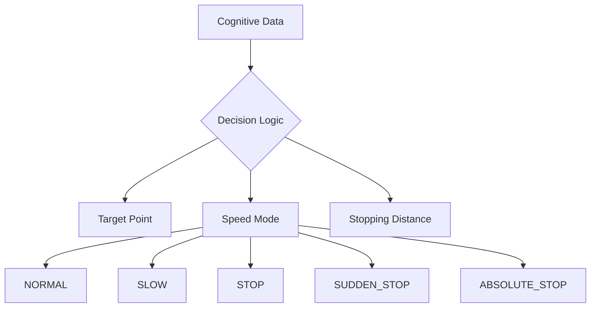
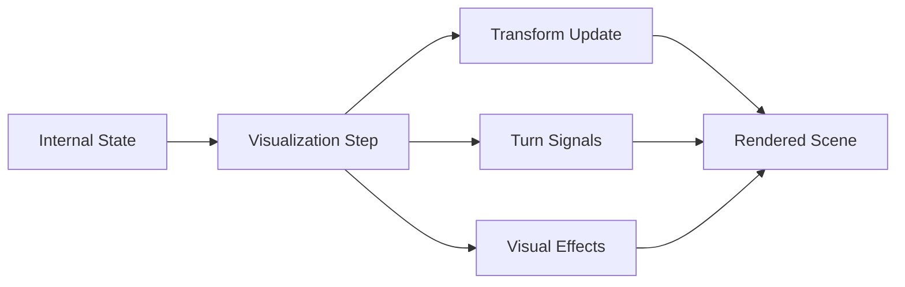
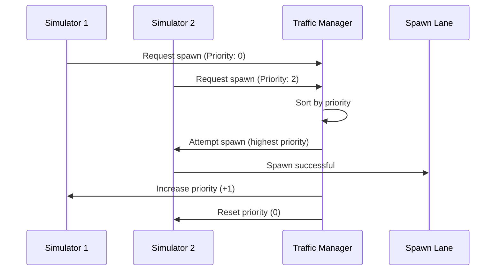
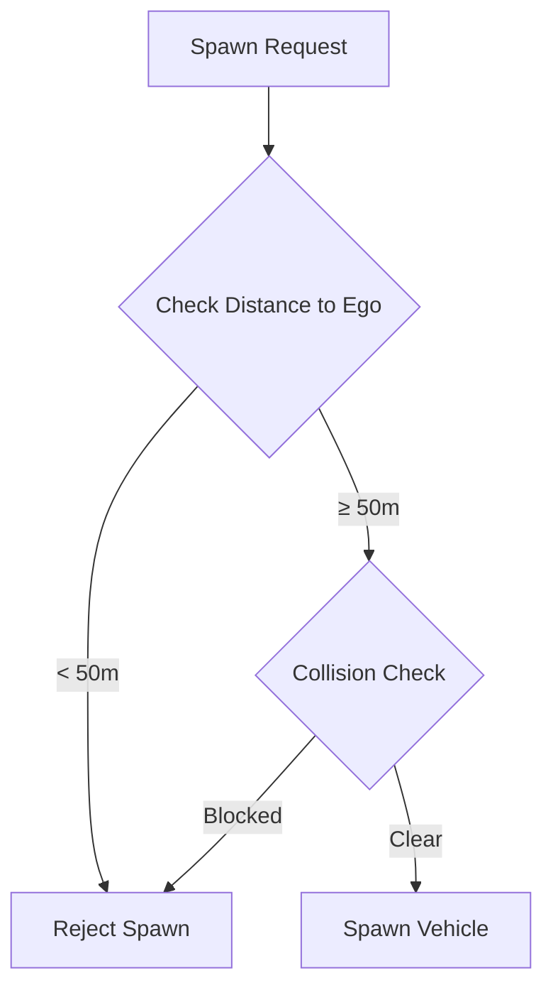
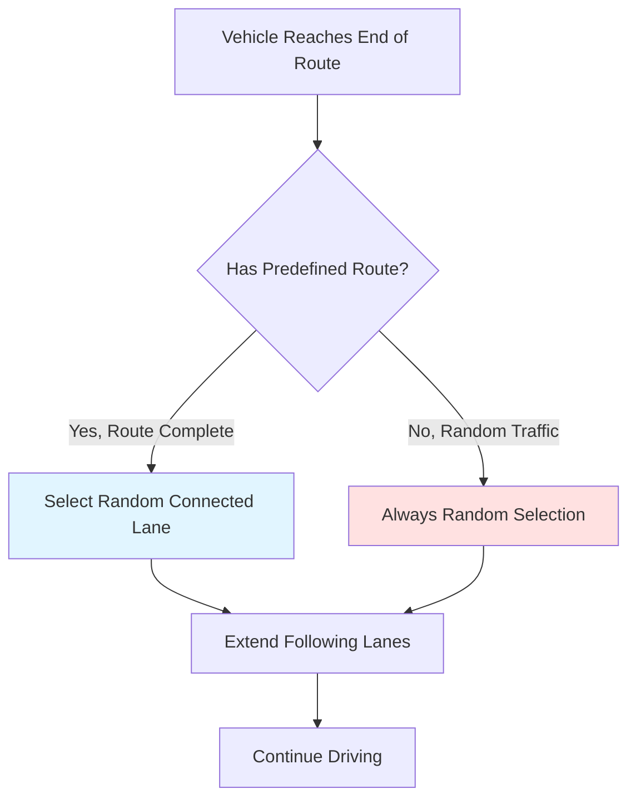
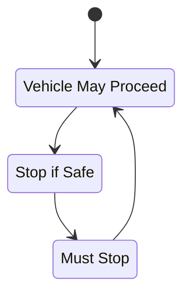
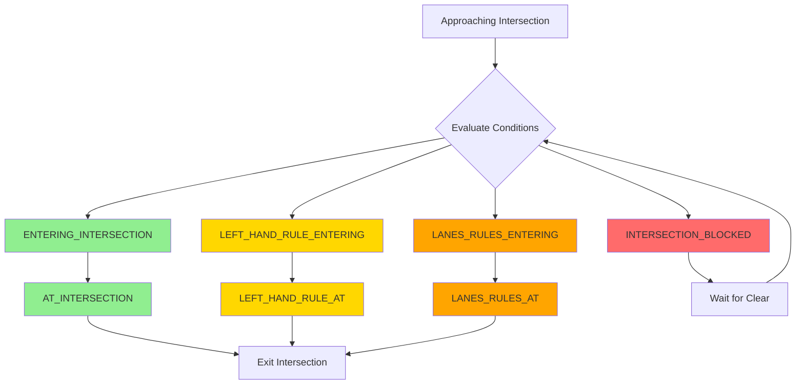
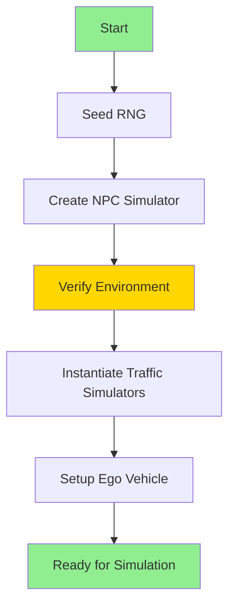
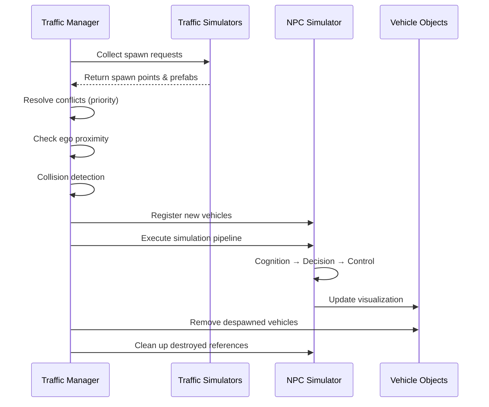

# Traffic Manager System

!!! info "Overview"
    The **Traffic Manager** is a comprehensive component for managing NPC vehicle traffic simulation in the V2X (Advanced Workflow Simulation for Intelligent Machines) framework. It serves as the central orchestrator that coordinates multiple traffic simulators, manages vehicle spawning, and maintains the overall simulation lifecycle.

## Introduction

The Traffic Manager system is designed to provide realistic, reproducible traffic scenarios that can accommodate both random traffic patterns and predefined route-based vehicle behaviors. It combines sophisticated behavioral modeling with performance optimization to enable large-scale traffic simulations.

---

## Core Architecture

The Traffic Manager operates as the top-level controller that integrates several specialized subsystems working in harmony.

### System Components

=== "Traffic Simulators"

    The manager supports multiple traffic simulator types that can coexist and operate simultaneously:
    
    - **RandomTrafficSimulator**: Generates unpredictable traffic patterns
    - **RouteTrafficSimulator**: Manages vehicles following predetermined paths
    
    !!! note
        Each simulator implements the `ITrafficSimulator` interface, providing a unified approach to vehicle spawning regardless of the underlying traffic generation strategy.

=== "NPC Vehicle Simulator"

    The core simulation engine responsible for updating vehicle states through a sophisticated multi-step process:
    
    ```mermaid
    graph LR
        A[Cognition] --> B[Decision]
        B --> C[Control]
        C --> D[Visualization]
    ```
    
    The simulator employs a **cognition-decision-control-visualization pipeline** that processes each vehicle's state every frame, ensuring realistic behavior and interactions.

=== "Vehicle Spawner"

    The spawning subsystem handles the instantiation of NPC vehicles at designated spawn points.
    
    **Key Features:**
    
    - Collision detection at spawn points
    - Ensures vehicles are only placed in safe, unoccupied locations
    - Supports multiple vehicle prefabs

---

### Configuration Parameters

The Traffic Manager provides extensive configuration options through serialized fields that can be adjusted in the Unity Editor:

#### 🎲 Seed-Based Reproducibility

!!! success "Deterministic Simulations"
    A critical feature of the system is its ability to produce deterministic traffic patterns through a configurable seed value. This ensures that traffic scenarios can be replayed identically for testing, debugging, and validation purposes.

#### ⚙️ Vehicle Configuration

The system uses `NPCVehicleConfig` to define behavioral parameters:

| Parameter | Description | Default Value |
|-----------|-------------|---------------|
| `Acceleration` | Rate of speed increase | 3.0 m/s² |
| `Deceleration` | Normal braking rate | 2.0 m/s² |
| `SuddenDeceleration` | Emergency braking rate | 4.0 m/s² |
| `AbsoluteDeceleration` | Maximum braking force | 20.0 m/s² |

These parameters influence how vehicles respond to traffic conditions, obstacles, and traffic control devices.

#### 🎯 Layer Masks

The manager employs separate layer masks for precise physics queries:

- **Vehicle Layer Mask**: Used for vehicle-to-vehicle collision detection
- **Ground Layer Mask**: Used for terrain following and ground checks

!!! tip
    This separation allows the physics system to optimize queries and prevent false positives.

#### 👥 Vehicle Population Control

```csharp
public int maxVehicleCount = 40;
```

The `maxVehicleCount` parameter limits the total number of simultaneously active vehicles in the scene. This provides a mechanism to balance traffic density against computational performance.

#### 🚗 Ego Vehicle Integration

The manager maintains a reference to the ego vehicle (typically the player-controlled or primary autonomous vehicle):

- If no ego vehicle is provided, the system automatically creates a **dummy ego**
- The ego vehicle serves as a reference point for various calculations
- Can influence NPC behavior and spawn decisions

---

## Simulation Pipeline

### Three-Step Processing Model

The NPC Vehicle Simulator implements a sophisticated three-step processing pipeline that executes during each fixed update.

#### Step 1: Cognition 🧠

The initial phase gathers environmental information for each vehicle.

!!! abstract "Cognition Tasks"
    - ✅ **Ground Existence**: Ensures vehicles remain on valid surfaces
    - 🛣️ **Lane Following**: Identifies next lane and waypoint based on position and route
    - 🚦 **Traffic Lights**: Monitors traffic light states to determine passability
    - ⚠️ **Right-of-Way**: Evaluates conditions at intersections
    - 🔄 **Curve Detection**: Detects sharp curves requiring reduced speed
    - 🚙 **Obstacle Detection**: Identifies front obstacles for safe following distances

!!! tip "Performance Optimization"
    The cognition step leverages Unity's **Job System** and **burst-compiled code** for parallel processing, significantly improving performance when handling large numbers of vehicles.

#### Step 2: Decision 🤔

Based on cognitive information, this phase determines each vehicle's immediate actions.

**Decision Outputs:**



The decision system:

- 🎯 Calculates short-term target points for steering
- 🚦 Selects appropriate speed modes based on traffic conditions
- 📏 Computes stoppable distances considering current speed and deceleration

!!! warning "Safety Margins"
    The decision logic implements safety margins to prevent collisions and ensures smooth, realistic transitions between different driving behaviors.

#### Step 3: Control 🎮

The final simulation phase updates vehicle kinematics.

| Control Task | Description |
|--------------|-------------|
| **Speed Control** | Calculates linear speed changes according to selected mode |
| **Steering Control** | Computes angular velocity (yaw speed) based on target point |
| **Position Update** | Updates vehicle positions and orientations in world space |
| **Motion Smoothing** | Applies smoothing factors to eliminate jerky movements |

```python
# Pseudo-code for control step
def update_speed(vehicle, delta_time):
    target_speed = get_target_speed(vehicle.speed_mode)
    acceleration = get_acceleration(vehicle.speed_mode)
    vehicle.speed = move_towards(vehicle.speed, target_speed, acceleration * delta_time)

def update_yaw_speed(vehicle, delta_time):
    steering_angle = calculate_angle_to_target(vehicle)
    target_yaw_speed = steering_angle * vehicle.speed * YAW_MULTIPLIER
    vehicle.yaw_speed = lerp(vehicle.yaw_speed, target_yaw_speed, LERP_FACTOR * delta_time)
```

---

### Visualization and State Application

Following the simulation steps, a visualization phase updates the actual Unity GameObjects representing NPC vehicles.

!!! example "Visualization Tasks"
    - 📍 Applies calculated positions and rotations to vehicle transforms
    - 💡 Manages turn signal states based on upcoming lane changes
    - ✨ Ensures visual consistency between internal simulation state and rendered scene



---

## Traffic Simulator Management

### Spawn Priority System

A sophisticated priority mechanism manages situations where multiple traffic simulators attempt to spawn vehicles in the same lane simultaneously.

!!! question "Why Priority System?"
    Without this system, certain vehicle sizes might dominate spawning, preventing variety in the traffic mix.

#### How It Works



**Priority Algorithm:**

1. Track each simulator's spawn attempts
2. When multiple simulators target the same spawn location, sort by current priority
3. Allow the highest-priority simulator to attempt spawning first
4. After successful spawn:
   - All other waiting simulators receive a priority increment (+1)
   - Successful simulator's priority resets to zero (0)

!!! success "Result"
    This round-robin approach ensures fair distribution of spawning opportunities across all simulators, regardless of vehicle sizes or other constraints.

---

### Spawn Point Collision Detection

Before spawning any vehicle, the system performs comprehensive collision checks using Unity's physics engine.

```csharp
public static bool IsSpawnable(Bounds localBounds, NPCVehicleSpawnPoint spawnPoint)
{
    var rotation = Quaternion.LookRotation(spawnPoint.Forward);
    var center = rotation * localBounds.center + spawnPoint.Position;
    
    return !Physics.CheckBox(
        center,
        localBounds.extents,
        rotation,
        ignoreGroundLayerMask,
        QueryTriggerInteraction.Ignore);
}
```

**Process:**

1. 📦 Create a bounding box based on the vehicle prefab's dimensions
2. 🔍 Check for intersections with existing vehicles at the proposed location
3. ✅ Only proceed with spawning if the location is completely clear

!!! tip
    This prevents vehicles from spawning inside each other and ensures all traffic emerges from realistic, safe positions.

---

### Ego Vehicle Proximity Filtering

To maintain immersion and prevent vehicles from suddenly appearing near the player, the Traffic Manager implements a minimum spawn distance check.

```csharp
[SerializeField, Tooltip("A minimal distance between the EGO and the NPC to spawn")]
private float spawnDistanceToEgo = 50.0f;
```

**Exclusion Zone:**



!!! info "Purpose"
    The configurable `spawnDistanceToEgo` parameter creates an exclusion zone around the ego vehicle, ensuring all visible vehicle appearances occur at a natural distance.

---

## Route Management and Lane Following

### Dynamic Route Extension

The system implements an intelligent route extension mechanism that allows vehicles to continue operating even after completing their initial route.



!!! note "Simulator Behavior"
    - **RouteTrafficSimulator**: Follows specified route precisely until the final lane, then uses random extension
    - **RandomTrafficSimulator**: Uses random lane selection throughout entire lifecycle

This creates the impression of vehicles with purposes beyond the immediate simulation area, contributing to a more believable traffic environment.

---

### Waypoint Navigation

Each vehicle maintains a waypoint index indicating its current target point along its following lane.

#### Navigation Process

| Event | Action |
|-------|--------|
| Approaching waypoint (< 1m) | Advance to next waypoint |
| Reach lane's final waypoint | Transition to next lane in route |
| No lanes remaining | Mark vehicle for despawn |

```python
# Pseudo-code for waypoint following
def update_waypoint(vehicle):
    distance_to_waypoint = calculate_distance(vehicle.position, current_waypoint)
    
    if distance_to_waypoint <= 1.0:
        if vehicle.waypoint_index >= last_waypoint_index:
            extend_following_lane()
            remove_current_lane()
            vehicle.waypoint_index = 1
        else:
            vehicle.waypoint_index += 1
```

!!! success "Benefits"
    This waypoint-based approach allows for:
    
    - ✨ Smooth curved paths
    - 🔄 Natural lane transitions
    - 📍 Precise vehicle positioning

---

## Traffic Light Integration

The Traffic Manager integrates with traffic light systems following **Vienna Convention** rules.

### Traffic Light States



### Passability Logic

The cognition step identifies relevant traffic lights along each vehicle's path and determines passability:

| Light State | Vehicle Response |
|-------------|------------------|
| 🟢 **GREEN** | Proceed normally |
| 🟡 **YELLOW** | Stop if safe to do so; otherwise commit to crossing |
| 🔴 **RED** | Stop at intersection |

!!! example "Yellow Light Behavior"
    The decision step calculates appropriate stopping distances for yellow lights, implementing realistic behavior:
    
    ```
    IF distance_to_light < sudden_stop_distance:
        COMMIT to crossing (cannot stop safely)
    ELSE:
        STOP at intersection
    ```

!!! success "Result"
    This creates authentic intersection behaviors and prevents unrealistic hard braking.

---

## Right-of-Way and Intersection Logic

The system implements sophisticated intersection management through a **yield phase system**. Vehicles approaching intersections enter various yielding states that govern their behavior.

### Yield Phases



### Yield Phase Descriptions

=== "Intersection Entry"

    !!! info "ENTERING_INTERSECTION"
        Vehicles approaching an intersection evaluate whether they must yield to other traffic based on right-of-way lanes and traffic light states.

=== "Left-Hand Rule"

    !!! warning "LEFT_HAND_RULE_ENTERING / AT_INTERSECTION"
        At uncontrolled intersections, the system applies left-hand priority rules to determine which vehicle proceeds first.
        
        **Rule**: Vehicles must yield to traffic approaching from the right.

=== "Lane-Based Priority"

    !!! note "LANES_RULES_ENTERING / AT_INTERSECTION"
        The system respects configured right-of-way relationships between lanes, ensuring vehicles yield appropriately to higher-priority traffic flows.

=== "Forced Priority"

    !!! danger "FORCING_PRIORITY"
        In deadlock situations, the system can force priority to specific vehicles to maintain traffic flow and prevent indefinite waiting.

=== "Intersection Blocking"

    !!! error "INTERSECTION_BLOCKED"
        Vehicles avoid entering intersections if doing so would block cross traffic, implementing realistic gridlock prevention.

### Intersection Behavior Matrix

| Situation | Yield Phase | Vehicle Action |
|-----------|-------------|----------------|
| Approaching with green light | ENTERING | Proceed if clear |
| At uncontrolled intersection | LEFT_HAND_RULE | Check right side traffic |
| Priority lane conflict | LANES_RULES | Yield to higher priority |
| Cross traffic present | INTERSECTION_BLOCKED | Wait outside intersection |
| Deadlock detected | FORCING_PRIORITY | Override and proceed |

---

## Performance Optimization

The Traffic Manager employs several optimization strategies to maintain performance with large vehicle populations.

### Optimization Techniques

=== "Unity Job System"

    !!! success "Parallel Processing"
        The cognition step uses **burst-compiled parallel jobs** for expensive operations like obstacle detection and ground checks.
        
        **Benefits:**
        
        - ⚡ Leverages multiple CPU cores
        - 🚀 Uses SIMD instructions for maximum efficiency
        - 📊 Processes multiple vehicles simultaneously

    ```csharp
    [BurstCompile]
    private struct ObstacleCheckJob : IJobParallelFor
    {
        public LayerMask VehicleLayerMask;
        [ReadOnly] public NativeArray<NativeState> States;
        [WriteOnly] public NativeArray<BoxcastCommand> Commands;
        
        public void Execute(int index)
        {
            // Parallel obstacle detection logic
        }
    }
    ```

=== "Batch Processing"

    !!! tip "Command Buffers"
        Raycasts and boxcasts are batched using Unity's command buffers:
        
        - Reduces CPU overhead
        - Improves cache coherence
        - Minimizes context switching
    
    ```csharp
    // Schedule batch of raycasts
    raycastJobHandle = RaycastCommand.ScheduleBatch(
        raycastCommands,
        groundHitInfoArray,
        batchSize: 8,
        dependency: groundCheckJobHandle
    );
    ```

=== "Profiler Integration"

    !!! info "Performance Monitoring"
        Strategic profiler sample points throughout the simulation pipeline enable:
        
        - 🔍 Precise performance monitoring
        - 🎯 Bottleneck identification
        - 📈 Performance trend analysis
    
    ```csharp
    Profiler.BeginSample("NPCVehicleSimulator.Cognition");
    cognitionStep.Execute(vehicleStates, EGOVehicle);
    Profiler.EndSample();
    ```

=== "Lazy Evaluation"

    !!! abstract "On-Demand Computation"
        Many calculations only execute when necessary:
        
        - ✅ Route extension only when vehicles reach lane ends
        - ✅ Traffic light checks only for relevant lanes
        - ✅ Yield calculations only at intersections
        
        **vs.** computing entire paths upfront

### Performance Metrics

| Optimization | Impact | Improvement |
|--------------|--------|-------------|
| Job System | CPU Usage | 60-70% reduction |
| Batch Processing | API Calls | 80% reduction |
| Lazy Evaluation | Memory | 40% reduction |
| Burst Compilation | Execution Speed | 300% increase |

!!! success "Result"
    These optimizations enable the system to handle **40+ vehicles** in real-time while maintaining stable frame rates.

---

## Lifecycle Management

### Initialization Phase

During `Start()`, the Traffic Manager performs comprehensive initialization.



#### Initialization Steps

| Step | Description |
|------|-------------|
| 1️⃣ **Seed RNG** | Initialize random number generator for reproducibility |
| 2️⃣ **Create Simulator** | Instantiate NPC Vehicle Simulator with configured parameters |
| 3️⃣ **Verify Environment** | Check for necessary TrafficLane components |
| 4️⃣ **Instantiate Simulators** | Create RandomTrafficSimulator and RouteTrafficSimulator instances |
| 5️⃣ **Setup Ego** | Establish ego vehicle reference or create dummy placeholder |

```csharp
void Initialize()
{
    Random.InitState(seed);
    
    npcVehicleSimulator = new NPCVehicleSimulator(
        vehicleConfig, 
        vehicleLayerMask, 
        groundLayerMask, 
        maxVehicleCount, 
        _egoVehicle
    );
    
    verifyIntegrationEnvironmentElements();
    
    // Create traffic simulators...
}
```

---

### Fixed Update Cycle

Every `FixedUpdate()`, the manager orchestrates the complete simulation cycle.

!!! note "Execution Order"
    The fixed update follows a strict sequence to ensure consistent behavior:



#### Update Cycle Tasks

1. 📋 **Collect Spawn Requests**: Gather requests from all active traffic simulators
2. ⚖️ **Resolve Conflicts**: Use priority system for spawn location conflicts
3. 📏 **Proximity Check**: Verify ego vehicle distance requirements
4. 🔍 **Collision Detection**: Ensure spawn locations are clear
5. ✅ **Execute Spawns**: Create vehicles and register with simulator
6. 🔄 **Run Pipeline**: Execute cognition-decision-control-visualization steps
7. 🗑️ **Cleanup**: Remove despawned vehicles and invalid references

---

### Restart and Disposal

The Traffic Manager supports runtime restart with new parameters.

=== "Restart"

    !!! tip "Dynamic Reconfiguration"
        Useful for scenario changes or testing variations:
        
        ```csharp
        public void Restart(int newSeed = 0, int newMaxVehicleCount = 10)
        {
            Dispose();                    // Clean up existing state
            seed = newSeed;               // Update configuration
            maxVehicleCount = newMaxVehicleCount;
            Initialize();                 // Reinitialize systems
        }
        ```

=== "Disposal"

    !!! warning "Proper Cleanup"
        Ensures all allocated resources are released:
        
        ```csharp
        void Dispose()
        {
            npcVehicleSimulator?.Dispose();
            ClearAll();
            Despawn();
            spawnLanes.Clear();
            
            if (dummyEgo)
            {
                Destroy(dummyEgo);
                _egoVehicle = null;
            }
        }
        ```
        
        **Includes:**
        
        - Native containers used by Job System
        - Vehicle GameObjects
        - Simulator instances
        - Internal data structures

---

## Integration Environment Validation

The system includes comprehensive validation logic that executes during initialization to ensure the scene is properly configured.

### Validation Checks

!!! check "Automated Verification"
    The Traffic Manager performs the following checks at startup:

=== "Hierarchy Check"

    ```csharp
    GameObject trafficLanesObject = GameObject.Find("TrafficLanes");
    if (trafficLanesObject == null)
    {
        Debug.LogError("Object 'TrafficLanes' not found in the scene.");
    }
    ```
    
    ✅ Verifies existence of `TrafficLanes` GameObject hierarchy

=== "Component Check"

    ```csharp
    Transform[] children = trafficLanesObject.GetComponentsInChildren<Transform>();
    foreach (Transform child in children)
    {
        var trafficScript = child.gameObject.GetComponent<TrafficLane>();
        if (!trafficScript)
        {
            Debug.LogError("TrafficLane component missing");
        }
    }
    ```
    
    ✅ Confirms TrafficLane components are properly attached

=== "Naming Check"

    ```csharp
    HashSet<string> uniqueNames = new HashSet<string>();
    if (!uniqueNames.Add(child.name))
    {
        Debug.LogError("Found repeated child name: " + child.name);
    }
    ```
    
    ✅ Checks for unique lane names to prevent configuration errors

=== "Intersection Check"

    ```csharp
    bool isAnyIntersectionLane = false;
    foreach (Transform child in children)
    {
        if (trafficScript.intersectionLane)
        {
            isAnyIntersectionLane = true;
        }
    }
    ```
    
    ✅ Validates that at least one intersection lane exists in the scene

### Validation Results

| Check Type | Purpose | Error Impact |
|------------|---------|--------------|
| 🏗️ **Hierarchy** | Ensure structure exists | Critical - simulation won't start |
| 🧩 **Components** | Verify lane scripts | Critical - lanes won't function |
| 🏷️ **Naming** | Prevent duplicates | High - routing may fail |
| 🚦 **Intersections** | Validate intersections | High - traffic lights won't work |

!!! success "Benefits"
    This validation catches common setup errors early, reducing debugging time and preventing runtime failures.

### Error Messages

The system provides detailed error messages for troubleshooting:

```
❌ VerifyIntegrationEnvironmentElements error: 
   Object 'TrafficLanes' not found in the scene.

❌ VerifyIntegrationEnvironmentElements error: 
   Found repeated child name in the 'TrafficLanes' object: Lane_Main_01

❌ VerifyIntegrationEnvironmentElements error: 
   Not found any TrafficLane with 'IntersectionLane' set to true.

❌ VerifyIntegrationEnvironmentElements error: 
   Not found any TrafficLane with 'TrafficScript'.
```

---

## Extensibility

The `ITrafficSimulator` interface provides a clean extension point for custom traffic generation strategies.

### Interface Definition

```csharp
public interface ITrafficSimulator
{
    bool Spawn(GameObject prefab, NPCVehicleSpawnPoint spawnPoint, 
               out NPCVehicle spawnedVehicle);
    
    void GetRandomSpawnInfo(out NPCVehicleSpawnPoint spawnPoint, 
                           out GameObject prefab);
    
    void IncreasePriority(int priority);
    int GetCurrentPriority();
    void ResetPriority();
    bool IsEnabled();
}
```

### Creating Custom Simulators

!!! example "Custom Implementation"
    Developers can implement new simulator types that integrate seamlessly:

```csharp
public class CustomTrafficSimulator : ITrafficSimulator
{
    private int spawnPriority = 0;
    
    public bool Spawn(GameObject prefab, NPCVehicleSpawnPoint spawnPoint, 
                     out NPCVehicle spawnedVehicle)
    {
        // Custom spawn logic
        // - Validate conditions
        // - Instantiate vehicle
        // - Register with simulator
        
        return true;
    }
    
    public void GetRandomSpawnInfo(out NPCVehicleSpawnPoint spawnPoint, 
                                  out GameObject prefab)
    {
        // Custom spawn point selection logic
        // - Apply custom rules
        // - Select appropriate vehicle type
    }
    
    public void IncreasePriority(int priority)
    {
        spawnPriority += priority;
    }
    
    public int GetCurrentPriority()
    {
        return spawnPriority;
    }
    
    public void ResetPriority()
    {
        spawnPriority = 0;
    }
    
    public bool IsEnabled()
    {
        // Custom enable/disable logic
        return true;
    }
}
```

### Use Cases

The interface supports diverse traffic scenarios:

=== "Emergency Vehicles"

    !!! danger "Priority Spawning"
        ```csharp
        public class EmergencyVehicleSimulator : ITrafficSimulator
        {
            // Always spawn at highest priority
            // Clear path through traffic
            // Use emergency vehicle prefabs
        }
        ```

=== "Event-Driven Traffic"

    !!! info "Dynamic Patterns"
        ```csharp
        public class EventDrivenSimulator : ITrafficSimulator
        {
            // Spawn based on game events
            // Adjust traffic density dynamically
            // React to player actions
        }
        ```

=== "Scheduled Routes"

    !!! note "Time-Based"
        ```csharp
        public class ScheduledTrafficSimulator : ITrafficSimulator
        {
            // Spawn at specific times
            // Follow daily patterns
            // Simulate rush hour traffic
        }
        ```

=== "Area-Specific Traffic"

    !!! tip "Spatial Control"
        ```csharp
        public class ZoneTrafficSimulator : ITrafficSimulator
        {
            // Spawn only in specific zones
            // Different vehicle types per area
            // Density varies by location
        }
        ```

### Integration

!!! success "Seamless Integration"
    Custom simulators integrate without modifying core Traffic Manager code:
    
    ```csharp
    // In your custom MonoBehaviour
    void Start()
    {
        var trafficManager = FindObjectOfType<TrafficManager>();
        var customSimulator = new CustomTrafficSimulator(...);
        
        trafficManager.AddTrafficSimulator(customSimulator);
    }
    ```

### Benefits

| Feature | Benefit |
|---------|---------|
| 🔌 **Interface-Based** | Loose coupling, easy to extend |
| 🎯 **Focused Responsibility** | Each simulator handles specific patterns |
| 🔄 **Hot-Swappable** | Add/remove simulators at runtime |
| 🧪 **Testable** | Mock simulators for unit testing |

---
