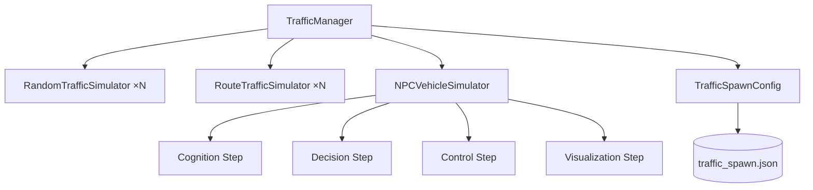
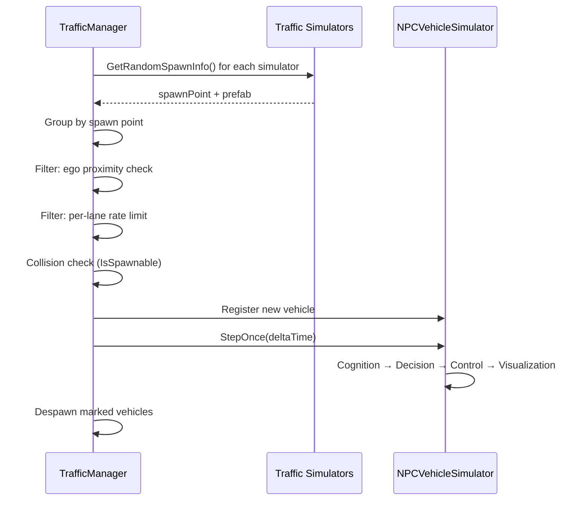
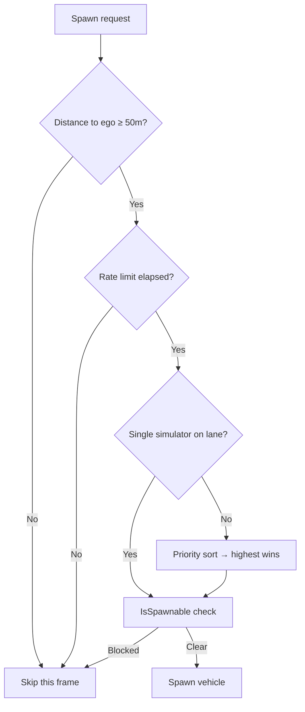
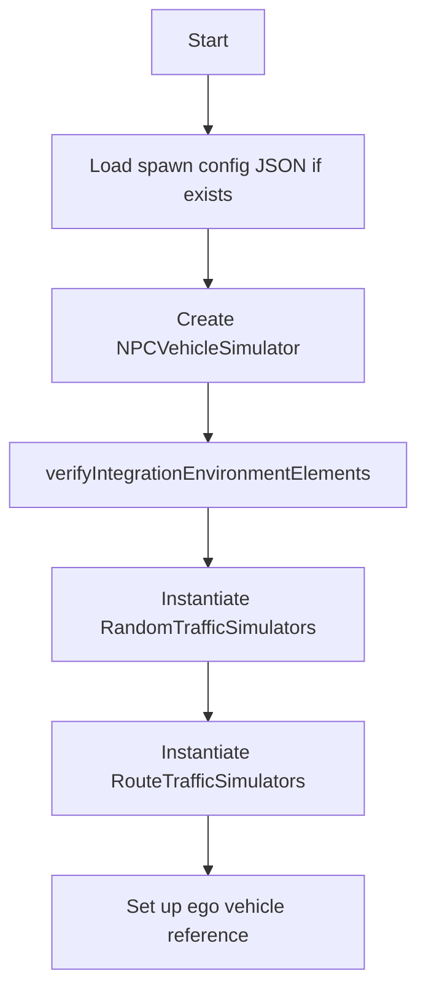

# Traffic Manager System

!!! info "Overview"
    The **Traffic Manager** is the central orchestrator for all NPC vehicle simulation. It manages multiple traffic simulators, controls spawn rate and density, enforces ego-vehicle safety distances, and handles the full lifecycle of NPC vehicles — from instantiation to despawn.

---

## Core Architecture



### System Components

=== "Traffic Simulators"

    The manager supports two simulator types running simultaneously:

    - **RandomTrafficSimulator** — spawns vehicles randomly across a set of lanes, with optional per-lane rates and branch weights. See [Random Traffic](../Traffic/index.md).
    - **RouteTrafficSimulator** — spawns vehicles that follow a fixed multi-lane route.

    Both implement `ITrafficSimulator`, giving the manager a uniform interface for spawn requests.

=== "NPC Vehicle Simulator"

    The core physics engine that steps all active NPC vehicles each `FixedUpdate`:

    ```mermaid
    graph LR
        A[Cognition] --> B[Decision]
        B --> C[Control]
        C --> D[Visualization]
    ```

    The pipeline runs burst-compiled parallel jobs for the cognition step, enabling real-time simulation of 40+ vehicles.

=== "TrafficSpawnConfig"

    A static configuration layer loaded from `Assets/Configs/traffic_spawn.json`. It provides per-lane spawn rates and weighted branch probabilities to both `TrafficManager` and the lane-change logic. See [TrafficSpawnConfig](../TrafficSpawnConfig/index.md).

---

## Inspector Reference

### NPC Vehicle Settings

| Field | Default | Description |
|---|---|---|
| `vehicleConfig` | See below | Motion parameters for all NPC vehicles |
| `vehicleLayerMask` | — | Layer for vehicle-to-vehicle raycasting |
| `groundLayerMask` | — | Layer for ground-following raycasts |
| `maxVehicleCount` | 40 | Maximum simultaneous NPC vehicles |
| `spawnDistanceToEgo` | 50 m | Minimum distance from ego vehicle to any spawn point |
| `egoVehicle` | — | Reference to the ego. If unset, a dummy is created automatically. |

### Spawn Config

| Field | Default | Description |
|---|---|---|
| `spawnConfigPath` | `Assets/Configs/traffic_spawn.json` | Path to load/save spawn rates and branch weights |

### Debug

| Field | Description |
|---|---|
| `showGizmos` | Master toggle for all debug gizmos |
| `showYieldingPhase` | Visualise intersection yield states |
| `showObstacleChecking` | Visualise obstacle detection rays |
| `showSpawnPoints` | Draw cyan cubes at all spawn lane starts |

---

## NPCVehicleConfig Parameters

| Parameter | Default | Description |
|---|---|---|
| `Acceleration` | 3 m/s² | Normal forward acceleration |
| `Deceleration` | 2 m/s² | Gentle braking |
| `SuddenDeceleration` | 4 m/s² | Obstacle braking |
| `AbsoluteDeceleration` | 20 m/s² | Physics-limit emergency braking |
| `SpeedLimitSource` | `FixedSpeedLimit` | `LaneletSpeedLimit` or `FixedSpeedLimit` |
| `FixedSpeedLimit` | 13.89 m/s (50 km/h) | Used when source is Fixed |

---

## Spawn Configuration (JSON)

`TrafficManager` can save and load a JSON file that controls per-lane spawn rates and branch weights. This makes it easy to tune traffic density without reopening the Unity Editor.

### Context Menu Actions

Right-click on the `TrafficManager` component in the Inspector:

- **Save Spawn Config JSON** — writes current rates/weights from all simulators to the JSON file.
- **Load Spawn Config JSON** — reads the JSON file and applies it to all simulators.

The config is also loaded automatically at scene start if the file exists.

### JSON Format

```json
{
  "spawnRates": [
    { "lane": "Lane_A1", "spawnsPerMinute": 6.0 },
    { "lane": "Lane_B2", "spawnsPerMinute": 3.5 }
  ],
  "branchWeights": [
    {
      "fromLane": "Lane_A1",
      "next": [
        { "lane": "Lane_B1", "weight": 2.0 },
        { "lane": "Lane_B2", "weight": 1.0 }
      ]
    }
  ]
}
```

- Lane names are **case-insensitive**.
- `spawnsPerMinute = 0` disables rate limiting for that lane.
- Weights are normalised automatically; only ratios matter.

### Per-Lane Rate Limiting

When a spawn rate is set for a lane, `TrafficManager` tracks the last spawn time per lane and skips spawn attempts until the interval has elapsed:

$$
\text{interval (s)} = \frac{60}{\text{spawnsPerMinute}}
$$

---

## RemoveVehiclesInRadius

The Teleporter calls this method before moving the ego vehicle to its new spawn position. All NPC vehicles within `radius` metres of `center` are marked for despawn and removed on the next `FixedUpdate`.

```csharp
// By world position
int count = trafficManager.RemoveVehiclesInRadius(position, radius);

// By transform
int count = trafficManager.RemoveVehiclesInRadius(transform, radius);
```

Returns the number of vehicles removed.

---

## Simulation Pipeline

### Fixed Update Cycle



### Spawn Decision Logic



---

## NPC Vehicle Simulation Pipeline

### Step 1 — Cognition

Runs as burst-compiled parallel jobs. Each vehicle gathers:

- Ground existence (vehicle must be above valid surface)
- Next lane and waypoint
- Traffic light state and passability
- Right-of-way at intersections
- Curve detection (upcoming sharp turns → reduce speed)
- Front obstacle distance

### Step 2 — Decision

Determines each vehicle's immediate action:

| Speed Mode | Trigger |
|---|---|
| `NORMAL` | Open road, green light |
| `SLOW` | Approaching curve or distant obstacle |
| `STOP` | Red light, pedestrian crossing, intersection yield |
| `SUDDEN_STOP` | Close obstacle, blocked crossing |
| `ABSOLUTE_STOP` | Emergency physics limit |

The decision step also checks `ZebraCrossingArea.TryGetBlockedStop()` to yield to pedestrians at crosswalks. See [Zebra Crossing](../ZebraCrossing/index.md).

### Step 3 — Control

Updates vehicle kinematics:

- Speed adjusted toward target via acceleration/deceleration ramp
- Steering computed from angle to next waypoint
- Position and rotation applied to the Unity transform

### Step 4 — Visualization

- Applies computed transform to the NPC GameObject
- Updates turn signal state based on upcoming lane

---

## Traffic Light Integration

Follows the Vienna Convention:

| State | NPC Behaviour |
|---|---|
| 🟢 Green | Proceed normally |
| 🟡 Yellow | Stop if distance allows; otherwise commit |
| 🔴 Red | Stop at stop line |

Yellow light decision:

```
if distance_to_light < sudden_stop_distance:
    commit (cannot stop safely)
else:
    stop
```

---

## Intersection Right-of-Way

NPC vehicles use a yield phase system at intersections:

| Phase | Meaning |
|---|---|
| `ENTERING_INTERSECTION` | Evaluating whether to yield |
| `LEFT_HAND_RULE_ENTERING` | Yielding to right-hand traffic |
| `LANES_RULES_ENTERING` | Yielding based on configured lane priorities |
| `INTERSECTION_BLOCKED` | Waiting because cross traffic is present |
| `FORCING_PRIORITY` | Override to break a deadlock |

---

## Lifecycle Management

### Initialization (`Start`)



### Restart

```csharp
trafficManager.Restart(newMaxVehicleCount: 20);
```

Disposes all current state, re-runs initialization with the new parameters.

### Destroy

On `OnDestroy`, the manager calls `TrafficSpawnConfig.ExportBranchDecisionCsv()` to write the full branch decision statistics to `Assets/Configs/traffic_branch_decisions.csv`. See [TrafficSpawnConfig](../TrafficSpawnConfig/index.md) for the CSV format.

---

## Scene Setup Checklist

!!! check "Required before Play"
    - [ ] A GameObject named **`TrafficLanes`** exists in the scene.
    - [ ] All `TrafficLane` child objects have **unique names**.
    - [ ] At least one `TrafficLane` has **`intersectionLane = true`**.
    - [ ] `TrafficManager.vehicleLayerMask` and `groundLayerMask` are assigned.
    - [ ] At least one `RandomTrafficSimulatorConfiguration` entry is configured.

These are validated at startup. Errors appear in the Console with descriptive messages.

---

## Extensibility

Custom simulators can be added at runtime via:

```csharp
trafficManager.AddTrafficSimulator(new MyCustomSimulator(...));
```

Any class implementing `ITrafficSimulator` integrates automatically with the priority system and spawn loop.
