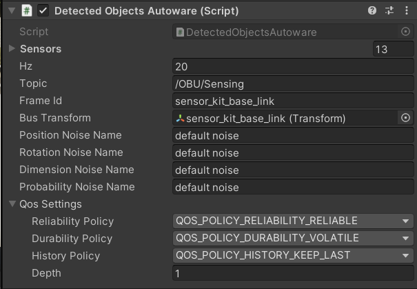

# Adding New Vehicle 

Firstly setup the vehicle based of tutorial of AWSIM ([ Awsim Link ](https://tier4.github.io/AWSIM/Components/Vehicle/EgoVehicle/
))

1. Create an empty object under the sensorkit_base_link or Any other objects which have responsible for sensors data name the object as "perception_sensor"

2. Add "Detected Object Autoware" to 

