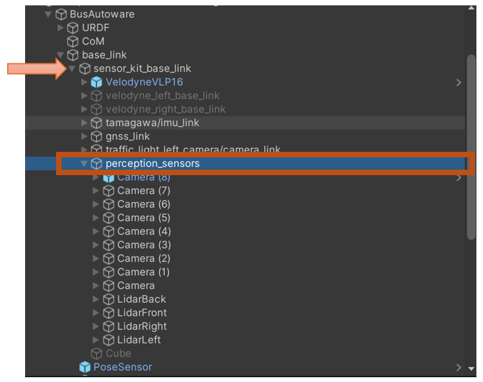
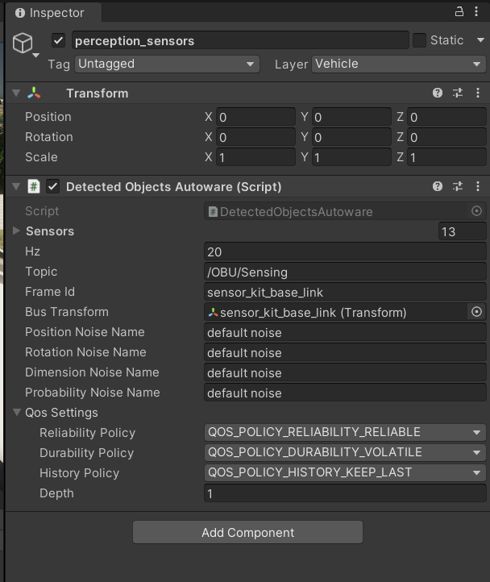
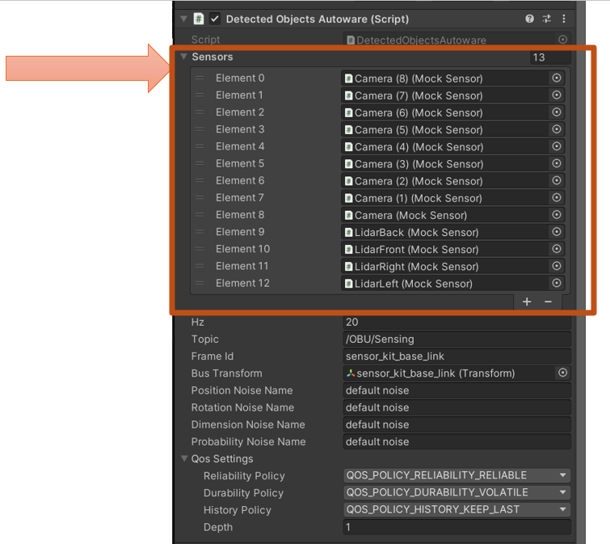
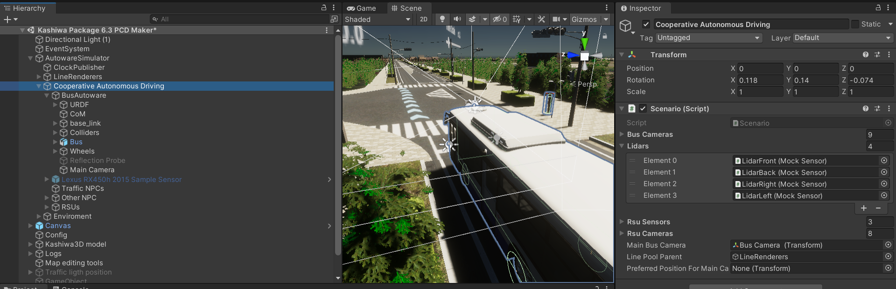

# Adding New Vehicle 

Firstly, set up the vehicle based on the tutorial from AWSIM ([ Awsim Link ](https://tier4.github.io/AWSIM/Components/Vehicle/EgoVehicle/
))

1. Create an empty object under the "sensorkit_base_link"" or any other object responsible for sensor data. Name the object "perception_sensor".

  

<!--  -->

2. Add "Detected Object Autoware" to the "perception_sensor".

  

<!--  -->

3. Under the "perception_sensor" object, you can add mock sensors in two ways::

    1. Create them from scratch based on our documentation [ link ](./../../PseudoSensors/PseudoSensors/index.md) 
    2. Use the prefabs inside the `Assets\KashiwaPackage\Prefabs\Pseudo Sensors`
)

4. You must add a reference to your sensor in the list of sensors within the "Detected Objects Autoware" component.

  

5. You are also required to add a reference to your sensors in the scenario component as shown in the picture. Be careful when selecting the correct list; you must choose the appropriate list and drag and drop the sensor onto it.

  

