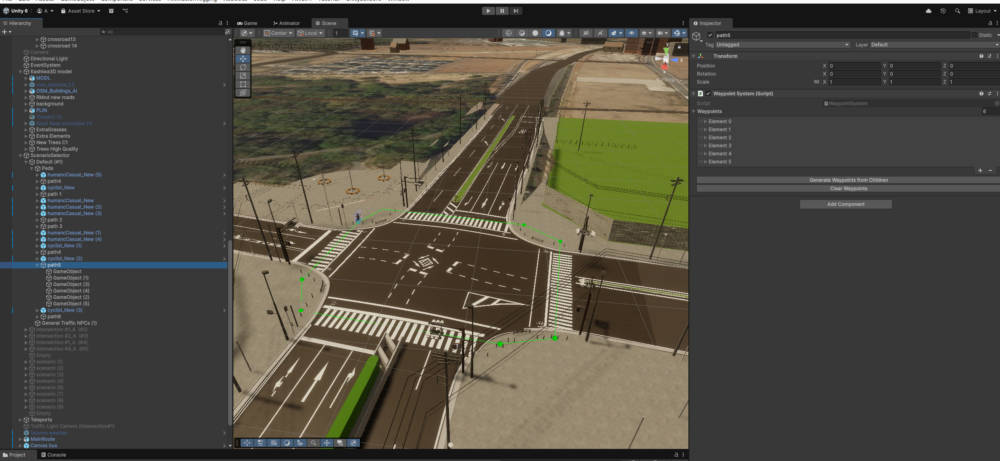
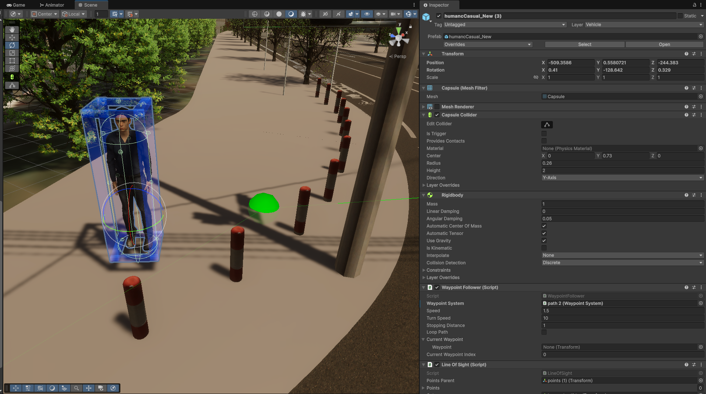
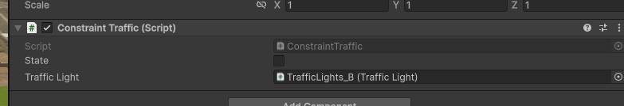

# Waypoint System

This system is designed to control the behavior of pedestrians and cyclists on pavements. It relies on two critical components: `WaypointSystem` and `WaypointFollower`. As expected, the `WaypointFollower` component should be attached to movable objects—such as pedestrians and cyclists—so they can follow the path defined by the `WaypointSystem`.

## `WaypointSystem`

This component should be added to a parent object. The path points must be set as child objects of this parent. Once configured, two buttons appear below the component: `Clear` and `Generate`.

It is generally recommended to press `Clear Waypoints` before performing any other actions. Then, click `Generate Waypoints from Children` to create a list of the child elements in order. If `Gizmos` are enabled, the path will be displayed as a green line in the Scene view.

  
  
Green line in the Scene view and `WaypointSystem` on the right side.

## `WaypointFollowers`

By adding the `WaypointFollowers` component, pedestrians will follow the path sequence previously defined in the `WaypointSystem`.

As shown in the image below, the `waypoint` variable specifies which path the object should follow. This assignment must be done manually in the Inspector.

  
  
List of pedestrian components

## `IConstraintWayPoint`

`IConstraintWayPoint` is an interface that must implement the `CheckState` function. This function handles logic such as stopping for red lights and will support additional features in the future for specific sections of the path.

As a rule of thumb, characters evaluate constraints precisely when they reach the corresponding vertex in the path. Therefore, any constraint related to traffic lights should be placed just before the street crossing point.

  
  
This constraint checks the traffic light for pedestrians.

