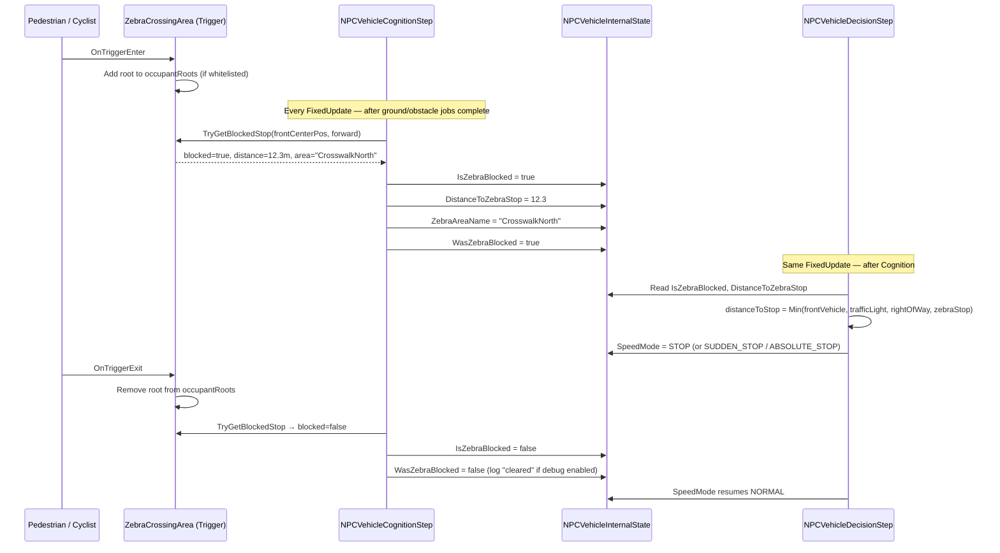

# Zebra Crossing System

## Overview

The Zebra Crossing system makes NPC vehicles automatically yield to pedestrians and cyclists at crosswalks. It consists of two components:

- **`ZebraCrossingArea`** — attached to an individual crosswalk trigger. Detects occupants and exposes a static query API for NPC vehicles.
- **`ZebraCrossingConfig`** — optional parent component. Defines a shared whitelist of occupant types for all child `ZebraCrossingArea` objects.

---

## How It Works

### Full Interaction Pipeline



### Where the Code Lives

| Code location | What it does |
|---|---|
| `ZebraCrossingArea.OnTriggerEnter/Exit` | Maintains the set of current occupants |
| `NPCVehicleCognitionStep.UpdateZebraCrossingAwareness()` | Queries every active area for every NPC vehicle each FixedUpdate |
| `NPCVehicleInternalState` fields | Stores the result between Cognition and Decision steps |
| `NPCVehicleDecisionStep.UpdateSpeedMode()` | Includes `DistanceToZebraStop` in the minimum stop distance calculation |

### NPC Vehicle State Fields

These fields are written by the Cognition step and read by the Decision step each frame:

| Field | Type | Description |
|---|---|---|
| `IsZebraBlocked` | `bool` | True when a blocked crossing is detected ahead |
| `DistanceToZebraStop` | `float` | Distance to the stop point (metres), `float.MaxValue` if not blocked |
| `ZebraAreaName` | `string` | Name of the matched `ZebraCrossingArea` (for debug logging) |
| `WasZebraBlocked` | `bool` | Previous frame's value — used to detect the cleared transition |

### How the Stop Distance Is Used

In `NPCVehicleDecisionStep`, the zebra stop distance competes with all other stop conditions:

```csharp
var distanceToStopPointByZebra = state.IsZebraBlocked
    ? state.DistanceToZebraStop
    : float.MaxValue;

var distanceToStopPoint = Mathf.Min(
    distanceToStopPointByFrontVehicle,
    distanceToStopPointByTrafficLight,
    distanceToStopPointByRightOfWay,
    distanceToStopPointByZebra        // ← zebra crossing
);
```

The resulting `distanceToStopPoint` then determines the speed mode:

| Condition | Speed Mode |
|---|---|
| `distance ≤ absoluteStopDistance` | `ABSOLUTE_STOP` |
| `distance ≤ suddenStopDistance` | `SUDDEN_STOP` |
| `distance ≤ stopDistance` | `STOP` |
| `distance ≤ slowDownDistance` | `SLOW` |
| otherwise | `NORMAL` |

Where the distances depend on current speed and the deceleration values in `NPCVehicleConfig`:

$$
d_\text{stoppable} = \frac{v^2}{2 \cdot a}
$$

So a faster NPC vehicle needs more distance to stop and may enter `SUDDEN_STOP` or `ABSOLUTE_STOP` if the crossing is detected late.

---

## ZebraCrossingArea

### Setup

1. Create an empty GameObject positioned over the crosswalk.
2. Add a **Collider** component and enable **Is Trigger**.
3. Scale the collider to cover the full crossing surface.
4. Attach the **ZebraCrossingArea** script.
5. Assign a **Stop Point** transform — place this just before the stop line where vehicles should halt.

### Occupant Detection

The area automatically identifies the following types:

| Type | Detection method |
|---|---|
| `NPCPedestrian` | `GetComponentInParent<NPCPedestrian>()` |
| `SimpleCyclistMovement` | Component name search in parent hierarchy |
| `BicycleMoveRotate` | Component name search in parent hierarchy |
| `ClearWaypointFollower` | Component name search in parent hierarchy |
| `WaypointFollower` | Component name search in parent hierarchy |

The occupant's **root transform** is stored (not the collider's transform), so compound colliders on a single character count as one occupant.

### Whitelist Filtering

If a `ZebraCrossingConfig` parent is present with non-empty lists, only occupants matching the whitelist are counted:

- **`allowedPrefabs`** — matched by normalized name (removes `(Clone)` suffix).
- **`allowedRootNameSubstrings`** — matched by case-insensitive substring of the root name.

If both lists are empty, all detected types are allowed.

### Inspector Fields

| Field | Default | Description |
|---|---|---|
| `stopPoint` | This object | Transform where vehicles should stop. Defaults to the area's own position if unset. |
| `maxDetectionDistance` | 40 m | How far ahead a vehicle will look for this crossing |
| `forwardAngleTolerance` | 80° | Angular cone (half-angle) in front of vehicle for detection |
| `stopBuffer` | 1.5 m | Extra gap kept between the vehicle and the stop point |
| `enableDebugLogs` | false | Log occupancy changes and stop decisions to the Console |

### Static Query API

NPC vehicles call this once per `FixedUpdate` during the decision step:

```csharp
bool blocked = ZebraCrossingArea.TryGetBlockedStop(
    vehiclePosition,   // vehicle's world position
    vehicleForward,    // vehicle's forward direction (Y is ignored)
    out float distance,           // distance to the stop point (minus buffer)
    out ZebraCrossingArea area    // the matched area, or null
);
```

The method checks all active, occupied `ZebraCrossingArea` instances and returns the closest one that:

1. Is within `maxDetectionDistance`
2. Falls within the `forwardAngleTolerance` cone in front of the vehicle

If `blocked == true`, the NPC sets its speed mode to `STOP` and uses `distance` as the stopping distance.

### Gizmo Visualization

When the GameObject is selected in the Scene view:

- **Green wireframe** — crossing is clear (no occupants)
- **Red wireframe** — crossing is occupied
- **Cyan sphere** — stop point position

Enable `enableDebugLogs` to see occupant enter/exit events in the Console, plus two extra NPC-level log messages per crossing event:

```
[NPC Zebra] Vehicle 'Bus_01' stopping for zebra 'CrosswalkNorth' at ~12.3m.
[NPC Zebra] Vehicle 'Bus_01' cleared zebra 'CrosswalkNorth'.
```

The first message fires the first frame an NPC detects the blocking state (`WasZebraBlocked` transition `false → true`). The second fires when the crossing clears (`true → false`).

---

## ZebraCrossingConfig

### Purpose

Place this component on a **parent GameObject** that groups multiple `ZebraCrossingArea` children. All child areas inherit its whitelist settings.

```
ZebraCrossingConfig (parent)
├── ZebraCrossingArea (north crosswalk)
├── ZebraCrossingArea (south crosswalk)
└── ZebraCrossingArea (east crosswalk)
```

### Fields

| Field | Description |
|---|---|
| `allowedPrefabs` | Only occupants whose root name matches one of these prefab names are counted |
| `allowedRootNameSubstrings` | Only occupants whose root name contains one of these strings (case-insensitive) are counted |

### Examples

```
allowedRootNameSubstrings: ["Human", "Cyclist", "Pedestrian"]
```

This ensures that vehicles that enter the trigger zone accidentally (e.g., due to overlapping colliders) are not counted as occupants.

---

## Complete Setup Example

```
Intersection (GameObject)
└── ZebraCrossingConfig
    ├── allowedRootNameSubstrings: ["Human", "Bicycle"]
    │
    ├── CrosswalkNorth (GameObject)
    │   ├── BoxCollider [Is Trigger = true]
    │   ├── ZebraCrossingArea
    │   │   └── stopPoint → StopLineNorth (Transform)
    │   └── StopLineNorth (child Transform)
    │
    └── CrosswalkEast (GameObject)
        ├── BoxCollider [Is Trigger = true]
        ├── ZebraCrossingArea
        │   └── stopPoint → StopLineEast (Transform)
        └── StopLineEast (child Transform)
```

!!! warning "Collider Must Be a Trigger"
    The `ZebraCrossingArea` script calls `Reset()` automatically to set `isTrigger = true` when first added. If you replace the collider later, make sure to re-enable the trigger flag.

!!! tip "Placement"
    Place the collider so it covers the full painted area of the crosswalk, not just the curb edge. Pedestrians need to be inside the zone for the system to work correctly.
