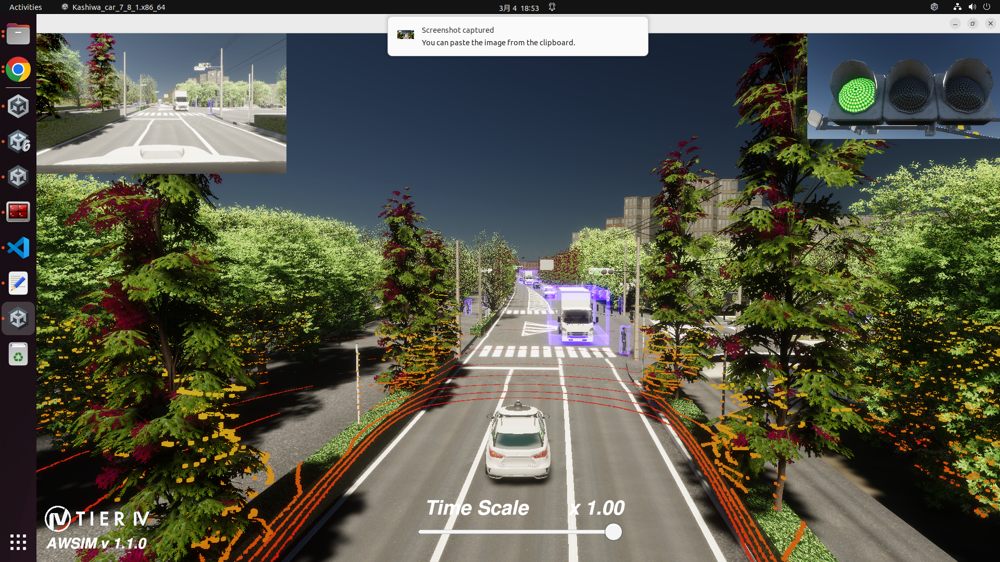
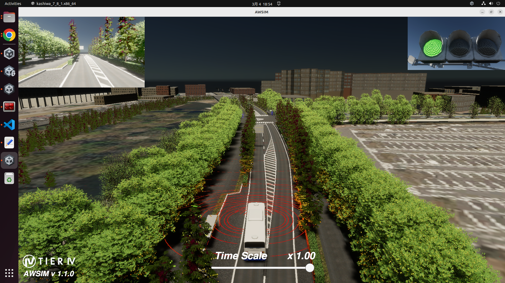
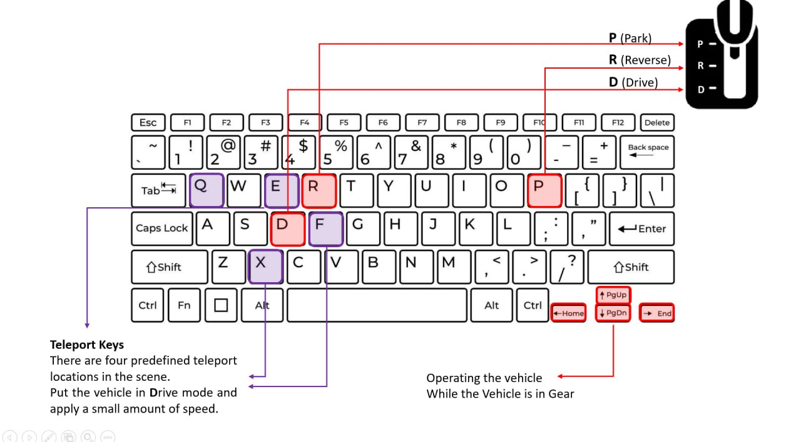
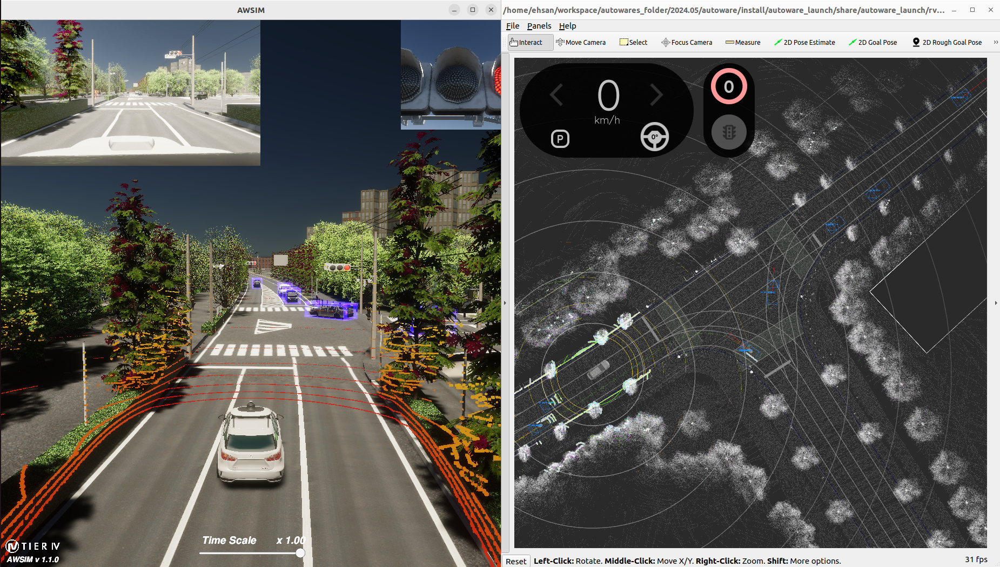
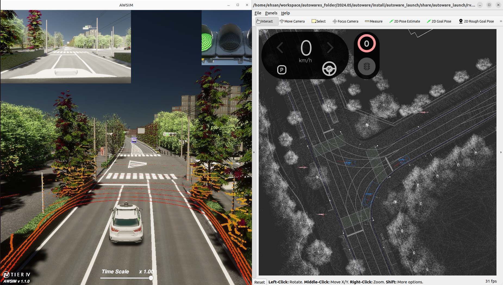

# Quick Start Demo

This section provides a quick start tutorial for the V2X_E2E_Simulator on Ubuntu. Most of this documentation is based on the <a href="https://tier4.github.io/AWSIM/GettingStarted/QuickStartDemo/">AWSIM documentation</a>.


### Demo configuration

#### **Standard Vehicle Configuration**

The simulation provided in the **V2X_E2E_Simulator** demo is configured as follows:

| **V2X_E2E_Simulator Demo Settings** | **Details** |
|:--|:--|
| **Vehicle** | Lexus RX 450h |
| **Environment** | Japan, Tokyo (Kashiwa) |
| **Sensors** | GNSS ×1 <br> IMU ×1 <br> LiDAR ×1 <br> Traffic Camera ×1 |
| **Traffic** | 5 different scenarios |
| **ROS2 Version** | Humble |

---

#### **Bus Configuration**
An alternative build is also available for the **bus simulation**:

| **V2X_E2E_Simulator Demo Settings** | **Details** |
|:--|:--|
| **Vehicle** | Bus |
| **Environment** | Japan, Tokyo (Kashiwa) |
| **Sensors** | GNSS ×1 <br> IMU ×1 <br> LiDAR ×3 <br> Traffic Camera ×1 |
| **Traffic** | 5 different scenarios |
| **ROS2 Version** | Humble |


### PC specs

Please make sure that your machine meets the following requirements in order to run the simulation correctly:

|Required PC Specs||
|:--|:--|
|OS|Ubuntu 22.04|
|CPU|6cores and 12thread or higher|
|GPU|RTX2080Ti or higher|
|Nvidia Driver (Windows)|>=472.50|
|Nvidia Driver (Ubuntu 22)|>=515.43.04|


### Localhost settings

The simulation is based on the appropriate network setting, which allows for trouble-free communication of the **V2X_E2E_Simulator** simulation with the Autoware software.
To apply required localhost settings please add the following lines to `~/.bashrc` file:

``` bash
if [ ! -e /tmp/cycloneDDS_configured ]; then
	sudo sysctl -w net.core.rmem_max=2147483647
	sudo ip link set lo multicast on
	touch /tmp/cycloneDDS_configured
fi
```

and these lines to `~/.profile` **or in either of files:** `~/.bash_profile` *or* `~/.bash_login`:

``` bash
export ROS_LOCALHOST_ONLY=1
export RMW_IMPLEMENTATION=rmw_cyclonedds_cpp
```

!!! warning
    A system restart is required for these changes to work.

## Start the demo

### Running the **V2X_E2E_Simulator** simulation demo

To run the simulator, please follow the steps below.

1. Install Nvidia GPU driver (Skip if already installed).
    1. Add Nvidia driver to apt repository
    ```
    sudo add-apt-repository ppa:graphics-drivers/ppa
    sudo apt update
    ```
    2. Install the recommended version of the driver.
    ```
    sudo ubuntu-drivers autoinstall
    ```

        !!! warning
        
            Currently, there are cases where the NVIDIA driver is incompatible, resulting in a segmentation fault. In such cases, please use the 580 version, which we have already tested.

    3. Reboot your machine to make the installed driver detected by the system.
    ```
    sudo reboot
    ```
    4. Open terminal and check if `nvidia-smi` command is available and outputs summary similar to the one presented below.
    ```
    $ nvidia-smi 
    Sat Oct 25 17:34:49 2025
    +-----------------------------------------------------------------------------+
    | NVIDIA-SMI 580.95.05    Driver Version: 580.95.05    CUDA Version: 13.0     |
    |-------------------------------+----------------------+----------------------+
    | GPU  Name        Persistence-M| Bus-Id        Disp.A | Volatile Uncorr. ECC |
    | Fan  Temp  Perf  Pwr:Usage/Cap|         Memory-Usage | GPU-Util  Compute M. |
    |                               |                      |               MIG M. |
    |===============================+======================+======================|
    |   0  NVIDIA GeForce ...  Off  | 00000000:01:00.0  On |                  N/A |
    | 37%   31C    P8    30W / 250W |    188MiB / 11264MiB |      3%      Default |
    |                               |                      |                  N/A |
    +-------------------------------+----------------------+----------------------+

    +-----------------------------------------------------------------------------+
    | Processes:                                                                  |
    |  GPU   GI   CI        PID   Type   Process name                  GPU Memory |
    |        ID   ID                                                   Usage      |
    |=============================================================================|
    |    0   N/A  N/A      1151      G   /usr/lib/xorg/Xorg                133MiB |
    |    0   N/A  N/A      1470      G   /usr/bin/gnome-shell               45MiB |
    +-----------------------------------------------------------------------------+
    ```

2. Install Vulkan Graphics Library (Skip if already installed).
    1. Update the environment.
    ```
    sudo apt update
    ```
    2. Install the library.
    ```
    sudo apt install libvulkan1
    ```

3. Download and Run **V2X_E2E_Simulator** Demo binary.

    1. Download the desired build (Bus or lexus).

        [Download V2X_E2E_Simulator Demo for Bus ubuntu](https://drive.google.com/file/d/1QbQizozZh1kLVYYlNSFUGBXGt8CajAbM/view?usp=drive_link){.md-button .md-button--primary}

        [Download V2X_E2E_Simulator Demo for Lexus ubuntu](https://drive.google.com/file/d/1q4WkCwwlp-LZb3iQLhD1qAB0R6S9IKbU/view?usp=drive_link){.md-button .md-button--primary}
    
    2. Unzip the downloaded file.

    3. Make the `*.x86_64` file executable.

        Rightclick the `*.x86_64` file and check the `Execute` checkbox

        

        or execute the command below.

        ```
        chmod +x <path to V2X folder>/{file_name}.x86_64
        ```

    4. Launch `*.x86_64`.
        ```
        ./<path to V2X folder>/{file_name}.x86_64
        ``` 
        
        !!! warning
        
            It may take some time for the application to start the so please wait until image similar to the one presented below is visible in your application window.

        


### Simulation Environment Images

#### **Lexus Simulation in E2E V2X Simulator**
  
*Figure: Lexus vehicle in the simulation environment.*

#### **Bus Simulation in E2E V2X Simulator**
  
*Figure: Bus vehicle in the simulation environment.*


### Controlling Features

Without using **Autoware**, you can manually control the cars to create your desired scenario.

#### **1. Basic Controls**  
- **D** (Drive) → Press to enable driving mode.  
- **P** (Park) → Press to stop the vehicle.  
- **R** (Reverse) → Press to drive in reverse mode.  

#### **2. Driving Controls**  
- After pressing **D** (Drive), use the **arrow keys** to move around the city.  

#### **3. Teleport Feature**  
- There are **four predefined teleport locations** in the scene.  
- The car can teleport **only when in Drive mode** and must have **at least a small amount of speed**.  
- Use the following keys to teleport to different locations on the map:  
  - **Q**, **E**, **F**, **X** → Teleport to four different places in the city.  
#### **4. Manual Object Creation**
- Use button **O** to spawn cars in scenarios where this feature is available

  
*Figure: Defualt keys for extra functionalities*


### RSU Section

You can retrieve **RSU (Roadside Unit) data** and drive the car **without using Autoware**.  

#### **RSU Data Visualization in Rviz**
To visualize RSU data, you need **Rviz** with support for custom message visualization.  

- If you **already have an Rviz configuration** that supports custom messages, you can use it directly.  
- If you **do not have the required Rviz configuration**, install **Autoware** and use its **default Rviz settings** for proper visualization.  

#### **RSU Data Visualization in Rviz (Autoware)**
The following images illustrate how **RSU data** appears in Rviz (Autoware):

##### **RSU Data - When the Car is Present**
  
*Figure: RSU data visualization when the car is close to the crossroad.*

##### **RSU Data - When the Car is Absent**
  
*Figure: RSU data visualization when the car is not present at the crossroad.*


---
## Topic List

In **V2X_E2E_Simulator version 7.8.1**, the following topics are published.

Some topics are **AWSIM default topics**, which you can check in the [AWSIM documentation](https://tier4.github.io/AWSIM/Components/ROS2/ROS2TopicAndServiceList/).

---

### **1. Objects Sensed by Bus Onboard Perception Sensors**
These objects are detected by the **Bus pseudo sensor**, which consists of a **4-LiDAR setup** and **more than 10 cameras**.

- **Published Topic:**  
  - `/OBU/Sensing`

---

### **2. NetSim-Compatible Topics**
These topics represent **all detected objects at each intersection** and are used as **input for NetSim**.

The message type **`CooperativeObjectsMessage`** comes from `autoware_auto_perception_msgs.msg`, which is a compatible type with **Autoware**. In the Autoware architecture, this message is typically created by one of the internal nodes. However, in our simulation, we replicate the detection algorithm and send this message directly from the simulator. 

Therefore, if we use this feature, we can ignore or disable the camera responsible for generating the corresponding message. Our policy for using this message is **hybrid**—it can be used either in combination with other real sensors or as a standalone pseudo sensor.


| **Topic Name** | **Intersection** |
|:--|:--|
| `/v2x/rsu1/net_sim` | Ganken Intersection |
| `/v2x/rsu2/net_sim` | Kakeiken Intersection |
| `/v2x/rsu3/net_sim` | Daisan Kidoutai |
| `/v2x/rsu4/net_sim` | Wakashiba Intersection |

---

### **3. Autoware-Compatible Topics**
These topics are **used as direct inputs to Autoware** for testing.
The message type **`PredictedObjects`** comes from `autoware_auto_perception_msgs.msg`, which is a default message type of **Autoware** and **AWSIM**.

| **Topic Name** | **Intersection** |
|:--|:--|
| `/v2x/rsu1/predicted_object` | Ganken Intersection |
| `/v2x/rsu2/predicted_object` | Kakeiken Intersection |
| `/v2x/rsu3/predicted_object` | Daisan Kidoutai |
| `/v2x/rsu4/predicted_object` | Wakashiba Intersection |

---

### **4. Cool4 DM Format Topics**
These topics provide **the same detected objects in Cool4 DM format**.  
(**Currently, only Intersection 1 and 2 have DM-compatible RSUs**).
The message type **`ObjectInfoArray`** comes from `dm_object_info_msgs.msg`. This message is not compatible with **Autoware** and was created to work with  the **DM protocol**.


| **Topic Name** | **Intersection** |
|:--|:--|
| `/v2x/object_info_1` | Ganken Intersection |
| `/v2x/object_info_1_noise` | Ganken Intersection (with noise) |
| `/v2x/object_info_2` | Kakeiken Intersection |
| `/v2x/object_info_2_noise` | Kakeiken Intersection (with noise) |


### **5. DM Format Topics for Intersection #2 in Kashiwa**
For **Intersection #2 in Kashiwa**, detected objects from **each sensor** are also published in **DM format**.  
The **rsu number** and **sensor number** help distinguish different sensors.  
- `/object_info` → Detected objects **without noise**  
- `/object_info_noise` → Detected objects **with noise**  
- `/object_info_noise/Cellular` → Detected objects **with noise and delay based on network types**

#### **Published Topics:**
```plaintext
/v2x/rsu12020002/sensor1/object_info
/v2x/rsu12020002/sensor1/object_info_noise
/v2x/rsu12020002/sensor1/object_info_noise/Cellular
/v2x/rsu12020002/sensor1/object_info_noise/DSRC
/v2x/rsu12020002/sensor2/object_info
/v2x/rsu12020002/sensor2/object_info_noise
/v2x/rsu12020002/sensor2/object_info_noise/Cellular
/v2x/rsu12020002/sensor2/object_info_noise/DSRC
/v2x/rsu12020002/sensor3/object_info
/v2x/rsu12020002/sensor3/object_info_noise
/v2x/rsu12020002/sensor3/object_info_noise/Cellular
/v2x/rsu12020002/sensor3/object_info_noise/DSRC
/v2x/rsu12020002/sensor4/object_info
/v2x/rsu12020002/sensor4/object_info_noise
/v2x/rsu12020002/sensor4/object_info_noise/Cellular
/v2x/rsu12020002/sensor4/object_info_noise/DSRC
/v2x/rsu12020002/sensor5/object_info
/v2x/rsu12020002/sensor5/object_info_noise
/v2x/rsu12020002/sensor5/object_info_noise/Cellular
/v2x/rsu12020002/sensor5/object_info_noise/DSRC
/v2x/rsu12020003/sensor1/object_info
/v2x/rsu12020003/sensor1/object_info_noise
/v2x/rsu12020003/sensor1/object_info_noise/Cellular
/v2x/rsu12020003/sensor1/object_info_noise/DSRC
/v2x/rsu12020003/sensor2/object_info
/v2x/rsu12020003/sensor2/object_info_noise
/v2x/rsu12020003/sensor2/object_info_noise/Cellular
/v2x/rsu12020003/sensor2/object_info_noise/DSRC
/v2x/rsu12020003/sensor3/object_info
/v2x/rsu12020003/sensor3/object_info_noise
/v2x/rsu12020003/sensor3/object_info_noise/Cellular
/v2x/rsu12020003/sensor3/object_info_noise/DSRC
/v2x/rsu12020003/sensor4/object_info
/v2x/rsu12020003/sensor4/object_info_noise
/v2x/rsu12020003/sensor4/object_info_noise/Cellular
/v2x/rsu12020003/sensor4/object_info_noise/DSRC
/v2x/rsu12020003/sensor5/object_info
/v2x/rsu12020003/sensor5/object_info_noise
/v2x/rsu12020003/sensor5/object_info_noise/Cellular
/v2x/rsu12020003/sensor5/object_info_noise/DSRC

```


---

### **6. Ground Truth Topics**
These topics publish the **ground truth** of **all objects** in the intersection.

- `/v2x/rsu_all/object_info_groundtruth`
- `/v2x/rsu_all/object_info_groundtruth_noise`
- `/v2x/rsu_all/object_info_groundtruth_noise/Cellular`
- `/v2x/rsu_all/object_info_groundtruth_noise/DSRC`

---

### **7. V2X Traffic Signal Information for Autoware**
- **Published Topic:**  
  - `/v2x/traffic_signals` 
  - `/v2x/rsu1/traffic_signals`
  - `/v2x/rsu2/traffic_signals`
  - `/v2x/rsu3/traffic_signals`
  - `/v2x/rsu4/traffic_signals`


## Scenarios

There are **five scenarios** available in **V2X_E2E_Simulator version 7.8.2**.  
You can select a scenario using the **number keys (1-5) on the main keyboard**.  
(**Note:** The **numpad keys do not work** for scenario selection.)


### **Available Scenarios**
- (1):**Normal Traffic** – City traffic with **pedestrians and cyclists**.
- (2)**Empty City** – No traffic or humans.  
   . **Manual spawning** of vehicles is available using the **O key** at **Intersection #1**.  
   . A **return gate** is placed along the way.
- (3)**Manual Traffic with Pedestrians & Cyclists**  
   . **Manual vehicle spawning** is available.  
   . **Pedestrians and cyclists** are present.  
   . A **return gate** is located in **Intersection #2**.
- (4)**Standard City Traffic**  
   . Normal **traffic, pedestrians, and cyclists**.  
   . A **return gate** is placed in **Intersection #1**.
- (5)**High Pedestrian Density**  
   . Extra **pedestrians** are present in **Intersection #4**.


## Steps to Lunch Autoware

1. **Download and Extract Map Files**  
   Download the `map files (pcd, osm)` and unzip them.

   [Download Map Files (pcd, osm)](https://drive.google.com/file/d/1sPpqLBxyWCifsDPViqgYgX3b91Fwh6JK/view?usp=drive_link){.md-button .md-button--primary}

2. **Ensure Compatibility with Autoware**  
   This version of the **E2E V2X Simulator** is compatible with **Autoware version 2024.05**.  
   Check this link for **Autoware 2024.05**: [Autoware 2024.05 Release](https://github.com/autowarefoundation/autoware/releases/tag/2024.05).

3. **Modify Parameters for Bus Autoware**  
   To work with **Bus Autoware**, you need to modify the vehicle parameters and sensor setup.  
   By default, the parameters are set for the **Lexus**, but you need to add the **bus configuration** separately.

4. **Download and Configure Bus-Specific Files**  
   In order to work with **Bus Autoware**, you need to download the bus vehicle parameters and the bus sensor kit setup.

   - **Bus Vehicle Parameters**: 
    [Download Bus Vehicle Parameters](https://drive.google.com/file/d/1x_ro7XKXHiObi-Tiy-BKj4Z2xExc8vSw/view?usp=drive_link){.md-button .md-button--primary}


   - **Bus Sensor Kit**:
   [Download Bus Sensor Kit](https://drive.google.com/file/d/1vJ-aszM0l5tHfYoezstcA7cOfBINmxjt/view?usp=drive_link){.md-button .md-button--primary}

   **Place the downloaded files in the following directories:**
   - `autoware/src/vehicle/sample_vehicle_launch/sample_vehicle_description/config`
   - `autoware/src/param/autoware_individual_params/individual_params/config/default/awsim_sensor_kit`


