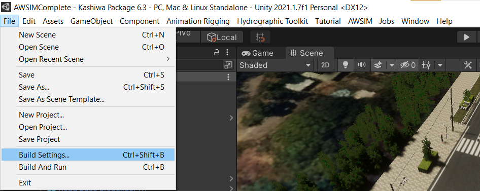

# Quick start demo

### Windows
The current Windows build version is (v6.3.1).

You can download the build version(For Windows) to use our build version.

([Download Kashiwa Windows Build  files (unitypackage)](https://drive.google.com/file/d/1hGW9C7maw9ai5W3z4EPt-zqZW9fSKdd9/view?usp=drive_link) {.md-button .md-button--primary})

Right now build version is only available for Windows system.

You can use the build version in Windows and run Autoware and NetSim in WSL (Windows Subsystem for Linux). For installing the requirements for WSL, check [System Setup Process](https://tlab-wide.github.io/V2X_E2E_Simulator/Simple-AV/SystemSetup/).

For better performance, we suggest users use the build version, but the Unity project version is more flexible in terms of manipulating different parameters. 

### Ubuntu
Currently, the build version is not available for Ubuntu. However, you can follow the instructions in **How to build** section and build your Ubuntu version. 

please check the following section **How to build**. 

# How to build 

You can use the Kashiwa unity package and import it to Unity ([Setup Unity Project](https://tlab-wide.github.io/V2X_E2E_Simulator/GettingStarted/SetupUnityProject/)), then follow the below instructions for building the Ubuntu version. 

  

**Note**: Old models currently exist in the exported scene to be used in the future if required. We recommend deleting these objects from the scene when you are building your project to achieve better performance at runtime.

  

To build your project :

1. Ensure that your changes have been saved by pressing  **Ctrl + S**.
2. Go to **File > Build Settings**.

  

3. Drag and drop your scene into the box and make sure to check the highlighted checkbox.
4. Press **Build** and choose the location to save your project.

   
## Maps required for Autoware
To use Autoware in Kashiwa, Lanelet2 and point cloud (PCD) maps of Kashiwa are required. Download them from the following link.

[Kashiwa Lanelet2 and PCD](https://drive.google.com/drive/folders/1aklZH4lyZGqQW4MeGH41F5dYixLSlVyr?usp=drive_link){.md-button .md-button--primary}

PCD of Kashiwa is made from the 3D simulation environment to match both in simulation and Autoware. 
