# Setup Unity Project

!!! info

    It is advised to checkout the [Quick Start Demo](../QuickStartDemo) tutorial before reading this section.

This page is a tutorial for setting up  V2X_E2E Simulator in Unity project.

## Environment preparation

### System setup

=== "Ubuntu 22"
    1. Make sure your machine meets the [required hardware specifications](../QuickStartDemo/#pc-specs).
        - *NOTE: PC requirements may vary depending on simulation contents which may change as the simulator develops*
    2. Prepare a desktop PC with Ubuntu 22.04 installed.
    2. Install [Nvidia drivers and Vulkan Graphics API](../QuickStartDemo).
    3. Install [git](https://git-scm.com/).
    4. Set the ROS 2 middleware and the localhost only mode in `~/.profile` (or, in `~/.bash_profile` or `~/bash_login` if either of those exists) file:
    ``` bash
    export ROS_LOCALHOST_ONLY=1
    export RMW_IMPLEMENTATION=rmw_cyclonedds_cpp
    ```

        !!! warning
            A system restart is required for these changes to work.

    4. Set the system optimizations by adding this code to the very bottom of your `~/.bashrc` file:
    ``` bash
    if [ ! -e /tmp/cycloneDDS_configured ]; then
        sudo sysctl -w net.core.rmem_max=2147483647
        sudo ip link set lo multicast on
        touch /tmp/cycloneDDS_configured
    fi
    ```

        !!! info
            As a result, each time you run the terminal (bash prompt), your OS will be configured for the best ROS 2 performance. Make sure you open your terminal at least once before running any instance of the V2X_E2E Simulator (or the Editor running the V2X_E2E Simulator).

=== "Windows"
    1. Make sure your machine meets the [required hardware specifications](../QuickStartDemo/#pc-specs).
        - *NOTE: PC requirements may vary depending on simulation contents which may change as the simulator develops*
    2. Prepare a desktop PC with Windows 10 or 11 (64 bit) installed.
    3. Install [git](https://git-scm.com/).
    4. Install [Microsoft Visual C++ Redistributable packages for Visual Studio 2015, 2017, 2019, and 2022](https://learn.microsoft.com/en-us/cpp/windows/latest-supported-vc-redist?view=msvc-170#visual-studio-2015-2017-2019-and-2022) (X64 Architecture)

### ROS 2

V2X_E2E Simulator comes with a *standalone* flavor of [`Ros2ForUnity`](../../Components/ROS2/ROS2ForUnity/index.md). This means that, to avoid internal conflicts between different ROS 2 versions, you shouldn't run the Editor or V2X_E2E Simulator binary with ROS 2 sourced.

!!! warning

    Do not run the V2X_E2E Simulator, Unity Hub, or the Editor with ROS 2 sourced.


=== "Ubuntu 22"
    - Make sure that the terminal which you are using to run Unity Hub, Editor, or V2X doesn't have ROS 2 sourced.
    - It is common to have ROS 2 sourced automatically with `~/.bashrc` or `~/.profile`. Make sure it is not obscuring your working environment:
        - Running Unity Hub from the Ubuntu GUI menu takes the environment configuration from `~/.profile`.
        - Running Unity Hub from the terminal uses the current terminal configuration from `~/.profile` and `~/.bashrc`.
        - Running Unity Editor from the UnityHub inherits the environment setup from the Unity Hub. 


!!! warning

    Currently, there are cases where the Nvidia driver version is too high, resulting in Segmentation fault. In that case, please lower the Nvidia driver version (550 is recommended.)


The easiest way to be sure about your version is by using 'Software & Updates' in Ubuntu.


=== "Windows"
    - Make sure your Windows environment variables are ROS 2 free.


### Unity installation

!!! info

    V2X_E2E Simulator's Unity version is currently **unity 6000.0.50f1**

Follow the steps below to install Unity on your machine:

1. Install **UnityHub** to manage Unity projects. Please go to [Unity download page](https://docs.unity3d.com/hub/manual/InstallHub.html) and download the DEB package link.
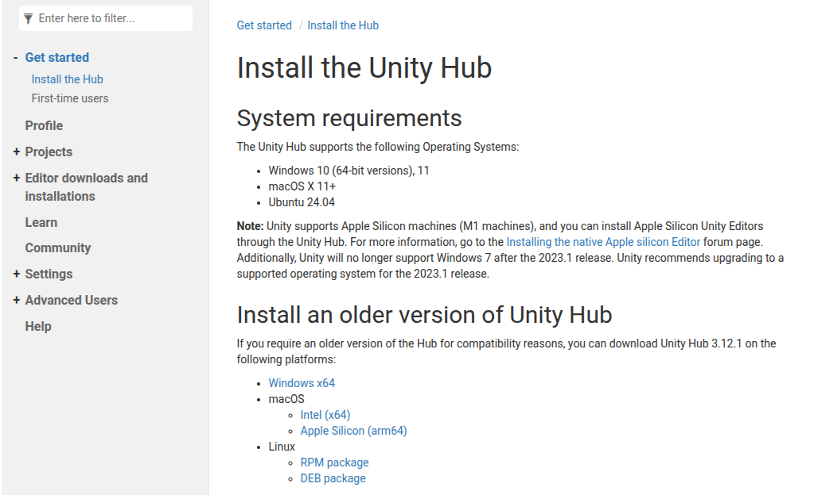

2. Install Unity 6 via UnityHub.
    - Open new terminal, navigate to directory where `UnityHub.AppImage` is download and execute the following command (or find the unityhub icon and run it):
```
./UnityHub.AppImage
```
    - Make sure you have the V2X repository cloned and ROS 2 is not sourced.
        ```
        git clone https://github.com/tlab-wide/V2X_E2E_Simulator.git
        ```
    - Now we add the project to unity hub
    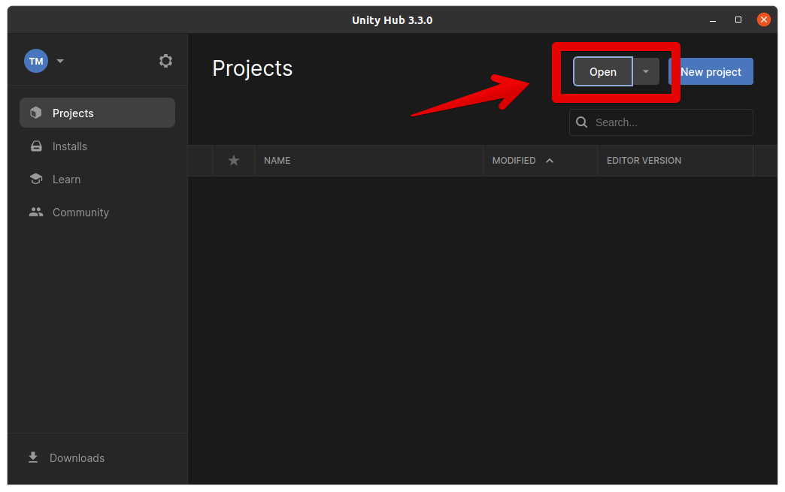
    - In this step, you have to select either 'V2X_E2E_Simulator'.
    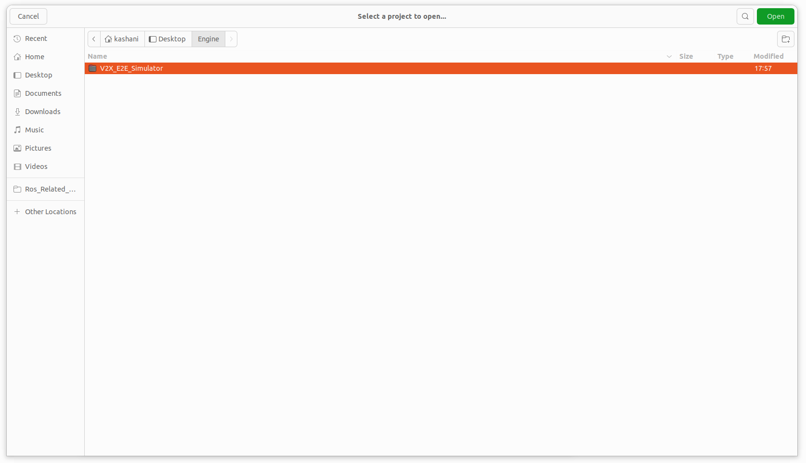

    !!! warning

        You may see a window during this step that says you need to install the Editor first. The window provides two options: Open and Cancel.
        At this stage, the Open button does not function, so select Cancel to continue instructions.

    - Then, you will see this error (if you don't already have the exact version of Unity 6).
    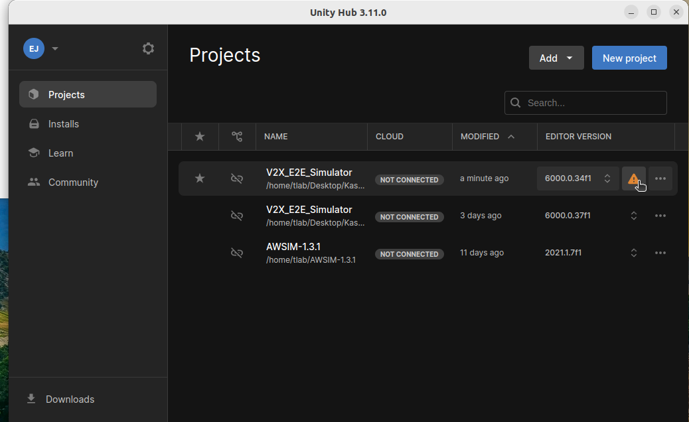
    - To fix this issue, install the correct version by clicking on the warning sign and selecting the shown version.
    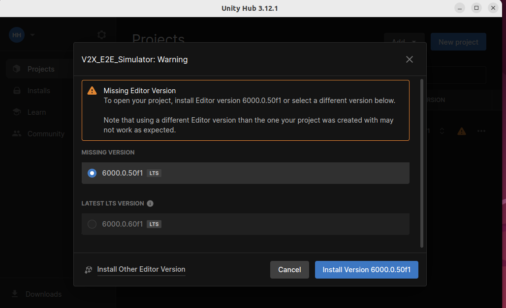
    - Only select the Linux Build Support. If you add other packages, you won't face any problems, but the installation will take longer. You can also install other packages later.
    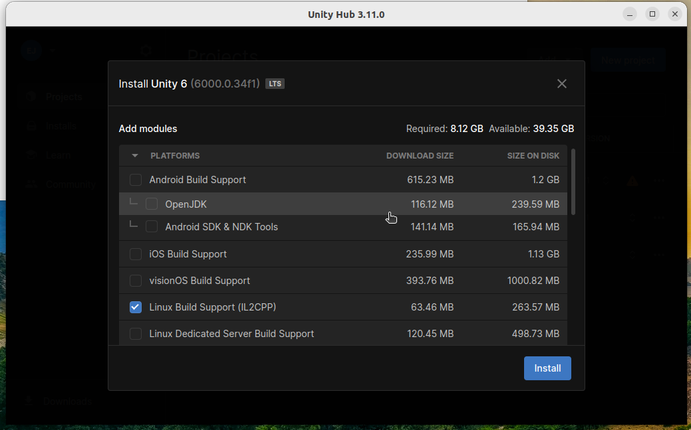
    - After successful installation the version will be available under the `Installs` tab in Unity Hub (your Unity6 can be different in minor version section).


<!-- 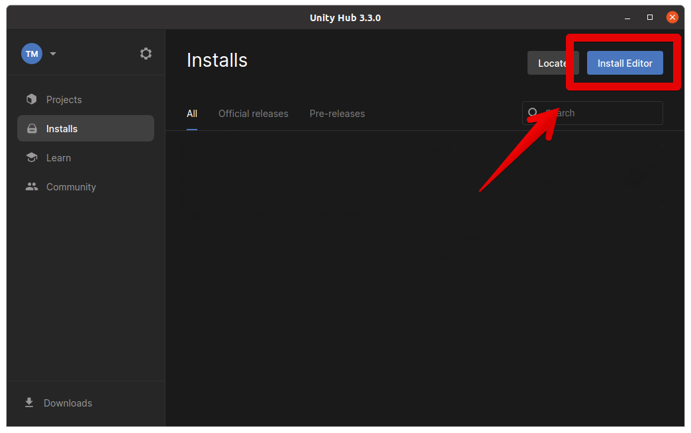
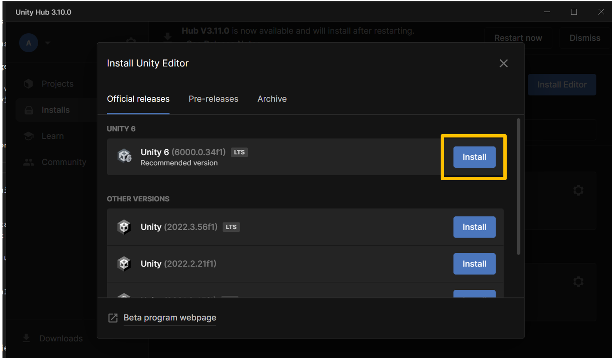
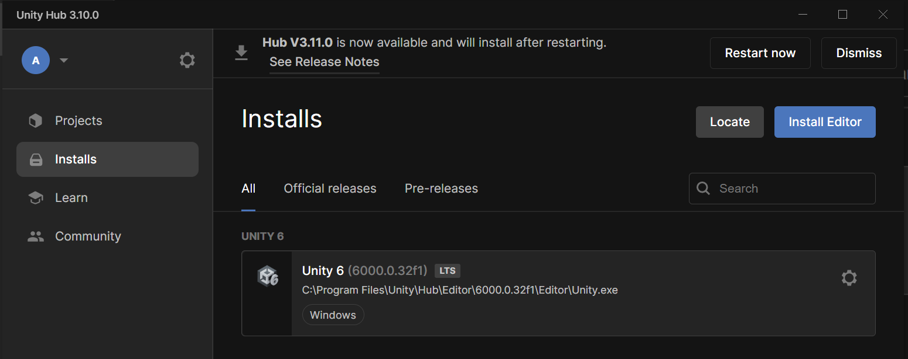 -->

    

<!-- ### Open AWSIM project

To open the Unity AWSIM project in Unity Editor:

=== "Using Unity Hub"
    1. Make sure you have the AWSIM repository cloned and ROS 2 is not sourced.
        ```
        git clone https://github.com/tlab-wide/V2X_E2E_Simulator.git
        ```

    2. Launch UnityHub.
        ```
        ./UnityHub.AppImage
        ```

        !!! info

            If you are launching the Unity Hub from the Ubuntu applications menu (without the terminal), make sure that system optimizations are set. To be sure, run the terminal at least once before running the Unity Hub. This will apply the OS settings.

    3. Open the project in UnityHub
        - Click the `Open` button
        

        - Navigate the directory where the AWSIM repository was cloned to
        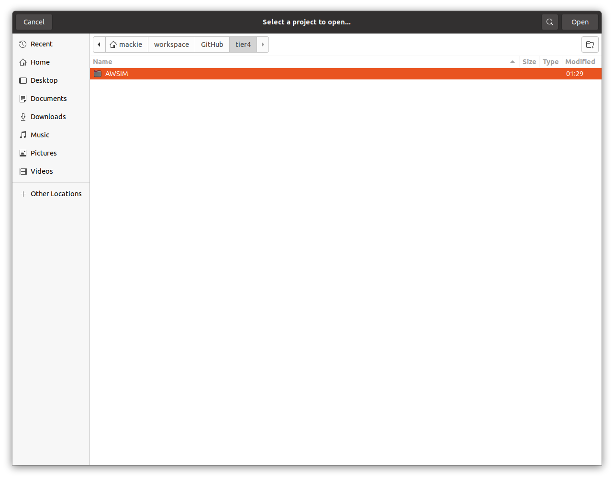

        - The project should be added to `Projects` tab in Unity Hub. To launch the project in Unity Editor simply click the `AWSIM` item
        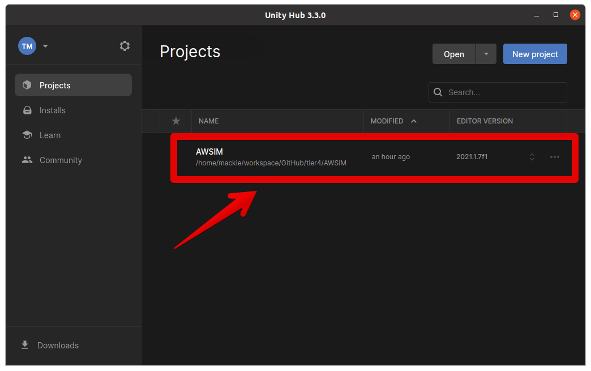

        - The project is now ready to use
        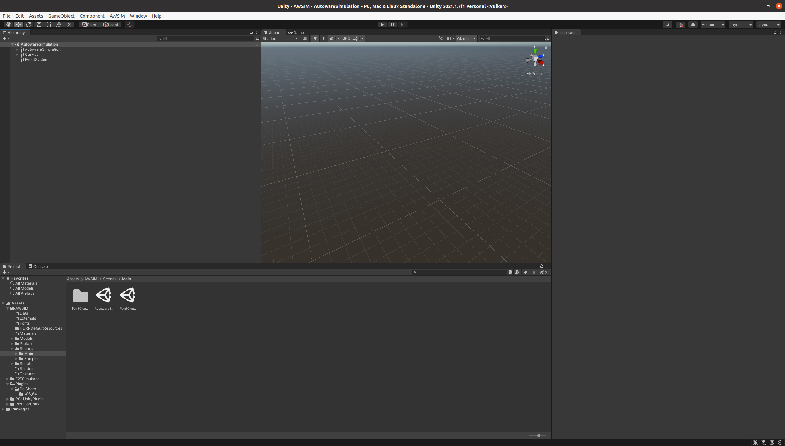
 -->

!!! warning
    <div style="text-align: left; text-justify: no;">
    If you get the safe mode dialog when starting UnityEditor, you may need to install openssl.

    1. Download libssl  
       `$ wget http://security.ubuntu.com/ubuntu/pool/main/o/openssl1.0/libssl1.0.0_1.0.2n-1ubuntu5.13_amd64.deb`
    2. Install  
       `sudo dpkg -i libssl1.0.0_1.0.2n-1ubuntu5.13_amd64.deb`
    </div>


### Import external packages

To properly run and use our project in Unity it is required to download map package which is not included in the repository.

1. Download and import the latest V2X_E2E_<version.unitypackage unity package 

    [Download Map files (unitypackage)](https://drive.google.com/file/d/1kAf_gZPu9zcm3SPo1MRCZVLIHzNL-YKH/view?usp=sharing){.md-button .md-button--primary}

2. In Unity Editor, from the menu bar at the top, select `Assets -> Import Package -> Custom Package...` and navigate the `V2X_E2E_<version>.unitypackage` file (or each version that you desire or download, in the image picture bleongs to V2X_E2E_v2_8_13.unitypackage).
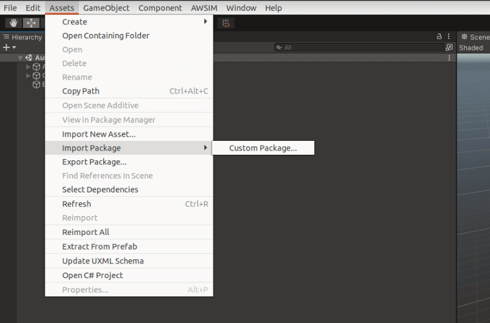
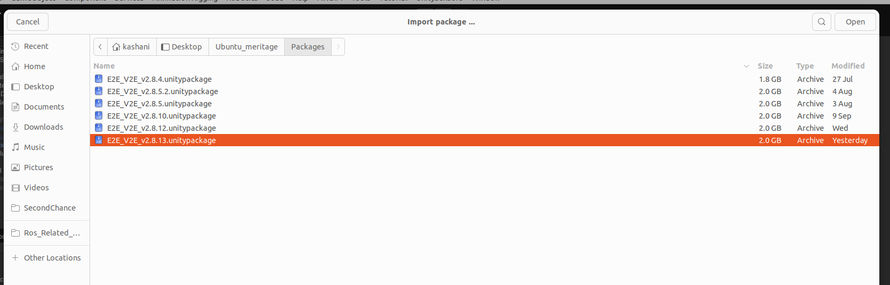
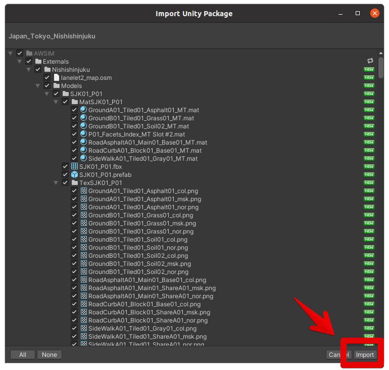
3. The package has been successfully imported under `Assets/V2X/Scenes/`directory.
<!-- 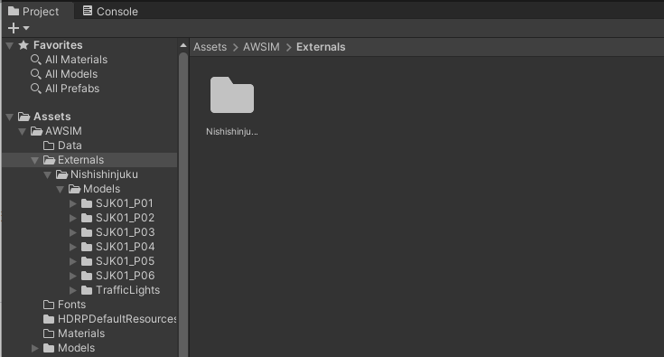 -->
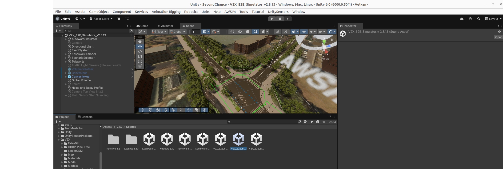

!!! info

    The Externals directory is added to the `.gitignore` because the map has a large file size and should not be directly uploaded to the repository.


*NOTE: There is a high probability that the engine may crash once during the installation of this package due to the excessive RAM required, but there is no problem, and the installation will complete after a minute.


<!-- 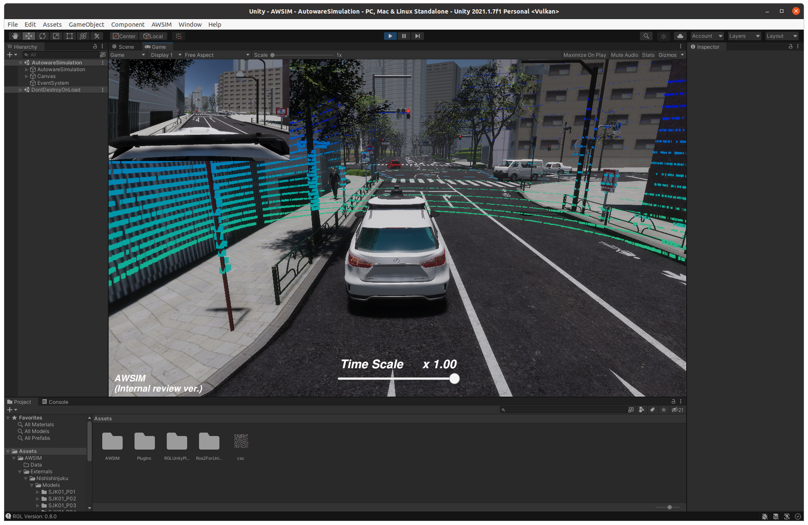 -->


<div style="text-align: center;">
  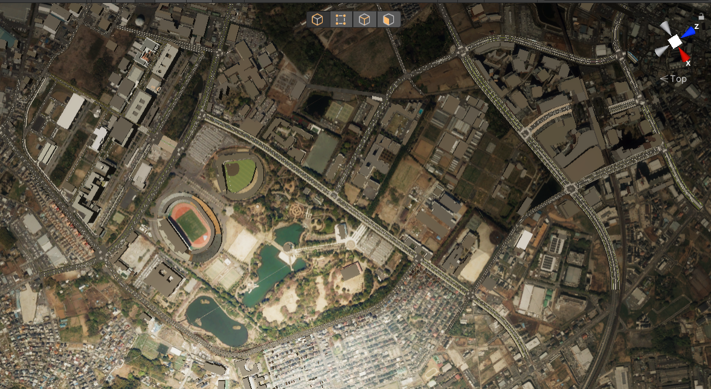
</div>

<br><br><br><br>


<!-- 
# Bug fix

It is probable that you required to check the that the read/write be enable as you can see in the picture


"It is likely that you need to check the `\Assets\AWSIM\Models\Sensors\Velodyne VLP-16` VLP-16.fbx file to ensure that the read/write option is enabled, as shown in the picture."

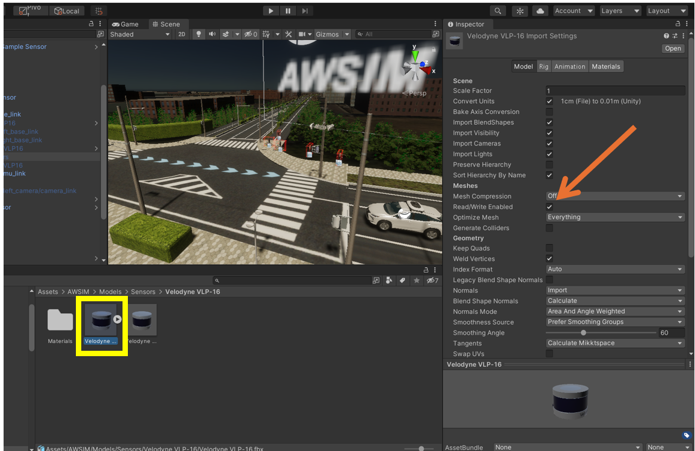

# Updates
There is a minor bug in time scale adjusting in ubuntu to fix this issue in version 7.4.11 please install this minor update package after installing the original package similarly

[7.4.11 Ui update](https://drive.google.com/file/d/1XOW9PvKk820zMUm7ynDqzaSZR4q-YROK/view?usp=sharing){.md-button .md-button--primary} -->
