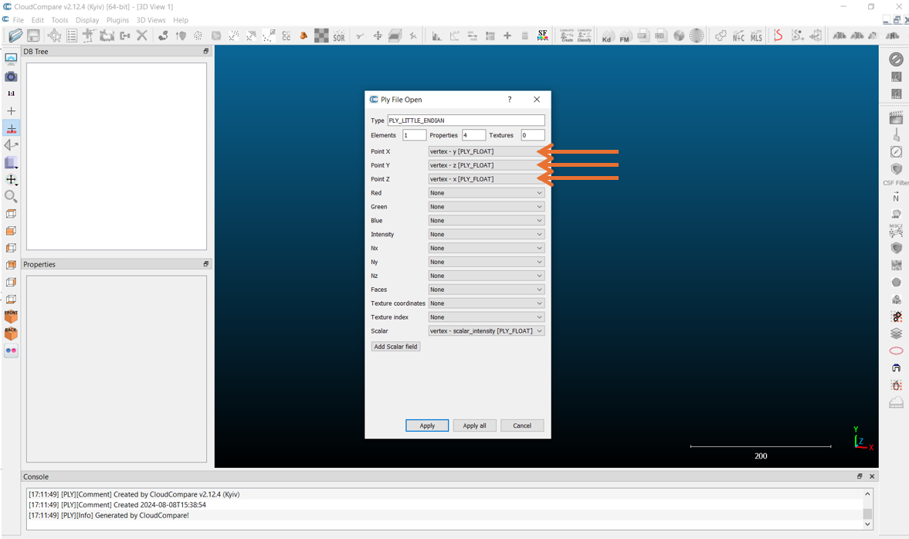
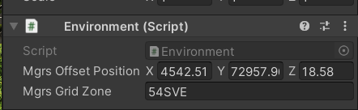
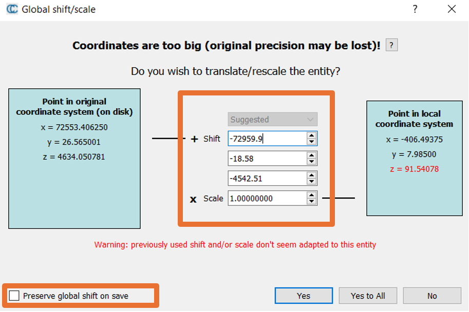
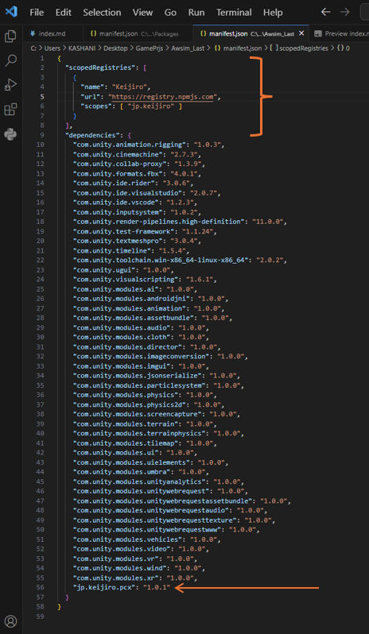
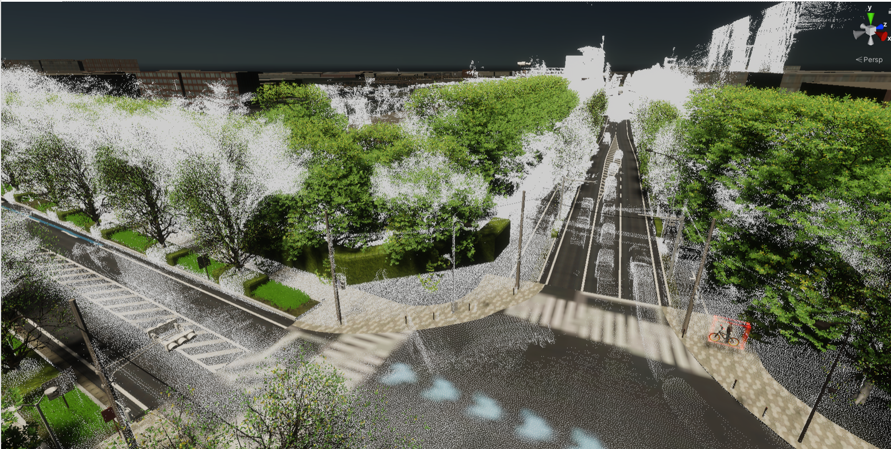

# Load PCD in unity

Loading PCD in unity is quite tricky and usually need to some payment. 
We have employed Pcx repository [(Github)](https://tlab-wide.github.io/V2X_E2E_Simulator/Simple-AV/SystemSetup/) in this project but the first problem is that this project only work with .ply extension we recommend to use Cloud Compare to convert .pcd to .ply 

when load the pcd in the cloud compare be carefull about x y z transformation as in shape shows

by considering this data fill the next box of inputs 

After that save it as .ply binray 

then you can easily drag and drop it in unity environment but you need to install PCX 

for installation first find the manifost.json in packages folder 

After that you can use the .ply files inside your project but we recomend to remove what you have added to project to make your engine more smoother and just use this feature to improve your 3d model quality and placement of object before simulation tests

## original
# Loading PCD Files in Unity

Loading Point Cloud Data (PCD) files into Unity can be challenging and often requires a paid solution. In this project, we've utilized the Pcx repository available on [GitHub](https://tlab-wide.github.io/V2X_E2E_Simulator/Simple-AV/SystemSetup/). However, it's important to note that Pcx is primarily designed to work with `.ply` files. We recommend using CloudCompare to convert `.pcd` files to `.ply`.

## Conversion Process in CloudCompare

When loading a PCD file into CloudCompare, pay close attention to the XYZ transformations, as illustrated below:

Ensure that you accurately fill out the input fields based on your data:

After configuring the transformations, save the file in the `.ply` binary format.

## Integrating .PLY Files into Unity

To use the converted `.ply` files in Unity, you will first need to install PCX. Begin by locating the `manifest.json` file in the Unity project’s `Packages` folder.

Once PCX is installed, you can drag and drop the `.ply` files into your Unity environment. However, for optimal performance, it is advisable to clean up previously added project files. This practice ensures a smoother engine performance and enhances the quality and placement of 3D models prior to conducting simulation tests.

