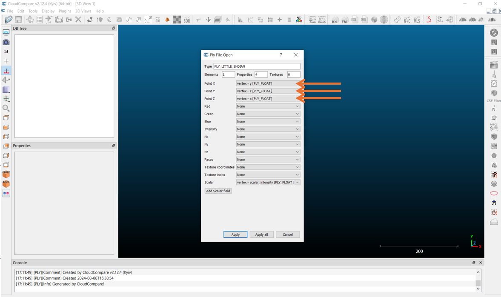
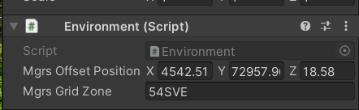
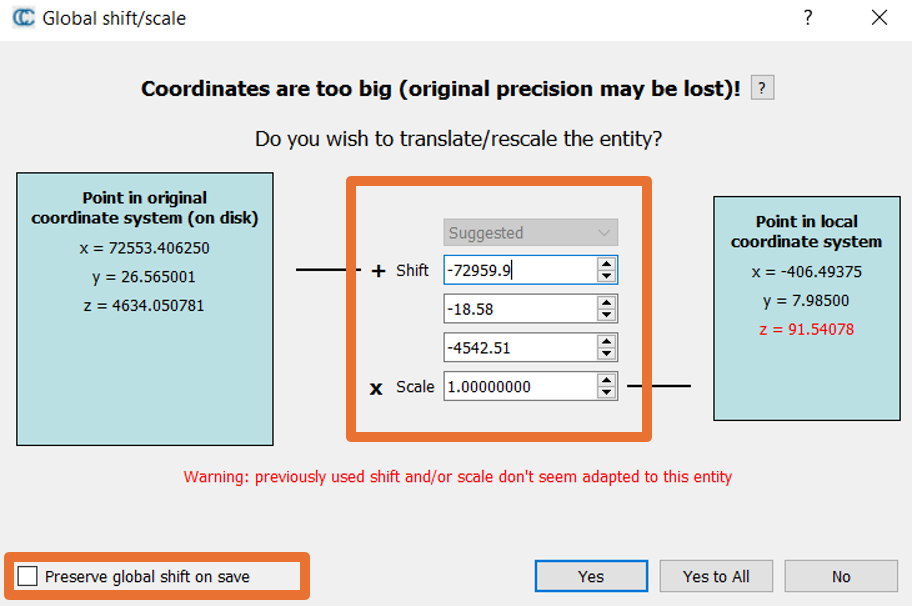
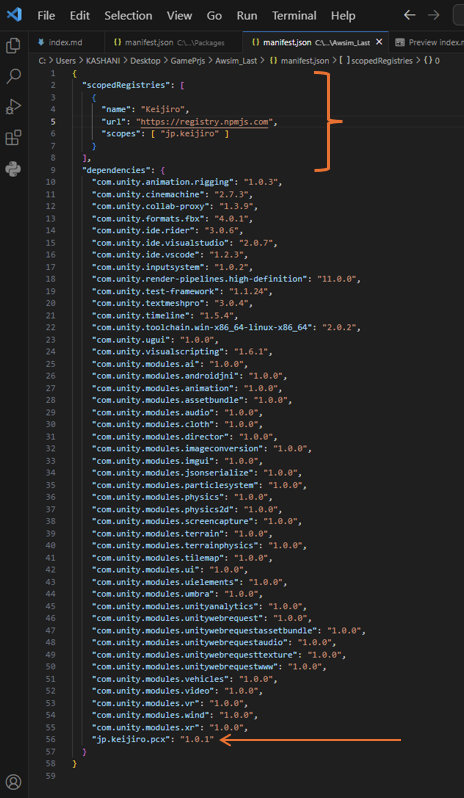
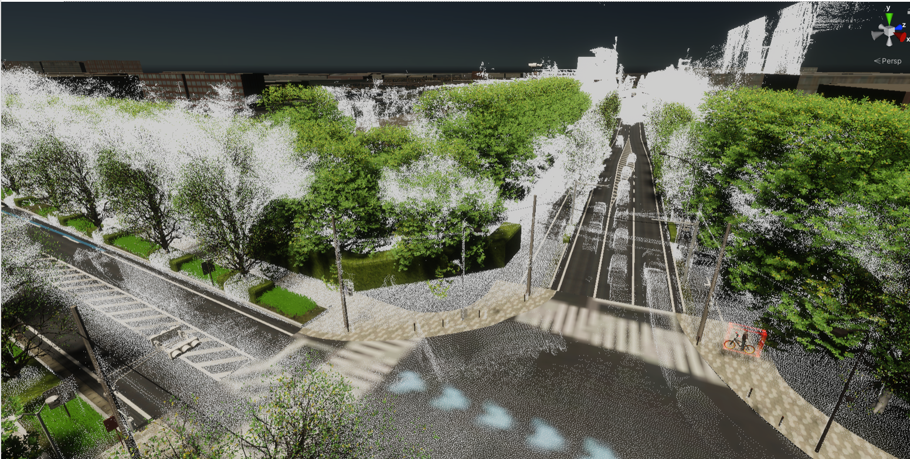
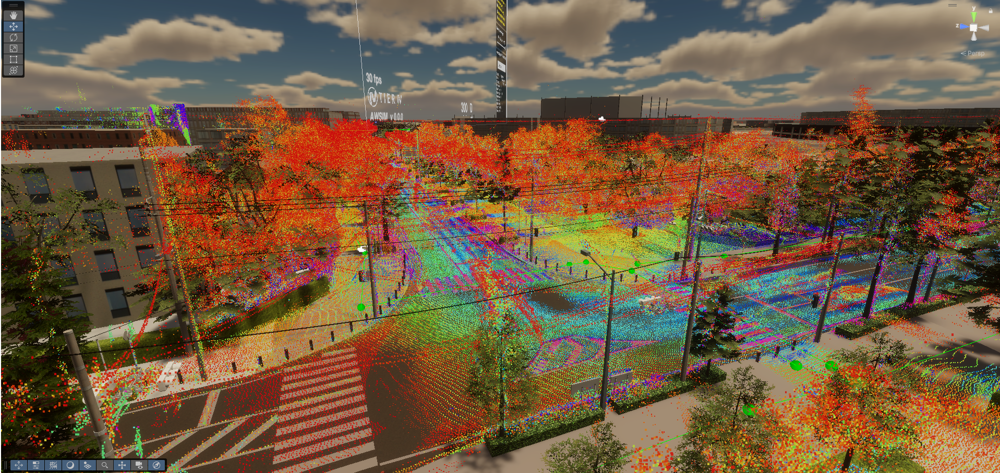

# Loading PCD Files in Unity

Loading Point Cloud Data (PCD) files into Unity can be challenging and often requires a paid solution. In this project, we've utilized the Pcx repository available on [GitHub](https://github.com/keijiro/Pcx). However, it's important to note that Pcx is primarily designed to work with `.ply` files. We recommend using CloudCompare to convert `.pcd` files to `.ply`. In the initial step, simply open the `.pcd` file and make sure not to change anything related to the position of the points.

## Conversion Process in CloudCompare

The first challenge of importing a PCD file into Unity is correcting the dimensions. You must apply the following transformation in the opening window when you import your file in CloudCompare.

<Strong> Note </Strong>: Sometimes, you may not find a similar opening. In this case, first save your model as a PLY file using CloudCompare, then load the PLY file again and continue with the steps below.

When loading a PCD file into CloudCompare, pay close attention to the XYZ transformations, as illustrated below:

Ensure that you accurately fill out the input fields based on your data:

After configuring the transformations, save the file in the `.ply` binary format.

## Integrating .PLY Files into Unity

To use the converted `.ply` files in Unity, you will first need to install PCX. Begin by locating the `manifest.json` file in the Unity project’s `Packages` folder.

<Strong> Note </Strong>: After importing the model into Unity, you need to set the X scale to -1, so the model aligns exactly in the correct position.

Once PCX is installed, you can drag and drop the `.ply` files into your Unity environment. However, for optimal performance, it is advisable to clean up previously added project files. This practice ensures a smoother engine performance and enhances the quality and placement of 3D models prior to conducting simulation tests.

<!-- todo compilite this section as "Point Cloud with Color " -->
<!-- to use color full point cloud we have to apply the filters of cloud compare or the defaul of that and then https://www.youtube.com/watch?v=ekLe_tMuGzc-->

## Point Cloud with Color

You can preserve or generate colors for your point cloud *before* exporting to `.ply` by using CloudCompare. PCX will read vertex colors automatically from the `.ply`, so there’s **no need to assign a material in Unity** for basic color display.

### 1) Start from your PCD (or PLY) in CloudCompare
- Open the file and apply the same **XYZ transform** rules described earlier (don’t re-center unless your pipeline requires it).
- Verify in the **Properties** panel whether the cloud already has **Colors** (RGB) and/or **Scalar Fields** (e.g., intensity, elevation).

### 2) If your data already contains RGB
- Confirm that **Colors** are present and look correct in the 3D view.
- (Optional) Improve legibility:
  - **Edit → Colors → Enhance RGB** (contrast/brightness)
  - **Edit → Colors → Saturate colors** (avoid over-saturation)
- Keep coordinates unchanged to avoid extra flips later in Unity.

### 3) If Your Data Has No RGB — Generate Colors from a Scalar Field

If your point cloud lacks native RGB values, you can colorize it using **scalar fields** such as **intensity**, **elevation (Z)**, **classification**, or **distance**.  
CloudCompare provides several built-in methods to visualize and export these as actual colors in your `.ply`.

---

#### 🟩 **Option A — Color by Height (Z-axis)**
This is the fastest and most intuitive method for topographic or structural data.

1. Select your cloud in the DB tree.  
2. Go to **Edit → Colors → Height Ramp**.  
3. In the pop-up, adjust the **Min/Max** height range to fit your dataset.  
4. Choose a color ramp (e.g., “Blue to Red”, “Jet”, or “Rainbow”).  
5. Confirm and view the gradient applied from low to high elevation.  

> **Tip:** This is great for terrain, buildings, and scans where height variation is meaningful.

---

#### 🟨 **Option B — Color by Intensity or Any Scalar Field**
For LiDAR or scanner data, intensity or reflectance fields can give visual cues about surface materials.

1. Ensure your cloud contains a **scalar field** (e.g., Intensity).  
   - You can verify this in the **Properties panel** — look for a drop-down labeled *Scalar field*.  
2. Set it active via: **Edit → Scalar fields → Set as active** (or use the SF toolbar menu).  
3. Visualize the range with the **Color Scale bar** on the right:  
   - Adjust **Min/Max** values to avoid washed-out or oversaturated regions.  
   - Experiment with **linear**, **logarithmic**, or **custom gradients**.  
4. Once satisfied, convert it to real RGB colors:  
   - **Edit → Colors → Convert SF to RGB**.  
5. (Optional) Fine-tune colors again and repeat the conversion if you modify the scale.

🎥 **Video Reference**  
If you’d like a step-by-step demonstration of this process, watch the video below.  
It shows how to apply color ramps, adjust scalar ranges, and export the result as a colored `.ply` file.

{: style="display: block; margin: 0 auto; text-align: center;"}

---

#### 🟦 **Option C — Color by Classification or Segments**
When working with classified LiDAR data or segmented point clouds (e.g., ground, vegetation, buildings), assign unique colors per class.

1. If a classification field exists, make it active:  
   **Edit → Scalar fields → Set as active** → choose *Classification*.  
2. Apply a color scheme:
   - **Edit → Colors → Convert SF to RGB** — for class-based palettes, or  
   - **Edit → Colors → Set Unique Colors** — to manually differentiate objects.  
3. Verify that each class or segment now displays a distinct, consistent color.

> **Use case:** Useful for visually inspecting segmented datasets before Unity import.

---

After applying any of the above methods, confirm the point cloud displays the expected colors in CloudCompare’s 3D view.  
You can then proceed to **export it as a Binary PLY** with the **“Save colors”** option enabled to preserve your colorization.

> Tip: If the colors look washed out, narrow the scalar field’s min/max range so the gradient spans the actual data.

### 4) Optional: Compute normals (for nicer point visuals)
- **Edit → Normals → Compute**  
  - Use **KNN** with a neighbor count that matches your point density (e.g., 16–32 for dense scans, 8–16 for sparse).
  - Normals are not required for color, but can help with round/disk rendering styles.

### 5) Export with colors to Binary PLY
- **File → Save** → pick **PLY** and choose **Binary** (smaller, faster to load).

