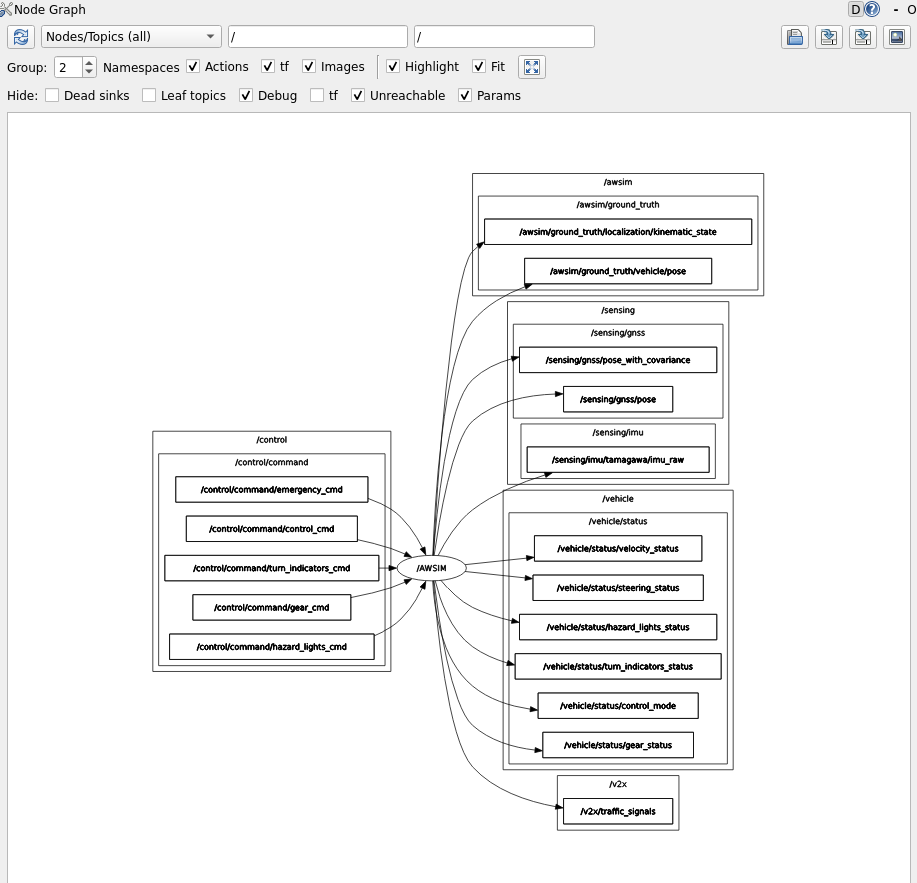
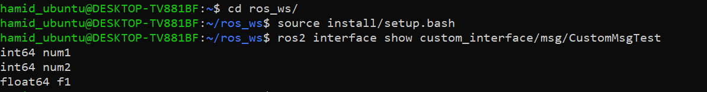
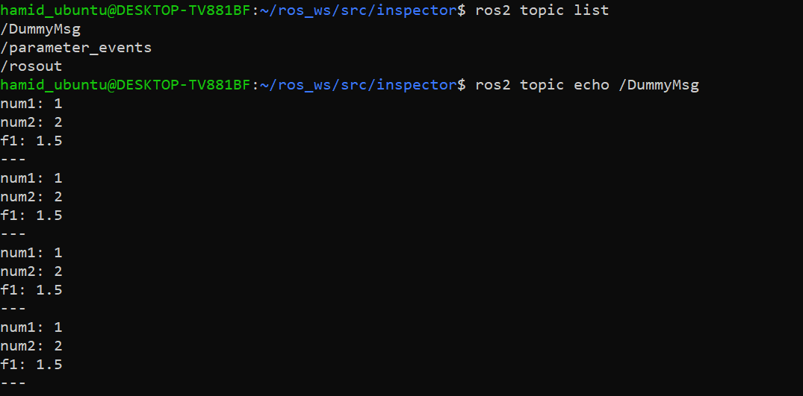
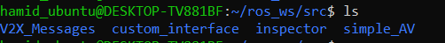
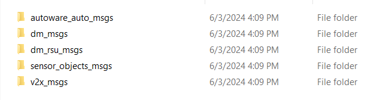

# Build AWSIM Messages

## Awsim Topics

<b>Run The Awsim Scene</b>


<b>Run WSL</b>

Run the WSL and source the ROS2 init using the command below:

```bash
source /opt/ros/humble/setup.bash
```

After sourcing the ROS2 you can get a topic list and see the all the topics that are being published and subscribed by AWSIM. 


<b>Topics</b>

The list of Topics above shows all the topics related to Awsim. But, which one of them are being published by Awsim and which ones do the Awsim subscives to. Generally Awsim publishes all of the topics instead the Control command ones. You can see the full relation and published/subscribed topics using the command below. Also, you can visit [Awsim ROS2 topic lists](https://tier4.github.io/AWSIM/Components/ROS2/ROS2TopicList/) from the Awsim Documentation.

```bash
rqt_graph
```

After running the command above a new window will appear. In this window unchek the `leaf topics'. As you can see all of the control topics are the ones that Awsim Subscribes to in order to control the vehicle. So by filling and publishing into these topics we can take control of the vehicle displayed in Awsim.


Now, if you uncheck the `dead sinks`, rqt-graph shows the topics that Awsim publishes.


------------------------------------------------------------

currently we are unable to access all of the topics and we must define message types of the topics. From the list of topics there are only 5 of the topics that are accessible and we can read them right now.
```
/awsim/ground_truth/localization/kinematic_state
/awsim/ground_truth/vehicle/pose 
/clock
/sensing/gnss/pose
/sensing/gnss/pose_with_covariance
```
 The other Topics cannot are not readable currently.

 

When working with ROS, you may encounter scenarios where some topics are easily accessible while others require additional steps to visualize the messages they publish. This discrepancy often stems from how message types are defined and made available in your ROS 2 environment.

<b>Accessible Topics</b>: For the topics you can successfully echo using the ros2 topic echo command, the message types are already built and recognized by your ROS 2 environment. These message types are typically part of the standard message packages that come pre-built with ROS 2 installations, or they are message types from packages you have already built and sourced in your workspace.

<b>Inaccessible Topics</b>: For the topics that produce errors when you attempt to echo them, the issue usually lies in the message types not being built or not recognized by the current ROS 2 environment. These errors indicate that ROS 2 cannot find the message type definitions required to interpret the messages published on those topics.

So, to resolve this issue and have access to all the Messages from AWSIM we need to build messages. 

## Build Awsim Messages.

As discussed above, a few Awsim topics are accessible by the default ROS 2 configuration using the std_msgs library. To read/write on other topics, we must define the message type of Awsim in our working package.

### Create Custom ROS2 msg

```bash
source /opt/ros/humble/setup.bash
cd ros_ws
source install/setup.bash
cd src
```

Create a new Package

```bash
ros2 pkg create --build-type ament_cmake custom_interface
```

Navigate to the `custom_interface` package:

```bash
cd custom_interface
ls
```

```bash
CMakeLists.txt
include/
package.xml
src/
```

```bash
rmdir src
mkdir msg
```
In the `custom_interface/msg` directory you just created, make a new file called custom_msg_test.msg with one line of code declaring its data structure:

```bash
cd msg
touch CustomMsgTest.msg
```

```bash
int64 num1
int64 num2
float64 f1
```

Modify CMakeList.txt

```bash
find_package(ament_cmake REQUIRED)
find_package(rosidl_default_generators REQUIRED)

rosidl_generate_interfaces(${PROJECT_NAME}
  "msg/CustomMsgTest.msg"
)
```

Modify package.xml

```bash
<buildtool_depend>rosidl_default_generators</buildtool_depend>
<exec_depend>rosidl_default_runtime</exec_depend>
<member_of_group>rosidl_interface_packages</member_of_group>
```

Build the `cusotm_interface` package:
```bash
cd ~/ros_ws
colcon build --packages-select cusotm_interface
```

Now the interfaces will be discoverable by other ROS 2 packages. Now you can confirm that your interface creation worked by using the `ros2 interface show` command:



<b>Create a simple publisher</b>

```bash
cd ~/ros_ws/src/inspector/inspector
touch CustoMsgTester.py
chmod +x CustomMsgTester.py
```

```python
#!/usr/bin/env python3

import rclpy
from rclpy.node import Node
from custom_interface.msg import CustomMsgTest

class CustomMsgPublisher(Node):
    def __init__(self):
        super().__init__('MsgPublisher')
        self.publisher_ = self.create_publisher(CustomMsgTest, 'DummyMsg', 10)
        timer_period = 1
        self.timer = self.create_timer(timer_period, self.callback)
    
    def callback(self):
        msg = CustomMsgTest()
        msg.num1 = 1
        msg.num2 = 2
        msg.f1 = 1.5
        self.publisher_.publish(msg)
    

def main(args=None):
    rclpy.init(args=args)
    node = CustomMsgPublisher()
    rclpy.spin(node)
    node.destroy_node()
    rclpy.shutdown()
    pass


if __name__ == "__main__":
    main()
```

Add the following to `setup.py`

```python
entry_points={
        'console_scripts': [
            'ConnectionControlNode = inspector.ConnectionController:main',
            'CustomMsgTesterNode = inspector.CustomMsgTester:main',
        ],
    },
```

Add the following to `package.xml`:

```python
<exec_depend>custom_interfaces</exec_depend>
```

```bash
cd ~/ros_ws
colcon build
ros2 run inspector CustomMsgTesterNode
```




### Build Awsim msgs

Download the V2X Messages from the link below.

[V2X Messages Link](Drive address)

Place it in the src directory of your workspace.



Insede the V2X Messages folder


Go back to the root of your workspace and build the new package

```bash
cd ~/ros_ws
colcon build
```

After the build is completed use `ros2 interface show` command to check if the messages have been built correctly. If the messages can be shown it means that the messages are added correctly.

```bash
hamid_ubuntu@DESKTOP-TV881BF:~/ros_ws$ ros2 interface show                                                           
Display all 431 possibilities? (y or n)                                                                                 
--all-comments                                                                                                          
--no-comments                                                                                                           
action_msgs/msg/GoalInfo                                                                                                
action_msgs/msg/GoalStatus                                                                                              
action_msgs/msg/GoalStatusArray                                                                                         
action_msgs/srv/CancelGoal                                                                                              
action_tutorials_interfaces/action/Fibonacci                                                                            
actionlib_msgs/msg/GoalID                                                                                               
actionlib_msgs/msg/GoalStatus                                                                                           
actionlib_msgs/msg/GoalStatusArray                                                                                      
autoware_auto_control_msgs/msg/AckermannControlCommand                                                                  
autoware_auto_control_msgs/msg/AckermannLateralCommand                                                                  
autoware_auto_control_msgs/msg/HighLevelControlCommand                                                                  
autoware_auto_control_msgs/msg/LongitudinalCommand                                                                      
autoware_auto_geometry_msgs/msg/Complex32                                                                               
autoware_auto_geometry_msgs/msg/Quaternion32                                                                            
autoware_auto_geometry_msgs/msg/RelativePositionWithCovarianceStamped                                                   
autoware_auto_mapping_msgs/msg/HADMapBin                                                                                
autoware_auto_mapping_msgs/msg/HADMapSegment                                                                            
autoware_auto_mapping_msgs/msg/MapPrimitive                                                                             
autoware_auto_mapping_msgs/srv/HADMapService                                                                            
autoware_auto_perception_msgs/msg/BoundingBox                                                                           
autoware_auto_perception_msgs/msg/BoundingBoxArray                                                                      
autoware_auto_perception_msgs/msg/ClassifiedRoi                                                                         
autoware_auto_perception_msgs/msg/ClassifiedRoiArray                                                                    
autoware_auto_perception_msgs/msg/DetectedObject                                                                        
autoware_auto_perception_msgs/msg/DetectedObjectKinematics                                                              
autoware_auto_perception_msgs/msg/DetectedObjects                                                                       
autoware_auto_perception_msgs/msg/LookingTrafficSignal                                                                  
autoware_auto_perception_msgs/msg/ObjectClassification                                                                  
autoware_auto_perception_msgs/msg/PointClusters                                                                         
autoware_auto_perception_msgs/msg/PointXYZIF                                                                            
autoware_auto_perception_msgs/msg/PredictedObject                                                                       
autoware_auto_perception_msgs/msg/PredictedObjectKinematics                                                             
autoware_auto_perception_msgs/msg/PredictedObjects                                                                      
autoware_auto_perception_msgs/msg/PredictedPath                                                                         
autoware_auto_perception_msgs/msg/Shape                                                                                 
autoware_auto_perception_msgs/msg/TrackedObject                                                                         
autoware_auto_perception_msgs/msg/TrackedObjectKinematics                                                               
autoware_auto_perception_msgs/msg/TrackedObjects                                                                        
autoware_auto_perception_msgs/msg/TrafficLight                                                                          
autoware_auto_perception_msgs/msg/TrafficLightRoi                                                                       
autoware_auto_perception_msgs/msg/TrafficLightRoiArray                                                                  
autoware_auto_perception_msgs/msg/TrafficSignal                                                                         
autoware_auto_perception_msgs/msg/TrafficSignalArray                                                                    
autoware_auto_perception_msgs/msg/TrafficSignalStamped                                                                  
autoware_auto_perception_msgs/msg/TrafficSignalWithJudge                                                                
autoware_auto_planning_msgs/action/PlanTrajectory                                                                       
autoware_auto_planning_msgs/action/PlannerCostmap                                                                       
autoware_auto_planning_msgs/action/RecordTrajectory                                                                     
autoware_auto_planning_msgs/action/ReplayTrajectory                                                                     
autoware_auto_planning_msgs/msg/HADMapRoute                                                                             
autoware_auto_planning_msgs/msg/OrderMovement                                                                           
autoware_auto_planning_msgs/msg/Path                                                                                    
autoware_auto_planning_msgs/msg/PathPoint                                                                               
autoware_auto_planning_msgs/msg/PathPointWithLaneId                                                                     
autoware_auto_planning_msgs/msg/PathWithLaneId                                                                          
autoware_auto_planning_msgs/msg/Route                                                                                   
autoware_auto_planning_msgs/msg/Trajectory                                                                              
autoware_auto_planning_msgs/msg/TrajectoryPoint                                                                         
autoware_auto_planning_msgs/srv/ModifyTrajectory                                                                        
autoware_auto_system_msgs/msg/AutowareState                                                                             
autoware_auto_system_msgs/msg/ControlDiagnostic                                                                         
autoware_auto_system_msgs/msg/DiagnosticHeader                                                                          
autoware_auto_system_msgs/msg/DrivingCapability                                                                         
autoware_auto_system_msgs/msg/EmergencyState                                                                            
autoware_auto_system_msgs/msg/HazardStatus                                                                              
autoware_auto_system_msgs/msg/HazardStatusStamped                                                                       
autoware_auto_vehicle_msgs/msg/ControlModeCommand                                                                       
autoware_auto_vehicle_msgs/msg/ControlModeReport                                                                        
autoware_auto_vehicle_msgs/msg/Engage                                                                                   
autoware_auto_vehicle_msgs/msg/GearCommand                                                                              
autoware_auto_vehicle_msgs/msg/GearReport                                                                               
autoware_auto_vehicle_msgs/msg/HandBrakeCommand                                                                         
autoware_auto_vehicle_msgs/msg/HandBrakeReport                                                                          
autoware_auto_vehicle_msgs/msg/HazardLightsCommand                                                                      
autoware_auto_vehicle_msgs/msg/HazardLightsReport                                                                       
autoware_auto_vehicle_msgs/msg/HeadlightsCommand                                                                        
autoware_auto_vehicle_msgs/msg/HeadlightsReport                                                                         
autoware_auto_vehicle_msgs/msg/HornCommand                                                                              
autoware_auto_vehicle_msgs/msg/HornReport                                                                               
autoware_auto_vehicle_msgs/msg/RawControlCommand                                                                        
autoware_auto_vehicle_msgs/msg/StationaryLockingCommand                                                                 
autoware_auto_vehicle_msgs/msg/SteeringReport                                                                           
autoware_auto_vehicle_msgs/msg/TurnIndicatorsCommand                                                                    
autoware_auto_vehicle_msgs/msg/TurnIndicatorsReport                                                                     
autoware_auto_vehicle_msgs/msg/VehicleControlCommand                                                                    
autoware_auto_vehicle_msgs/msg/VehicleKinematicState                                                                    
autoware_auto_vehicle_msgs/msg/VehicleOdometry                                                                          
autoware_auto_vehicle_msgs/msg/VehicleStateCommand                                                                      
autoware_auto_vehicle_msgs/msg/VehicleStateReport                                                                       
autoware_auto_vehicle_msgs/msg/VelocityReport                                                                           
autoware_auto_vehicle_msgs/msg/WheelEncoder                                                                             
autoware_auto_vehicle_msgs/msg/WipersCommand                                                                            
autoware_auto_vehicle_msgs/msg/WipersReport                                                                             
autoware_auto_vehicle_msgs/srv/AutonomyModeChange                                                                       
autoware_auto_vehicle_msgs/srv/ControlModeCommand                                                                       
builtin_interfaces/msg/Duration                                                                                         
builtin_interfaces/msg/Time                                                                                             
composition_interfaces/srv/ListNodes                                                                                    
composition_interfaces/srv/LoadNode                                                                                     
composition_interfaces/srv/UnloadNode                                                                                   
custom_interface/msg/CustomMsgTest                                                                                      
diagnostic_msgs/msg/DiagnosticArray                                                                                     
diagnostic_msgs/msg/DiagnosticStatus                                                                                    
diagnostic_msgs/msg/KeyValue                                                                                            
diagnostic_msgs/srv/AddDiagnostics                                                                                      
diagnostic_msgs/srv/SelfTest                                                                                            
dm_debug_msgs/msg/DebugInfoWithObjectId                                                                                 
dm_debug_msgs/msg/DebugInfoWithObjectIdArray                                                                            
dm_debug_msgs/msg/DebugInfoWithSignalId                                                                                 
dm_debug_msgs/msg/DebugInfoWithSignalIdArray                                                                            
dm_freespace_info_msgs/msg/FreespaceInfo                                                                                
dm_freespace_info_msgs/msg/FreespaceInfoArray                                                                           
dm_object_info_msgs/msg/Acceleration                                                                                    
dm_object_info_msgs/msg/AccelerationAccuracy                                                                            
dm_object_info_msgs/msg/AccelerationValue                                                                               
dm_object_info_msgs/msg/Altitude                                                                                        
dm_object_info_msgs/msg/AltitudeAccuracy                                                                                
dm_object_info_msgs/msg/AuxiliaryBrakeState                                                                             
dm_object_info_msgs/msg/BrakeState                                                                                      
dm_object_info_msgs/msg/ClassConfidence                                                                                 
dm_object_info_msgs/msg/ClassId                                                                                         
dm_object_info_msgs/msg/ControlSystemState                                                                              
dm_object_info_msgs/msg/ControlSystemStates                                                                             
dm_object_info_msgs/msg/CrpId                                                                                           
dm_object_info_msgs/msg/DistanceRatio                                                                                   
dm_object_info_msgs/msg/DistanceValue                                                                                   
dm_object_info_msgs/msg/ExistenceConfidence                                                                             
dm_object_info_msgs/msg/ExteriorLights                                                                                  
dm_object_info_msgs/msg/GeodeticSystem                                                                                  
dm_object_info_msgs/msg/LaneCount                                                                                       
dm_object_info_msgs/msg/LaneId                                                                                          
dm_object_info_msgs/msg/LaneLateralPosition                                                                             
dm_object_info_msgs/msg/LanePosition                                                                                    
dm_object_info_msgs/msg/Latitude                                                                                        
dm_object_info_msgs/msg/Location                                                                                        
dm_object_info_msgs/msg/Longitude                                                                                       
dm_object_info_msgs/msg/ObjectClass                                                                                     
dm_object_info_msgs/msg/ObjectColor                                                                                     
dm_object_info_msgs/msg/ObjectDimension                                                                                 
dm_object_info_msgs/msg/ObjectDimensionAccuracy                                                                         
dm_object_info_msgs/msg/ObjectDimensionValue                                                                            
dm_object_info_msgs/msg/ObjectId                                                                                        
dm_object_info_msgs/msg/ObjectInfo                                                                                      
dm_object_info_msgs/msg/ObjectInfoArray                                                                                 
dm_object_info_msgs/msg/ObjectSize                                                                                      
dm_object_info_msgs/msg/ReferencePoint                                                                                  
dm_object_info_msgs/msg/SemiAxisLength                                                                                  
dm_object_info_msgs/msg/ShiftPosition                                                                                   
dm_object_info_msgs/msg/Speed                                                                                           
dm_object_info_msgs/msg/SpeedAccuracy                                                                                   
dm_object_info_msgs/msg/SpeedValue                                                                                      
dm_object_info_msgs/msg/SteeringAngle                                                                                   
dm_object_info_msgs/msg/SubclassType                                                                                    
dm_object_info_msgs/msg/ThrottlePosition                                                                                
dm_object_info_msgs/msg/TimestampIts                                                                                    
dm_object_info_msgs/msg/VehicleExtendedInformation                                                                      
dm_object_info_msgs/msg/VehicleRole                                                                                     
dm_object_info_msgs/msg/WGS84Angle                                                                                      
dm_object_info_msgs/msg/WGS84AngleAccuracy                                                                              
dm_object_info_msgs/msg/WGS84AngleValue                                                                                 
dm_object_info_msgs/msg/YawRate                                                                                         
dm_object_info_msgs/msg/YawRateAccuracy                                                                                 
dm_object_info_msgs/msg/YawRateValue                                                                                    
dm_pole_info_msgs/msg/AreaId                                                                                            
dm_pole_info_msgs/msg/AreaName                                                                                          
dm_pole_info_msgs/msg/DeviceErrorInfo                                                                                   
dm_pole_info_msgs/msg/DeviceId                                                                                          
dm_pole_info_msgs/msg/DeviceMfrId                                                                                       
dm_pole_info_msgs/msg/DeviceOpStat                                                                                      
dm_pole_info_msgs/msg/DeviceStat                                                                                        
dm_pole_info_msgs/msg/DeviceTypeId                                                                                      
dm_pole_info_msgs/msg/DeviceUniqueId                                                                                    
dm_pole_info_msgs/msg/DirectionMax                                                                                      
dm_pole_info_msgs/msg/DirectionMin                                                                                      
dm_pole_info_msgs/msg/DistanceMax                                                                                       
dm_pole_info_msgs/msg/DistanceMin                                                                                       
dm_pole_info_msgs/msg/PoleData                                                                                          
dm_pole_info_msgs/msg/PoleHeader                                                                                        
dm_pole_info_msgs/msg/PoleId                                                                                            
dm_pole_info_msgs/msg/PoleInfo                                                                                          
dm_pole_info_msgs/msg/SecLvl                                                                                            
dm_rsu_msgs/msg/CooperativeFreespaceInfoMessage                                                                         
dm_rsu_msgs/msg/CooperativeObjectInfoMessage                                                                            
dm_rsu_msgs/msg/CooperativeSignalInfoMessage                                                                            
dm_signal_info_msgs/msg/ArrowLightIndication                                                                            
dm_signal_info_msgs/msg/CountDownStopFlag                                                                               
dm_signal_info_msgs/msg/EventCount                                                                                      
dm_signal_info_msgs/msg/MainLightIndication                                                                             
dm_signal_info_msgs/msg/MaxTimeToChange                                                                                 
dm_signal_info_msgs/msg/MinTimeToChange                                                                                 
dm_signal_info_msgs/msg/SignalId                                                                                        
dm_signal_info_msgs/msg/SignalInfo                                                                                      
dm_signal_info_msgs/msg/SignalInfoArray                                                                                 
dm_signal_info_msgs/msg/SignalLightInfo                                                                                 
dm_signal_info_msgs/msg/SignalState                                                                                     
dm_signal_info_msgs/msg/SpecificControlFlags                                                                            
example_interfaces/action/Fibonacci                                                                                     
example_interfaces/msg/Bool                                                                                             
example_interfaces/msg/Byte                                                                                             
example_interfaces/msg/ByteMultiArray                                                                                   
example_interfaces/msg/Char                                                                                             
example_interfaces/msg/Empty                                                                                            
example_interfaces/msg/Float32                                                                                          
example_interfaces/msg/Float32MultiArray                                                                                
example_interfaces/msg/Float64                                                                                          
example_interfaces/msg/Float64MultiArray                                                                                
example_interfaces/msg/Int16                                                                                            
example_interfaces/msg/Int16MultiArray                                                                                  
example_interfaces/msg/Int32                                                                                            
example_interfaces/msg/Int32MultiArray                                                                                  
example_interfaces/msg/Int64                                                                                            
example_interfaces/msg/Int64MultiArray                                                                                  
example_interfaces/msg/Int8                                                                                             
example_interfaces/msg/Int8MultiArray                                                                                   
example_interfaces/msg/MultiArrayDimension                                                                              
example_interfaces/msg/MultiArrayLayout                                                                                 
example_interfaces/msg/String                                                                                           
example_interfaces/msg/UInt16                                                                                           
example_interfaces/msg/UInt16MultiArray                                                                                 
example_interfaces/msg/UInt32                                                                                           
example_interfaces/msg/UInt32MultiArray                                                                                 
example_interfaces/msg/UInt64                                                                                           
example_interfaces/msg/UInt64MultiArray                                                                                 
example_interfaces/msg/UInt8                                                                                            
example_interfaces/msg/UInt8MultiArray                                                                                  
example_interfaces/msg/WString                                                                                          
example_interfaces/srv/AddTwoInts                                                                                       
example_interfaces/srv/SetBool                                                                                          
example_interfaces/srv/Trigger                                                                                          
geometry_msgs/msg/Accel                                                                                                 
geometry_msgs/msg/AccelStamped                                                                                          
geometry_msgs/msg/AccelWithCovariance                                                                                   
geometry_msgs/msg/AccelWithCovarianceStamped                                                                            
geometry_msgs/msg/Inertia                                                                                               
geometry_msgs/msg/InertiaStamped                                                                                        
geometry_msgs/msg/Point                                                                                                 
geometry_msgs/msg/Point32                                                                                               
geometry_msgs/msg/PointStamped                                                                                          
geometry_msgs/msg/Polygon                                                                                               
geometry_msgs/msg/PolygonStamped                                                                                        
geometry_msgs/msg/Pose                                                                                                  
geometry_msgs/msg/Pose2D                                                                                                
geometry_msgs/msg/PoseArray                                                                                             
geometry_msgs/msg/PoseStamped                                                                                           
geometry_msgs/msg/PoseWithCovariance                                                                                    
geometry_msgs/msg/PoseWithCovarianceStamped                                                                             
geometry_msgs/msg/Quaternion                                                                                            
geometry_msgs/msg/QuaternionStamped                                                                                     
geometry_msgs/msg/Transform                                                                                             
geometry_msgs/msg/TransformStamped                                                                                      
geometry_msgs/msg/Twist                                                                                                 
geometry_msgs/msg/TwistStamped                                                                                          
geometry_msgs/msg/TwistWithCovariance                                                                                   
geometry_msgs/msg/TwistWithCovarianceStamped                                                                            
geometry_msgs/msg/Vector3                                                                                               
geometry_msgs/msg/Vector3Stamped                                                                                        
geometry_msgs/msg/Wrench                                                                                                
geometry_msgs/msg/WrenchStamped                                                                                         
lifecycle_msgs/msg/State                                                                                                
lifecycle_msgs/msg/Transition                                                                                           
lifecycle_msgs/msg/TransitionDescription                                                                                
lifecycle_msgs/msg/TransitionEvent                                                                                      
lifecycle_msgs/srv/ChangeState                                                                                          
lifecycle_msgs/srv/GetAvailableStates                                                                                   
lifecycle_msgs/srv/GetAvailableTransitions                                                                              
lifecycle_msgs/srv/GetState                                                                                             
logging_demo/srv/ConfigLogger                                                                                           
map_msgs/msg/OccupancyGridUpdate                                                                                        
map_msgs/msg/PointCloud2Update                                                                                          
map_msgs/msg/ProjectedMap                                                                                               
map_msgs/msg/ProjectedMapInfo                                                                                           
map_msgs/srv/GetMapROI                                                                                                  
map_msgs/srv/GetPointMap                                                                                                
map_msgs/srv/GetPointMapROI                                                                                             
map_msgs/srv/ProjectedMapsInfo                                                                                          
map_msgs/srv/SaveMap                                                                                                    
map_msgs/srv/SetMapProjections                                                                                          
nav_msgs/msg/GridCells                                                                                                  
nav_msgs/msg/MapMetaData                                                                                                
nav_msgs/msg/OccupancyGrid                                                                                              
nav_msgs/msg/Odometry                                                                                                   
nav_msgs/msg/Path                                                                                                       
nav_msgs/srv/GetMap                                                                                                     
nav_msgs/srv/GetPlan                                                                                                    
nav_msgs/srv/LoadMap                                                                                                    
nav_msgs/srv/SetMap                                                                                                     
pcl_msgs/msg/ModelCoefficients                                                                                          
pcl_msgs/msg/PointIndices                                                                                               
pcl_msgs/msg/PolygonMesh                                                                                                
pcl_msgs/msg/Vertices                                                                                                   
pcl_msgs/srv/UpdateFilename                                                                                             
pendulum_msgs/msg/JointCommand                                                                                          
pendulum_msgs/msg/JointState                                                                                            
pendulum_msgs/msg/RttestResults                                                                                         
rcl_interfaces/msg/FloatingPointRange                                                                                   
rcl_interfaces/msg/IntegerRange                                                                                         
rcl_interfaces/msg/ListParametersResult                                                                                 
rcl_interfaces/msg/Log                                                                                                  
rcl_interfaces/msg/Parameter                                                                                            
rcl_interfaces/msg/ParameterDescriptor                                                                                  
rcl_interfaces/msg/ParameterEvent                                                                                       
rcl_interfaces/msg/ParameterEventDescriptors                                                                            
rcl_interfaces/msg/ParameterType                                                                                        
rcl_interfaces/msg/ParameterValue                                                                                       
rcl_interfaces/msg/SetParametersResult                                                                                  
rcl_interfaces/srv/DescribeParameters                                                                                   
rcl_interfaces/srv/GetParameterTypes                                                                                    
rcl_interfaces/srv/GetParameters                                                                                        
rcl_interfaces/srv/ListParameters                                                                                       
rcl_interfaces/srv/SetParameters                                                                                        
rcl_interfaces/srv/SetParametersAtomically                                                                              
rmw_dds_common/msg/Gid                                                                                                  
rmw_dds_common/msg/NodeEntitiesInfo                                                                                     
rmw_dds_common/msg/ParticipantEntitiesInfo                                                                              
rosbag2_interfaces/msg/ReadSplitEvent                                                                                   
rosbag2_interfaces/msg/WriteSplitEvent                                                                                  
rosbag2_interfaces/srv/Burst                                                                                            
rosbag2_interfaces/srv/GetRate                                                                                          
rosbag2_interfaces/srv/IsPaused                                                                                         
rosbag2_interfaces/srv/Pause                                                                                            
rosbag2_interfaces/srv/PlayNext                                                                                         
rosbag2_interfaces/srv/Resume                                                                                           
rosbag2_interfaces/srv/Seek                                                                                             
rosbag2_interfaces/srv/SetRate                                                                                          
rosbag2_interfaces/srv/Snapshot                                                                                         
rosbag2_interfaces/srv/TogglePaused                                                                                     
rosgraph_msgs/msg/Clock                                                                                                 
sensor_msgs/msg/BatteryState                                                                                            
sensor_msgs/msg/CameraInfo                                                                                              
sensor_msgs/msg/ChannelFloat32                                                                                          
sensor_msgs/msg/CompressedImage                                                                                         
sensor_msgs/msg/FluidPressure                                                                                           
sensor_msgs/msg/Illuminance                                                                                             
sensor_msgs/msg/Image                                                                                                   
sensor_msgs/msg/Imu                                                                                                     
sensor_msgs/msg/JointState                                                                                              
sensor_msgs/msg/Joy                                                                                                     
sensor_msgs/msg/JoyFeedback                                                                                             
sensor_msgs/msg/JoyFeedbackArray                                                                                        
sensor_msgs/msg/LaserEcho                                                                                               
sensor_msgs/msg/LaserScan                                                                                               
sensor_msgs/msg/MagneticField                                                                                           
sensor_msgs/msg/MultiDOFJointState                                                                                      
sensor_msgs/msg/MultiEchoLaserScan                                                                                      
sensor_msgs/msg/NavSatFix                                                                                               
sensor_msgs/msg/NavSatStatus                                                                                            
sensor_msgs/msg/PointCloud                                                                                              
sensor_msgs/msg/PointCloud2                                                                                             
sensor_msgs/msg/PointField                                                                                              
sensor_msgs/msg/Range                                                                                                   
sensor_msgs/msg/RegionOfInterest                                                                                        
sensor_msgs/msg/RelativeHumidity                                                                                        
sensor_msgs/msg/Temperature                                                                                             
sensor_msgs/msg/TimeReference                                                                                           
sensor_msgs/srv/SetCameraInfo                                                                                           
sensor_objects_msgs/msg/SensorDetectedObjects                                                                           
shape_msgs/msg/Mesh                                                                                                     
shape_msgs/msg/MeshTriangle                                                                                             
shape_msgs/msg/Plane                                                                                                    
shape_msgs/msg/SolidPrimitive                                                                                           
statistics_msgs/msg/MetricsMessage                                                                                      
statistics_msgs/msg/StatisticDataPoint                                                                                  
statistics_msgs/msg/StatisticDataType                                                                                   
std_msgs/msg/Bool                                                                                                       
std_msgs/msg/Byte                                                                                                       
std_msgs/msg/ByteMultiArray                                                                                             
std_msgs/msg/Char                                                                                                       
std_msgs/msg/ColorRGBA                                                                                                  
std_msgs/msg/Empty                                                                                                      
std_msgs/msg/Float32                                                                                                    
std_msgs/msg/Float32MultiArray                                                                                          
std_msgs/msg/Float64                                                                                                    
std_msgs/msg/Float64MultiArray                                                                                          
std_msgs/msg/Header                                                                                                     
std_msgs/msg/Int16                                                                                                      
std_msgs/msg/Int16MultiArray                                                                                            
std_msgs/msg/Int32                                                                                                      
std_msgs/msg/Int32MultiArray                                                                                            
std_msgs/msg/Int64                                                                                                      
std_msgs/msg/Int64MultiArray                                                                                            
std_msgs/msg/Int8                                                                                                       
std_msgs/msg/Int8MultiArray                                                                                             
std_msgs/msg/MultiArrayDimension                                                                                        
std_msgs/msg/MultiArrayLayout                                                                                           
std_msgs/msg/String                                                                                                     
std_msgs/msg/UInt16                                                                                                     
std_msgs/msg/UInt16MultiArray                                                                                           
std_msgs/msg/UInt32                                                                                                     
std_msgs/msg/UInt32MultiArray                                                                                           
std_msgs/msg/UInt64                                                                                                     
std_msgs/msg/UInt64MultiArray                                                                                           
std_msgs/msg/UInt8                                                                                                      
std_msgs/msg/UInt8MultiArray                                                                                            
std_srvs/srv/Empty                                                                                                      
std_srvs/srv/SetBool                                                                                                    
std_srvs/srv/Trigger                                                                                                    
stereo_msgs/msg/DisparityImage                                                                                          
tf2_msgs/action/LookupTransform                                                                                         
tf2_msgs/msg/TF2Error                                                                                                   
tf2_msgs/msg/TFMessage                                                                                                  
tf2_msgs/srv/FrameGraph                                                                                                 
trajectory_msgs/msg/JointTrajectory                                                                                     
trajectory_msgs/msg/JointTrajectoryPoint                                                                                
trajectory_msgs/msg/MultiDOFJointTrajectory                                                                             
trajectory_msgs/msg/MultiDOFJointTrajectoryPoint                                                                        
turtlesim/action/RotateAbsolute                                                                                         
turtlesim/msg/Color                                                                                                     
turtlesim/msg/Pose                                                                                                      
turtlesim/srv/Kill                                                                                                      
turtlesim/srv/SetPen                                                                                                    
turtlesim/srv/Spawn                                                                                                     
turtlesim/srv/TeleportAbsolute                                                                                          
turtlesim/srv/TeleportRelative                                                                                          
unique_identifier_msgs/msg/UUID                                                                                         
v2x_msgs/msg/CooperativePerceptionObjectsMessage                                                                        
v2x_msgs/msg/CooperativePerceptionSignalsMessage                                                                        
visualization_msgs/msg/ImageMarker                                                                                      
visualization_msgs/msg/InteractiveMarker                                                                                
visualization_msgs/msg/InteractiveMarkerControl                                                                         
visualization_msgs/msg/InteractiveMarkerFeedback                                                                        
visualization_msgs/msg/InteractiveMarkerInit                                                                            
visualization_msgs/msg/InteractiveMarkerPose                                                                            
visualization_msgs/msg/InteractiveMarkerUpdate                                                                          
visualization_msgs/msg/Marker                                                                                           
visualization_msgs/msg/MarkerArray                                                                                      
visualization_msgs/msg/MenuEntry                                                                                        
visualization_msgs/msg/MeshFile                                                                                         
visualization_msgs/msg/UVCoordinate                                                                                
visualization_msgs/srv/GetInteractiveMarkers
```

