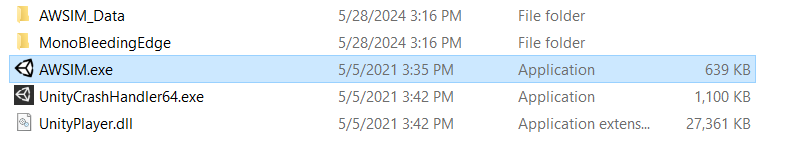

# Building AWSIM Messages on ROS2 on WSL

### Run The Build Awsim Scene



### Run the WSL2

Run the WSL and source the ROS2 init using the command below:

```bash
source /opt/ros/humble/setup.bash
```

After sourcing the ROS2 you can get a topic list and see the all the topics that are being published and subscribed by AWSIM. 


### AWSIM Topics

The list of Topics above shows all the topics related to Awsim. But, which one of them are being published by Awsim and which ones do the Awsim subscives to. Generally Awsim publishes all of the topics instead the Control command ones. You can see the full relation and published/subscribed topics using the command below. Also, you can visit [Awsim ROS2 topic lists](https://tier4.github.io/AWSIM/Components/ROS2/ROS2TopicList/) from the Awsim Documentation.

```bash
rqt_graph
```

After running the command above a new window will appear. In this window unchek the `leaf topics'. As you can see all of the control topics are the ones that Awsim Subscribes to in order to control the vehicle. So by filling and publishing into these topics we can take control of the vehicle displayed in Awsim.


Now, if you uncheck the `dead sinks`, rqt-graph shows the topics that Awsim publishes.


------------------------------------------------------------

currently we are unable to access all of the topics and we must define message types of the topics. From the list of topics there are only 5 of the topics that are accessible and we can read them right now.
```
/awsim/ground_truth/localization/kinematic_state
/awsim/ground_truth/vehicle/pose 
/clock
/sensing/gnss/pose
/sensing/gnss/pose_with_covariance
```
 The other Topics cannot are not readable currently.

 

When working with ROS, you may encounter scenarios where some topics are easily accessible while others require additional steps to visualize the messages they publish. This discrepancy often stems from how message types are defined and made available in your ROS 2 environment.

<b>Accessible Topics</b>: For the topics you can successfully echo using the ros2 topic echo command, the message types are already built and recognized by your ROS 2 environment. These message types are typically part of the standard message packages that come pre-built with ROS 2 installations, or they are message types from packages you have already built and sourced in your workspace.

<b>Inaccessible Topics</b>: For the topics that produce errors when you attempt to echo them, the issue usually lies in the message types not being built or not recognized by the current ROS 2 environment. These errors indicate that ROS 2 cannot find the message type definitions required to interpret the messages published on those topics.

So, to resolve this issue and have access to all the Messages from AWSIM we need to build messages. 


