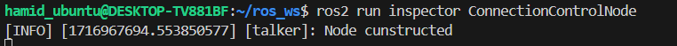
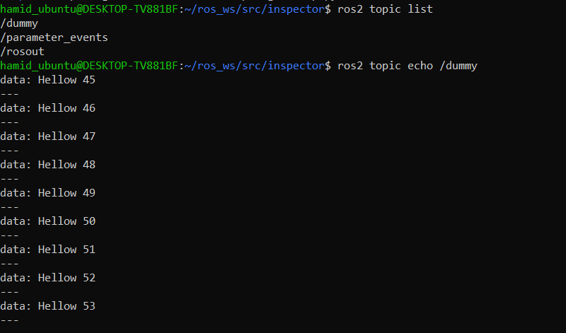
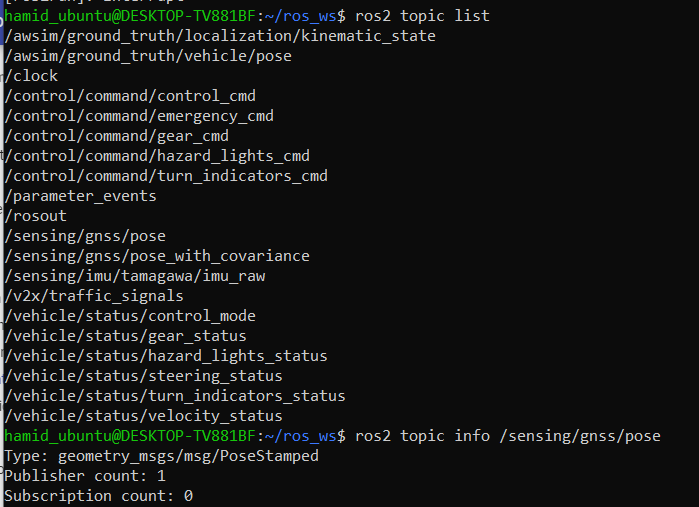
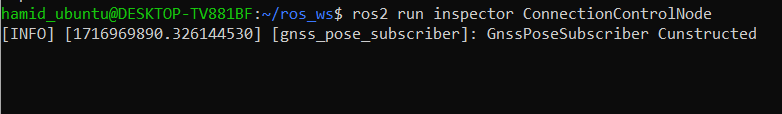
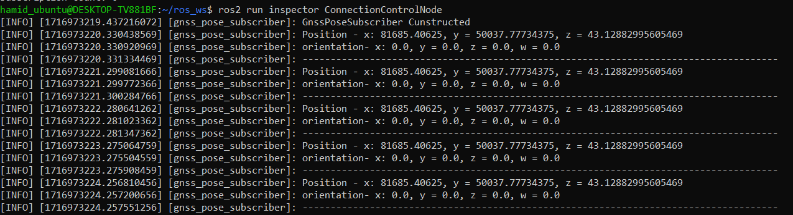
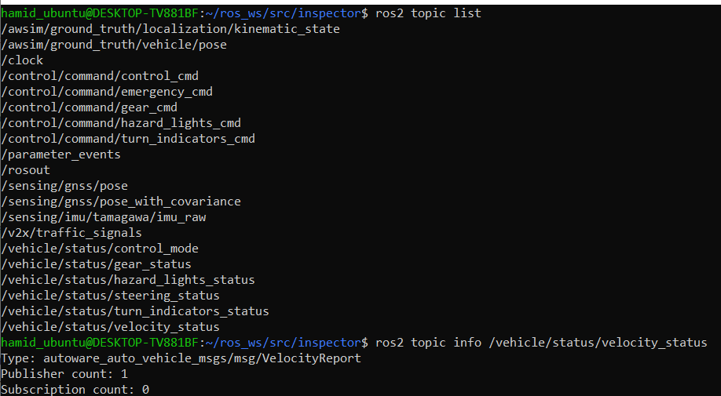
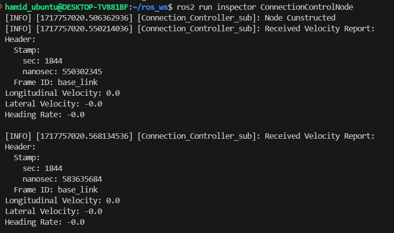
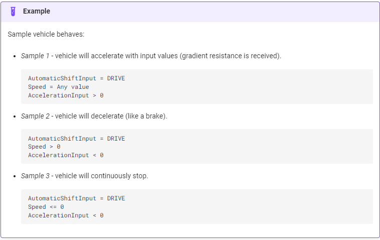

# Communication with Awsim

## Phase No.1 - Creating a simple ROS2 Node

If you have not installed ROS2 humble please refer to [Installing ROS2](../SystemSetup/InstallingROS2/index.md) page.

To communicate with Awsim, filling control/command topics and subscribing to other topics that Awsim publishes, we need to create a Node and write the appropriate code. To do this, we first create a workspace and package. You can also look at [ROS2 documentation](https://docs.ros.org/en/humble/Tutorials/Beginner-Client-Libraries/Colcon-Tutorial.html#create-a-workspace) for better undertanding of the process.

first install colcon build tool on Ubuntu:

```bash
sudo apt install python3-colcon-common-extensions
```

### Creating a workspace

First, create a directory `simple_av` to contain our workspace:

```bash
mkdir -p ~/simple_av/src
cd ~/simple_av
```

At this point the workspace contains a single empty directory `src`:

```
.
└── src

1 directory, 0 files
```

In the root of the workspace, run `colcon build`. the option `--symlink-install` allows the installed files to be changed by changing the files in the source space (e.g. Python files or other non-compiled resources) for faster iteration.

```bash
colcon build --symlink-install
```

After the build is finished, we should see the build, install, and log directories:

```
.
├── build
├── install
├── log
└── src

4 directories, 0 files
```

### Creating a package

First, source your ROS 2 installation.

```bash
source /opt/ros/humble/setup.bash
```

Make sure you are in the `src` folder before running the package creation command.

```bash
cd ~/ros2_ws/src
```

The command syntax for creating a new package in ROS 2 is:


```bash
ros2 pkg create --build-type ament_python <your_package_name>
```

The simplest possible package may have a file structure that looks like:


```
my_package/
      package.xml
      resource/my_package
      setup.cfg
      setup.py
      my_package/
```


### Creating a python node file

Go to the package folder and create a .py file. Give access to it using `chmod` command.

```bash
cd ~/simple_av/src/my_package/my_package
touch ConnectionController.py
chmod +x ConnectionController.py
```

### Simple code for a subscriber node on `/sensing/gnss/pose` topic - Python

```python
#!/usr/bin/env python3

import rclpy
from rclpy.node import Node
from std_msgs.msg import String

class MinimalPublisher(Node):
    def __init__(self):
        super().__init__('talker')
        self.get_logger().info("Node cunstructed")
        self.publisher_ = self.create_publisher(String, 'dummy', 10)
        timer_period = 0.5
        self.timer = self.create_timer(timer_period, self.callback)
        self.i = 0

    def callback(self):
        msg = String()
        msg.data = "Hellow %d" % self.i
        self.publisher_.publish(msg)
        self.i += 1


def main(args=None):
    rclpy.init(args=args)
    _node = MinimalPublisher()
    rclpy.spin(_node)
    _node.destroy_node()
    rclpy.shutdown()
    

if __name__ == '__main__':
    main()
```

### Modifications on setup.py and package.xml


Add the following code into the setup.py
```python
entry_points={
        'console_scripts': [
            'ConnectionControlNode = my_package.ConnectionController:main',
        ],
    },
```

Add the following to the package.xml
```bash
 <build_depend>rclpy</build_depend>
 <build_depend>std_msgs</build_depend>
```

### Testing

First, go to the root and build using colcon. then source the workspace

```bash
cd ~/simple_av
colcon build
source /install/setup.bash
```

Now, run the node.






## Phase No.2 - Subscribing to Awsim Topics

In this Phase we aim to subscribe to Awsim Topics. we try to subscibe to 2 topics from Awsim.

### 1. `/sensing/gnss/pose` Topic

<b>Step 1: Finding the topic informations</b>

Run the Awsim scene and use the command bellow to get the information of the desiered topic.

```bash
ros2 topic info </topic_name>
```



As we can see the message type of the `/sensing/gnss/pose` topic is `geometry_msgs/msg/PoseStamped`.

<b>Step 2: Creating ROS subscriber node</b>

Python code:

```python
#!/usr/bin/env python3

import rclpy
from rclpy.node import Node
from std_msgs.msg import String
from geometry_msgs.msg import PoseStamped

class GnssPoseSubscriber(Node):
    def __init__(self):
        super().__init__('gnss_pose_subscriber')
        self.get_logger().info("GnssPoseSubscriber Cunstructed")
        self.subscription = self.create_subscription(
            PoseStamped,
            '/sensing/gnss/pose',
            self.listener_callback,
            10
        )
        self.subscription
    
    def listener_callback(self, msg):
        self.get_logger().info(f'Position - x: {msg.pose.position.x}, y = {msg.pose.position.y}, z = {msg.pose.position.z}')
        self.get_logger().info(f'orientation- x: {msg.pose.orientation.x}, y = {msg.pose.orientation.y}, z = {msg.pose.orientation.z}, w = {msg.pose.orientation.w}')
        self.get_logger().info("-------------------------------------------------------------------------------------")


def main(args=None):
    rclpy.init(args=args)
    _node = GnssPoseSubscriber()
    rclpy.spin(_node)
    _node.destroy_node()
    rclpy.shutdown()

    

if __name__ == '__main__':
    main()
```

setup.py:
```python
entry_points={
        'console_scripts': [
            'ConnectionControlNode = inspector.ConnectionController:main',
        ],
    },
```

package.xml:
```python
<build_depend>rclpy</build_depend>
<build_depend>std_msgs</build_depend>
<build_depend>geometry_msgs</build_depend>
```

After applying the mentioned modification, source the workplace and run the `colcon build` in workspace root. Then, run the node
```bash
ros2 run my_package ConnectionControllerNode
```



<b>Step2: Run Awsim</b>

If you have not set up the [windows/WSL connection](../SystemSetup/Windows_WSL_Connection/index.md) you may not see the results below. 




### 2. `/vehicle/status/velocity_status` Topic

<b>Step 1: Finding the topic informations</b>

Run the Awsim scene and use the command bellow to get the information of the desiered topic.

```bash
ros2 topic info </topic_name>
```




As you can see the message type of the `/vehicle/status/velocity_status` topic is `autoware_auto_vehicle_msgs/msg/VelocityReport`.

<b>Step 2: Creating ROS subscriber node</b>

```python
#!/usr/bin/env python3

import rclpy
from rclpy.node import Node
from std_msgs.msg import String
from geometry_msgs.msg import PoseStamped
from autoware_auto_vehicle_msgs.msg import VelocityReport

class GnssPoseSubscriber(Node):
    def __init__(self):
        super().__init__('Connection_Controller_sub')
        self.get_logger().info("Node Cunstructed")
        self.subscription = self.create_subscription(
            VelocityReport,
            '/vehicle/status/velocity_status',
            self.listener_callback,
            10
        )
        self.subscription
    
    def listener_callback(self, msg):
        self.get_logger().info(
            f'Received Velocity Report:\n'
            f'Header:\n'
            f'  Stamp:\n'
            f'    sec: {msg.header.stamp.sec}\n'
            f'    nanosec: {msg.header.stamp.nanosec}\n'
            f'  Frame ID: {msg.header.frame_id}\n'
            f'Longitudinal Velocity: {msg.longitudinal_velocity}\n'
            f'Lateral Velocity: {msg.lateral_velocity}\n'
            f'Heading Rate: {msg.heading_rate}\n'
        )


def main(args=None):
    rclpy.init(args=args)
    _node = GnssPoseSubscriber()
    rclpy.spin(_node)
    _node.destroy_node()
    rclpy.shutdown()

    

if __name__ == '__main__':
    main()
```

setup.py:
```python
entry_points={
        'console_scripts': [
            'ConnectionControlNode = inspector.ConnectionController:main',
        ],
    },
```

package.xml:
```python
  <build_depend>autoware_auto_vehicle_msgs</build_depend>
  <exec_depend>autoware_auto_vehicle_msgs</exec_depend>
```

After applying the mentioned modification, source the workplace and run the `colcon build` in workspace root. Then, run the node
```bash
ros2 run my_package ConnectionControllerNode
```




## Phase No.3 - Publishing to Awsim Topics

In this phase we are going to move the vehicle in Awsim. To do this, we have to publish into atleast to topics.
1. `/control/command/control_cmd`: For controlling the vehicle speed.
2. `/control/command/gear_cmd`: For changing the gear to Drive mode.

### List of Subscribers of Awsim

| Category | Topic                                 | Message type                                      |
|----------|---------------------------------------|--------------------------------------------------|
| Control  | /control/command/control_cmd          | autoware_auto_control_msgs/AckermannControlCommand|
| Control  | /control/command/gear_cmd             | autoware_auto_vehicle_msgs/GearCommand            |
| Control  | /control/command/turn_indicators_cmd  | autoware_auto_vehicle_msgs/TurnIndicatorsCommand  |
| Control  | /control/command/hazard_lights_cmd    | autoware_auto_vehicle_msgs/HazardLightsCommand    |
| Control  | /control/command/emergency_cmd        | tier4_vehicle_msgs/msg/VehicleEmergencyStamped    |



### ROS2 Node

Use the code below to move the vehicle.

```python
import rclpy
from rclpy.node import Node
from autoware_auto_control_msgs.msg import AckermannControlCommand, AckermannLateralCommand, LongitudinalCommand
from builtin_interfaces.msg import Time
from rclpy.qos import QoSProfile, DurabilityPolicy, HistoryPolicy, ReliabilityPolicy  # Import necessary modules
from autoware_auto_vehicle_msgs.msg import GearCommand

class AckermannControlPublisher(Node):

    def __init__(self):
        super().__init__('ackermann_control_publisher')

        # Create a QoS profile with all required settings
        qos_profile = QoSProfile(
            reliability=ReliabilityPolicy.RELIABLE,
            history=HistoryPolicy.KEEP_LAST,
            depth=10,
            durability=DurabilityPolicy.TRANSIENT_LOCAL
        )

       # Create publishers for control and gear commands
        self.control_publisher = self.create_publisher(AckermannControlCommand, '/control/command/control_cmd', qos_profile)
        self.gear_publisher = self.create_publisher(GearCommand, '/control/command/gear_cmd', qos_profile)

        # Create a timer for publishing commands
        self.timer = self.create_timer(0.5, self.callback)

    def callback(self):
        # Create and publish control command
        control_msg = AckermannControlCommand()
        control_msg.stamp = self.get_clock().now().to_msg()
        control_msg.lateral = self.get_lateral_command()
        control_msg.longitudinal = self.get_longitudinal_command()
        self.control_publisher.publish(control_msg)

        # Create and publish gear command
        gear_msg = GearCommand()
        gear_msg.stamp = self.get_clock().now().to_msg()
        gear_msg.command = GearCommand.DRIVE
        self.gear_publisher.publish(gear_msg)
    
        self.get_logger().info("Publishing")

    def get_lateral_command(self):
        lateral_command = AckermannLateralCommand()
        lateral_command.steering_tire_angle = 0.0  # example value
        lateral_command.steering_tire_rotation_rate = 0.0  # example value
        return lateral_command

    def get_longitudinal_command(self):
        longitudinal_command = LongitudinalCommand()
        longitudinal_command.speed = 2.0  # example value
        longitudinal_command.acceleration = 0.5  # example value
        return longitudinal_command
    
    def get_gear_command(self):
        gear = GearCommand()
        gear.stamp=self.get_clock().now().to_msg()
        gear.command=GearCommand.DRIVE

def main(args=None):
    rclpy.init(args=args)
    node = AckermannControlPublisher()
    rclpy.spin(node)
    node.destroy_node()
    rclpy.shutdown()

if __name__ == '__main__':
    main()

```

Make sure to define the QoS like the code above. [Quallity of service setting](https://docs.ros.org/en/rolling/Concepts/Intermediate/About-Quality-of-Service-Settings.html)

setup.py
```python
entry_points={
        'console_scripts': [
            'ackermann_control_publisher = your_package.control_publisher:main',
        ],
    },
```

package.xml
```python
<build_depend>rclpy</build_depend>
<build_depend>std_msgs</build_depend>
<build_depend>geometry_msgs</build_depend>
<build_depend>autoware_auto_vehicle_msgs</build_depend>
<build_depend>autoware_auto_control_msgs</build_depend>
<build_depend>builtin_interfaces</build_depend>

<exec_depend>autoware_auto_control_msgs</exec_depend>
<exec_depend>builtin_interfaces</exec_depend>
<exec_depend>autoware_auto_vehicle_msgs</exec_depend>

<test_depend>ament_copyright</test_depend>
<test_depend>ament_flake8</test_depend>
<test_depend>ament_pep257</test_depend>
<test_depend>python3-pytest</test_depend>
<exec_depend>custom_interfaces</exec_depend>
```

Now run the Awsim scene and then run the node.

```bash
cd ~/ros_ws
colcon build --packages-select your_package
ros2 run inspector ackermann_control_publisher
```

<video width="1920" controls autoplay muted loop>
<source src="awsim_control_command.mp4" type="video/mp4">
</video>


