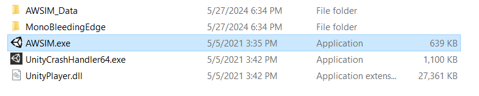
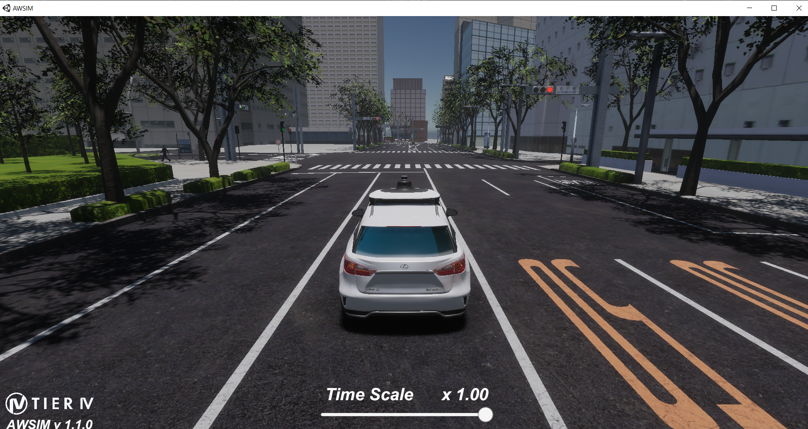

# Setting up AWSIM on Window 10

Install AWSIM using the <i>quick start demo</i> provided in [AWSIM documentation](https://tier4.github.io/AWSIM/GettingStarted/QuickStartDemo/). 

But in the case of this project, there is no need to actually install the AWSIM. We just need the Awsim to be up and running and have the ability to publish and subscribe topics and messages. So, we use a built scene and just run the .exe file.

The picture below shows the builted Awsim from shinjuku scene. The highlited file is the .exe file that we run.

The picture below shows the Awsim environment after running the AWSIM.exe file

### How to build Awsim project
//TODO: Kashi