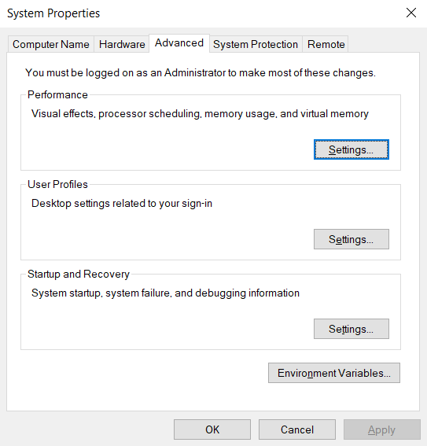
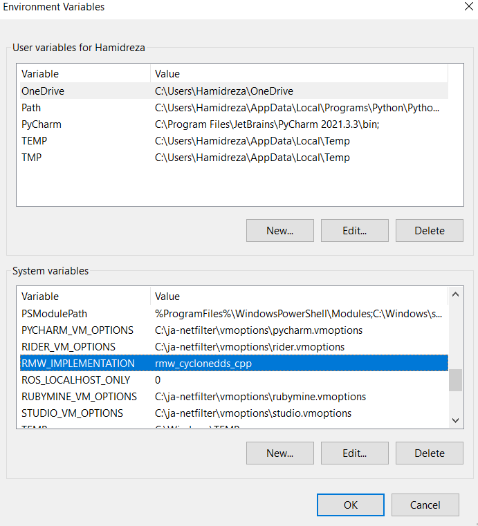
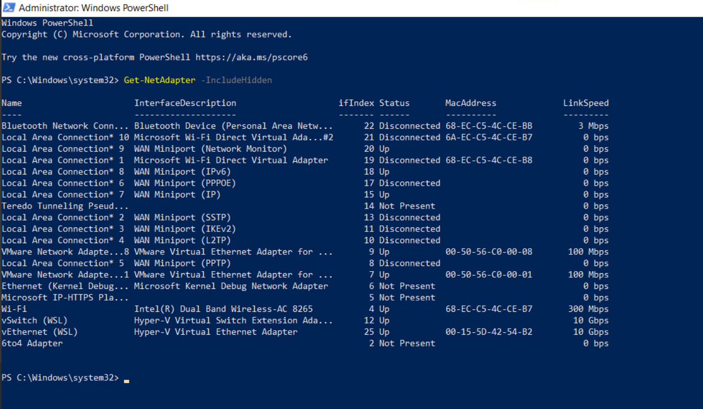
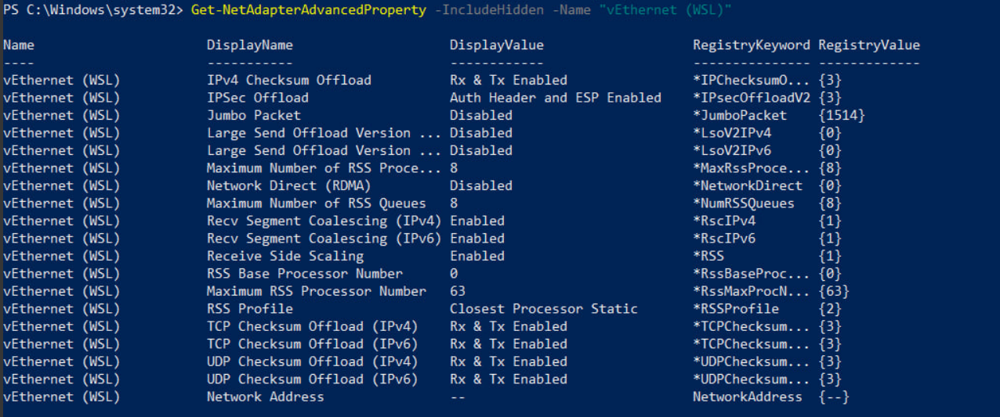

# Setting up Awsim and WSL2 connection

Before running AWSIM, you need to make a few changes to your Windows 10 environment to make sure that the messages and topic correctly transfer to your WSL2 environment.

## Step 1: Set environment variables

By default, ROS2 on Windows uses the FastDDS middleware. You need to change that to CycloneDDS for AWSIM messages to be able to transfer to your WSL2 environment.

Open the system environment variables panel on Windows. Click on Environment Variables.



In the `System variables section` create two new variables:

1. RMW_IMPLEMENTATION: rmw_cyclonedds_cpp
2. ROS_LOCALHOST_ONLY: 0



Finally, reboot your system.

## Step 2: Disable the Windows LSO (large send offload)

<b>Explanation of Large Send Offload (LSO)</b>:
LSO is a feature that helps improve network performance by offloading packet segmentation tasks from the CPU to the network adapter hardware. However, in some scenarios, LSO can cause network issues, especially with virtual network adapters or certain types of network traffic. Disabling LSO can help resolve such issues.

<b>Why Disable LSO on WSL Adapter?</b>:
Disabling LSO on the WSL virtual Ethernet adapter might be necessary if you're experiencing network performance issues or connectivity problems with applications running in WSL. By disabling LSO, you force the CPU to handle packet segmentation, which can sometimes result in more stable network behavior in virtualized environments.


1-  open Windows Powershell as administrator. 

2- Run the command below to Identify the network adapters.

```bash
Get-NetAdapter -IncludeHidden
```
This command used to retrieve information about the network adapters on a Windows system, including those that are hidden. By using this command, you can see all network adapters on the system, including those that are not currently in use or visible in the standard network settings interface. This can be useful for troubleshooting network issues or for getting a complete inventory of all network interfaces on a system.

In this Step the network adapters are something like below.


3- Run the command below to Disable Large Send Offload (LSO).

```bash
Disable-NetAdapterLso -IncludeHidden -Name "vEthernet (WSL)"
```
This command disables the Large Send Offload (LSO) feature on the specified network adapter, including hidden ones. LSO offloads the task of segmenting large TCP/IP packets to the network adapter hardware.

4- Run the command below to Check the advanced properties.

```bash
Get-NetAdapterAdvancedProperty -IncludeHidden -Name "vEthernet (WSL)"
```

This command retrieves advanced properties and settings of the specified network adapter, including hidden ones.

5- Run the command below to Restart the WSL adapter.

```bash
Restart-NetAdapter -IncludeHidden -Name "vEthernet (WSL)"
```

This command restarts the specified network adapter, including hidden ones. To apply and solidify changes made to the network adapter settings, such as disabling LSO. Restarting the adapter ensures that all configuration changes take effect and the adapter operates with the updated settings.


After running the 4 commands above, once again run the `Get-NetAdapterAdvancedProperty -IncludeHidden -Name "vEthernet (WSL)"` command. As is shown in the picture below, the Lso should be Off and the RegistryValue must be {0}




Once again reboot your system.

