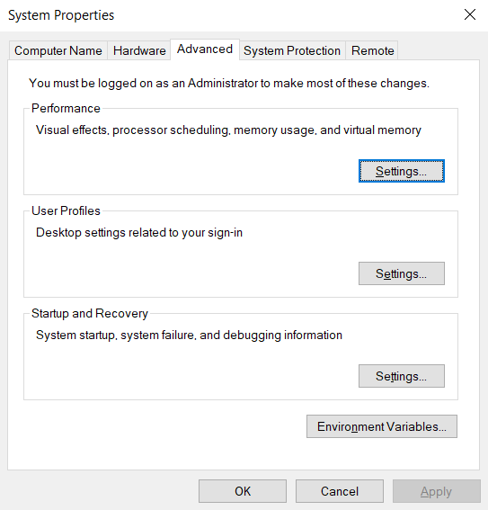

# Environment Setup for simple-AV

This guide will walk you through the steps to set up an environment in Ubuntu 22.04 for developing the simple-AV ROS node, including the installation of AWSIM, ROS2 Humble, and other necessary components. To develop this project, communication between AWSIM and ROS2 is required. To achieve this, AWSIM is used on Windows 10, and Ubuntu 22.04 is installed on WSL (Windows Subsystem for Linux) on Windows 10. ROS2 will be installed on Ubuntu 22.04 within WSL.

More specifically, this document goes through the installation process of
* Installing WSL2 on Windows 10.
* Installing ROS2 Humble on Ubuntu 22.04 on WSL2 
* Setting up AWSIM on Window 10
* Setting up Awsim and WSL2 connection

<b>For running AWSIM on Windows and get the topics in WSL, you don’t need to actually install ROS2 for Windows, so you can skip this part.</b>

## Installing WSL2 on Windows 10.


## Installing ROS2 Humble on Ubuntu 22.04 on WSL2 

First, ensure your system is up to date.

```bash
sudo apt update
sudo apt upgrade
```

Install [Ros2 Humble distibution](https://docs.ros.org/en/humble/Installation/Ubuntu-Install-Debians.html). Follow all the steps and install ros-humble-desktop. Make sure the installations is complete by using the commands bellow.

In one terminal, source the setup file and then run a C++ talker:

```bash
source /opt/ros/humble/setup.bash
ros2 run demo_nodes_cpp talker
```

In another terminal source the setup file and then run a Python listener:
```bash
source /opt/ros/humble/setup.bash
ros2 run demo_nodes_py listener
```
You should see the talker saying that it’s Publishing messages and the listener saying I heard those messages. This verifies both the C++ and Python APIs are working properly. Hooray!

## Setting up AWSIM on Window 10

Install AWSIM using the <i>quick start demo</i> provided in [AWSIM documentation](https://tier4.github.io/AWSIM/GettingStarted/QuickStartDemo/). 

But in the case of this project, there is no need to actually install the AWSIM. We just need the Awsim to be up and running and have the ability to publish and subscribe topics and messages. So, we use a built scene and just run the .exe file.

The picture below shows the builted Awsim from shinjuku scene. The highlited file is the .exe file that we run.


The picture below shows the Awsim environment after running the AWSIM.exe file


### How to build Awsim project
//TODO: Kashi

## Setting up Awsim and WSL2 connection

Before running AWSIM, you need to make a few changes to your Windows 10 environment to make sure that the messages and topic correctly transfer to your WSL2 environment.

### Set environment variables

By default, ROS2 on Windows uses the FastDDS middleware. You need to change that to CycloneDDS for AWSIM messages to be able to transfer to your WSL2 environment.

Open the system environment variables panel on Windows. Click on Environment Variables.



In the `System variables section` create two new variables:

1. RMW_IMPLEMENTATION: rmw_cyclonedds_cpp
2. ROS_LOCALHOST_ONLY: 0


Finally, reboot your system. After that you should be able to run AWSIM and view its publishing message in your WSL2 environment.