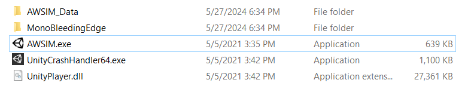
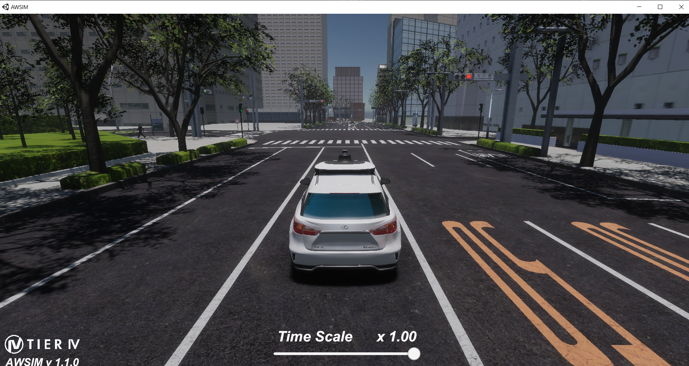
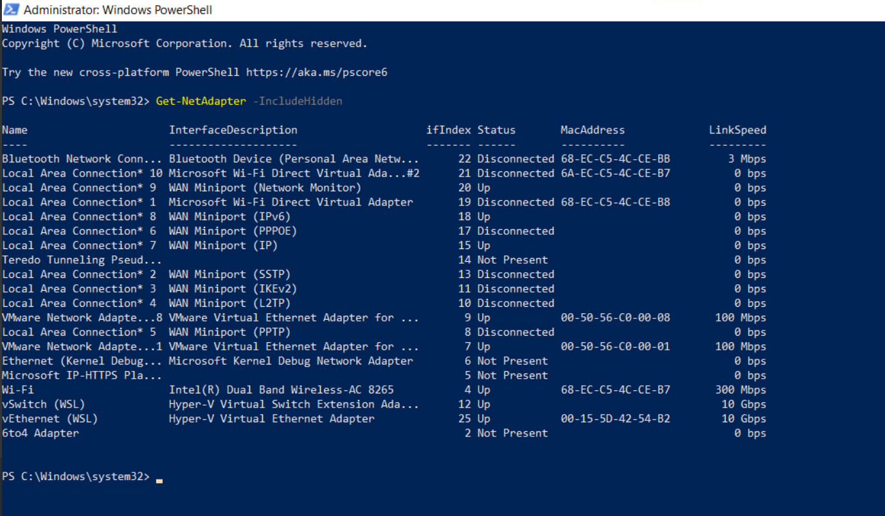
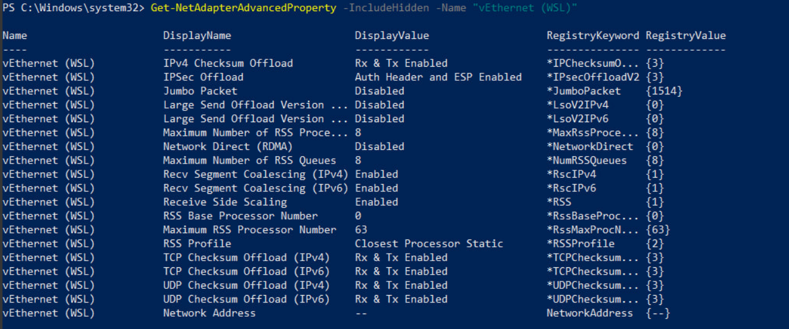
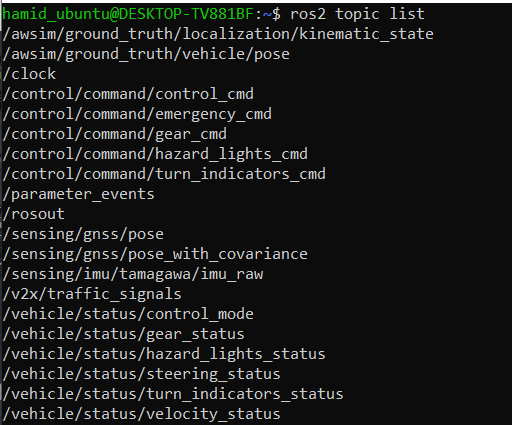

# Environment Setup for simple-AV

This guide will walk you through the steps to set up an environment in Windows 10 for launching the simple-AV, including the installation of AWSIM, ROS2 Humble, and WSL.

To develop and run simple-AV, it is essential to establish communication between AWSIM and ROS2. For this project, AWSIM is installed on Windows 10, while Ubuntu 22.04 is installed on WSL (Windows Subsystem for Linux) within Windows 10. ROS2 is then installed on Ubuntu 22.04 within WSL.

Given the crucial need for seamless communication between simple-AV and AWSIM, we ensure proper setup for the exchange of ROS topics. This involves configuring the network settings to enable ROS topics to be sent and received correctly between the Windows 10 environment and the ROS2 installation on WSL.

## System Setup process
More specifically, this document goes through the installation process of

* [Installing WSL2 on Windows 10](https://learn.microsoft.com/en-us/windows/wsl/install)
* [Installing ROS2 Humble on Ubuntu 22.04 on WSL2](https://docs.ros.org/en/humble/Installation/Ubuntu-Install-Debians.html)
* [Setting up AWSIM on Window 10](#setting-up-awsim-on-window)
* [Setting up Awsim and WSL2 connection](#setting-up-awsim-and-wsl2-connection)

<b>For running AWSIM on Windows and get the topics in WSL, you don’t need to actually install ROS2 for Windows.</b>

By following this guide, you will create a development environment that supports efficient communication between AWSIM and ROS2, enabling the successful deployment of the simple-AV ROS node.

--------------------------------------------------------------------------------------------------------------------

## Setting up AWSIM on Window

ou can install AWSIM using the <i>quick start demo</i> provided in the [AWSIM documentation](https://tier4.github.io/AWSIM/GettingStarted/QuickStartDemo/). This gives you access to Unity and AWSIM, allowing you to modify the scene and objects in the simulator, change the sensors, and add new topics, messages, and vehicles.

However, if you just want to test and work with simple-AV, you can use the built-in scene of AWSIM. You can download a scene of Shinjuku using the link below. The image shows the built AWSIM from the Shinjuku scene. The highlighted file is the .exe file that you need to run.



The picture below shows the Awsim environment after running the AWSIM.exe file



### How to build scene using Awsim
//TODO: Kashi


## Setting up Awsim and WSL2 connection

Before running AWSIM, you need to make a few changes to your Windows 10 environment to make sure that the messages and topic correctly transfer to your WSL2 environment.

### Step 1: Set environment variables

By default, ROS2 on Windows uses the FastDDS middleware. You need to change that to CycloneDDS for AWSIM messages to be able to transfer to your WSL2 environment.

Open the system environment variables panel on Windows. Click on Environment Variables.


In the `System variables section` create two new variables:

1. RMW_IMPLEMENTATION: rmw_cyclonedds_cpp
2. ROS_LOCALHOST_ONLY: 0


Finally, reboot your system.

### Step 2: Disable the Windows LSO (large send offload)

<b>Explanation of Large Send Offload (LSO)</b>:
LSO is a feature that helps improve network performance by offloading packet segmentation tasks from the CPU to the network adapter hardware. However, in some scenarios, LSO can cause network issues, especially with virtual network adapters or certain types of network traffic. Disabling LSO can help resolve such issues.

<b>Why Disable LSO on WSL Adapter?</b>:
Disabling LSO on the WSL virtual Ethernet adapter might be necessary if you're experiencing network performance issues or connectivity problems with applications running in WSL. By disabling LSO, you force the CPU to handle packet segmentation, which can sometimes result in more stable network behavior in virtualized environments.


1- open Windows Powershell as administrator. 

2- Run the command below to Identify the network adapters.

```bash
Get-NetAdapter -IncludeHidden
```
This command used to retrieve information about the network adapters on a Windows system, including those that are hidden. By using this command, you can see all network adapters on the system, including those that are not currently in use or visible in the standard network settings interface. This can be useful for troubleshooting network issues or for getting a complete inventory of all network interfaces on a system.

In this Step the network adapters are something like below.


3- Run the command below to Disable Large Send Offload (LSO).

```bash
Disable-NetAdapterLso -IncludeHidden -Name "vEthernet (WSL)"
```
This command disables the Large Send Offload (LSO) feature on the specified network adapter, including hidden ones. LSO offloads the task of segmenting large TCP/IP packets to the network adapter hardware.

4- Run the command below to Check the advanced properties.

```bash
Get-NetAdapterAdvancedProperty -IncludeHidden -Name "vEthernet (WSL)"
```

This command retrieves advanced properties and settings of the specified network adapter, including hidden ones.

5- Run the command below to Restart the WSL adapter.

```bash
Restart-NetAdapter -IncludeHidden -Name "vEthernet (WSL)"
```

This command restarts the specified network adapter, including hidden ones. To apply and solidify changes made to the network adapter settings, such as disabling LSO. Restarting the adapter ensures that all configuration changes take effect and the adapter operates with the updated settings.


After running the 4 commands above, once again run the `Get-NetAdapterAdvancedProperty -IncludeHidden -Name "vEthernet (WSL)"` command. As is shown in the picture below, the Lso should be Off and the RegistryValue must be {0}




Once again reboot your system.


## Testing

<b>1. Run Awsim</b>

After completing the 4 steps mentioned in [System setup process](#system-setup-process), run the Awsim (if you have installed Awsim) or an Awsim Scene (you can use this provided scene: [link]())


<b>2. Run WSL2</b>

Now, run the WSL and source the ROS2 init using the command below:

```bash
source /opt/ros/humble/setup.bash
```

After sourcing the ROS2 you can get a topic list and see the all the topics that are being published and subscribed by AWSIM. 



This means we have successfully setup our system and create a communication between Awsim on Windows and Ros2 on WSL. However, currently we are unable to access all of the topics and we must define message types of the topics. Please refer to [Building Messages](../../BuildingMessages/index.md) page to see the full documentation.

