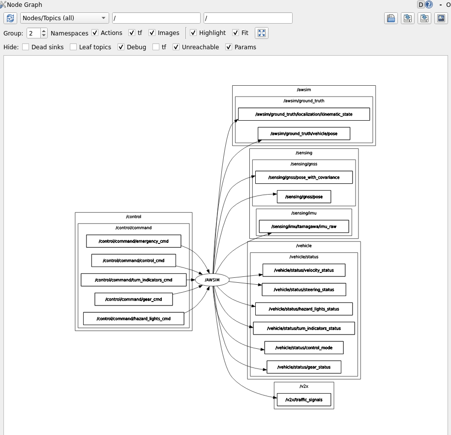

# Environment Setup for simple-AV

This guide will walk you through the steps to set up an environment in Windows 10 for launching the simple-AV ROS node, including the installation of AWSIM, ROS2 Humble, and WSL.

To develop and run simple-AV, it is essential to establish communication between AWSIM and ROS2. For this project, AWSIM is installed on Windows 10, while Ubuntu 22.04 is installed on WSL (Windows Subsystem for Linux) within Windows 10. ROS2 is then installed on Ubuntu 22.04 within WSL.

Given the crucial need for seamless communication between simple-AV and AWSIM, we ensure proper setup for the exchange of ROS topics. This involves configuring the network settings to enable ROS topics to be sent and received correctly between the Windows 10 environment and the ROS2 installation on WSL.

More specifically, this document goes through the installation process of

* [Installing WSL2 on Windows 10](../WSL/index.md)
* [Installing ROS2 Humble on Ubuntu 22.04 on WSL2](../InstallingROS2/index.md)
* [Setting up AWSIM on Window 10](../AWSIM_on_Windows/index.md)
* [Setting up Awsim and WSL2 connection](../Windows_WSL_Connection/index.md)

<b>For running AWSIM on Windows and get the topics in WSL, you don’t need to actually install ROS2 for Windows.</b>

--------------------------------------------------------------------------------------------------------------------

By following this guide, you will create a development environment that supports efficient communication between AWSIM and ROS2, enabling the successful deployment of the simple-AV ROS node.

### Run The Build Awsim Scene

After doing the 4 steps mentioned above, run the Build of Shinjuku Scene provided in the link below or any other built scenes.


### Run the WSL2

Now, run the WSL and source the ROS2 init using the command below:

```bash
source /opt/ros/humble/setup.bash
```

After sourcing the ROS2 you can get a topic list and see the all the topics that are being published and subscribed by AWSIM


From this list there are only 5 of the topics that are accessible and we can read them right now.
```
/awsim/ground_truth/localization/kinematic_state
/awsim/ground_truth/vehicle/pose 
/clock
/sensing/gnss/pose
/sensing/gnss/pose_with_covariance
```
 The other Topics cannot are not readable currently.

 

When working with ROS, you may encounter scenarios where some topics are easily accessible while others require additional steps to visualize the messages they publish. This discrepancy often stems from how message types are defined and made available in your ROS 2 environment.

<b>Accessible Topics</b>: For the topics you can successfully echo using the ros2 topic echo command, the message types are already built and recognized by your ROS 2 environment. These message types are typically part of the standard message packages that come pre-built with ROS 2 installations, or they are message types from packages you have already built and sourced in your workspace.

<b>Inaccessible Topics</b>: For the topics that produce errors when you attempt to echo them, the issue usually lies in the message types not being built or not recognized by the current ROS 2 environment. These errors indicate that ROS 2 cannot find the message type definitions required to interpret the messages published on those topics.

So, to resolve this issue and have access to all the Messages from AWSIM we need to build messages. Please refer to [Building Messages](../BuildingMessages/index.md) page to see the full documentation.

## AWSIM Topics

The list of Topics above shows all the topics related to Awsim. But, which one of them are being published by Awsim and which ones do the Awsim subscives to. Generally Awsim publishes all of the topics instead the Control command ones. You can see the full relation and published/subscribed topics using the command below.

```bash
rqt_graph
```

After running the command above a new window will appear. In this window unchek the `leaf topics'. As you can see all of the control topics are the ones that Awsim Subscribes to in order to control the vehicle. So by filling and publishing into these topics we can take control of the vehicle displayed in Awsim.


Now, if you uncheck the `dead sinks`, rqt-graph shows the topics that Awsim publishes.


