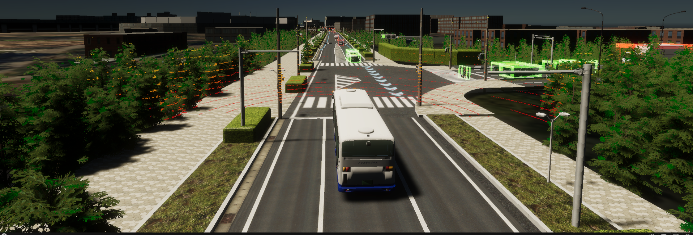

# Welcome to V2X E2E simulator

<<<<<<< Updated upstream

=======
<!-- For full documentation visit [mkdocs.org](https://www.mkdocs.org). -->

## Some pictures
>>>>>>> Stashed changes

<!--## Some video

<video width="1920" controls autoplay muted loop>
<source src="video.mp4" type="video/mp4">
</video> -->

<!-- ## Some notes

* `mkdocs new [dir-name]` - Create a new project.
* `mkdocs serve` - Start the live-reloading docs server.
* `mkdocs build` - Build the documentation site.
* `mkdocs -h` - Print help message and exit.

## Project layout

    mkdocs.yml    # The configuration file.
    docs/
        index.md  # The documentation homepage.
        ...       # Other markdown pages, images and other files. -->
